# เซสชันการคอมพิวเตอร์

The most visited pages in the Backend.AI WebUI would be the 'เซสชัน' and 'Data' pages.
This document will cover how to query and create container-based compute sessions and utilize various web applications on the 'เซสชัน' page.

## เริ่มเซสชันใหม่

After logging in with a ผู้ใช้ account, click 'เซสชัน' on the left sidebar.
'เซสชัน' page lets you start new sessions or use and manage existing running sessions.

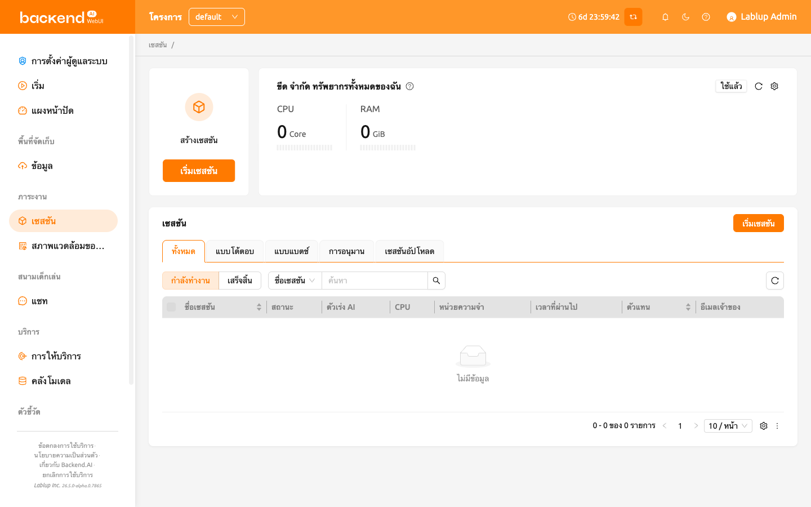

Click the 'START' button to start a new compute session.

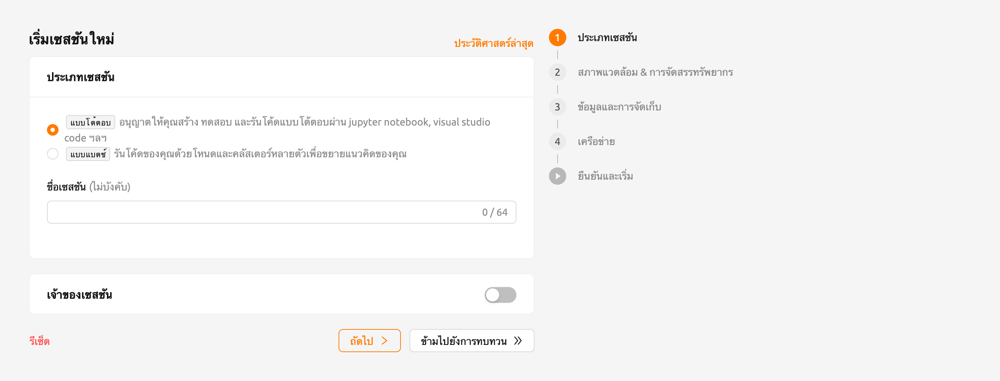

### Session Type

In the first page, ผู้ใช้s can select the type of session, 'interactive' or 'batch'.
If needed, setting the name of the session (optional) is also available.

- Session type: Determines the type of the session. There are two different types of session, \"Interactive\" and \"Batch\".
  The following are the primary distinctions between the two types:

  - ช่วงการคำนวณแบบโต้ตอบ

    - This is the type which has been supported from the initial version of the Backend.AI.
    - เซสชันการคอมพิวเตอร์ถูกใช้งานในลักษณะที่ผู้ใช้มีปฏิสัมพันธ์หลังจากสร้างเซสชันโดยไม่ต้องระบุสคริปต์หรือคำสั่งการดำเนินการที่กำหนดไว้ล่วงหน้า
    - เซสชันจะไม่ถูกยกเลิกโดยอัตโนมัติ เว้นแต่ผู้ใช้จะทำการทำลายเซสชันอย่างชัดเจนหรือผู้ดูแลระบบตั้งค่าโปรแกรมทำความสะอาดเซสชัน

  - เซสชันการคำนวณแบบชุด

    - This type of session is supported via GUI from Backend.AI 22.03 (CLI has
      supported the batch-type session before the 22.03).
    - กำหนดสคริปต์ล่วงหน้าที่จะถูกดำเนินการเมื่อเซสชันการคอมพิวเตอร์พร้อมใช้งาน
    - This session will execute the script as soon as the compute session is ready, and then
      automatically terminates the session as soon as the execution finishes.
      It will utilize the server farm's resources efficiently and flexibly if a ผู้ใช้ can write the execution script in advance or is
      building a pipeline of workloads.
    - Users can set the start time of a batch-type compute session.
      However, keep in mind that this feature does not guarantee that the session will start at the registered time.
      It may still stay at 'PENDING' due to the lack of resources, etc. Rather, it guarantees that
      the session WILL NOT run until the start time.
    - Users can also set the 'Timeout Duration' of a batch-type compute session.
      When ผู้ใช้s set the timeout duration, The session will automatically terminate if the specified time is exceeded.

    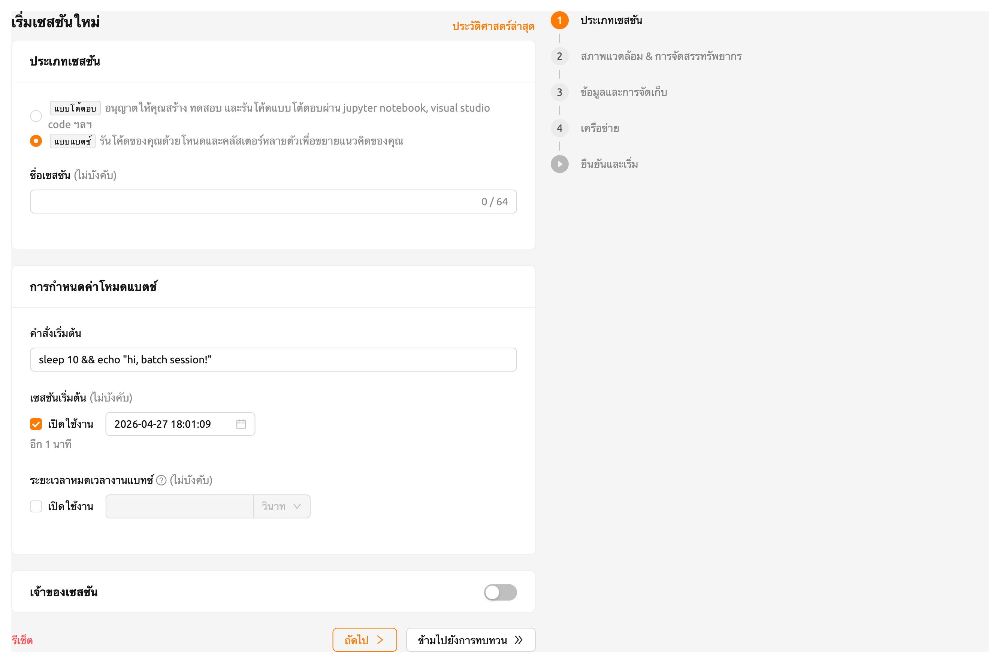

- Session name: Users can specify the name of the compute session to be
  created. If set, this name appears in Session Info, so it is
  distinguishable among multiple compute sessions. If not specified, random
  word will be assigned automatically. Session names only accept alphanumeric
  characters between 4 and 64 without spaces.

If ผู้ใช้s create a session with the `super admin` or `admin` account,
they can additionally assign a session owner. If you enable the toggle,
a ผู้ใช้ email field will appear.

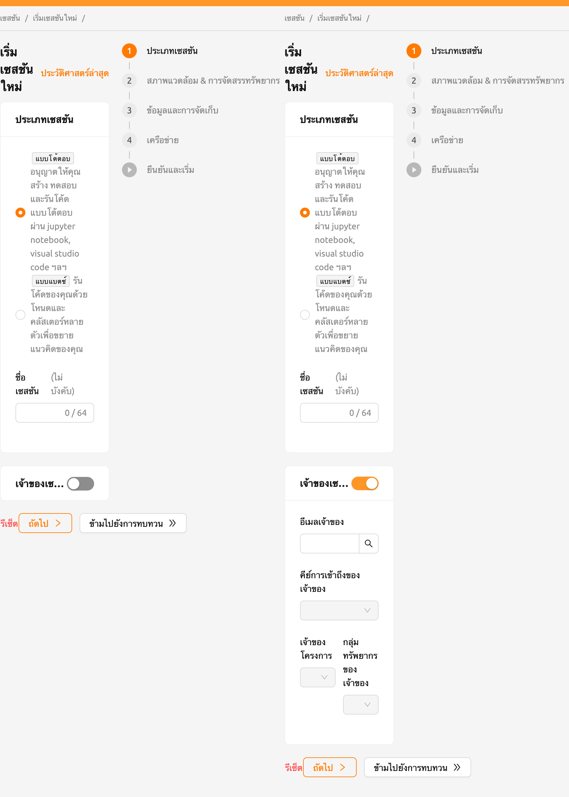

Enter the email of the ผู้ใช้ you want to assign the session to,
click the 'search' button, and the ผู้ใช้'s access key will be automatically registered.
You can also select a project and กลุ่มทรัพยากร.

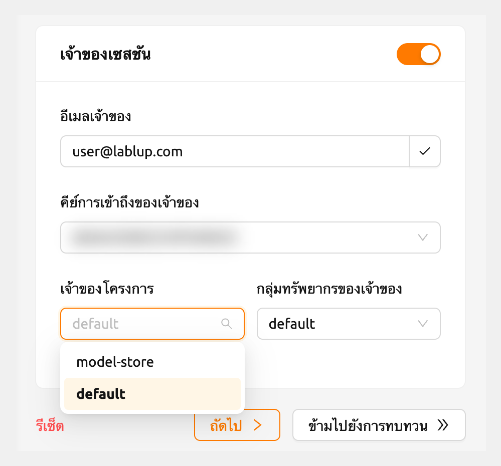

### Environments & Resource allocation

Click the 'Next' button below, or the 'Environments & Resource allocation' menu on the right
to proceed to the next page. If you want to create a session without any further
settings, press the 'Skip to review' button. In this case, settings on the
other pages will all use the default values.

  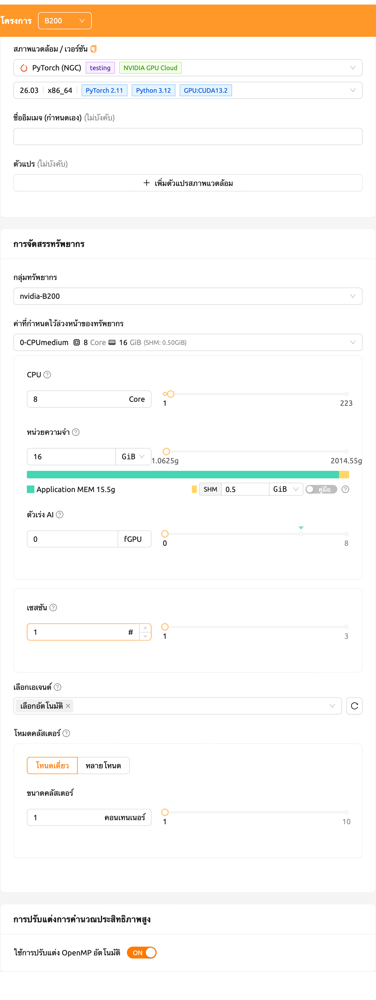

### Environments

For detailed explanations of each item that can be set on the second page, please
refer to the following:

- Environments: Users can select the base environment for compute sessions such as
  TensorFlow, PyTorch, C++, etc. The compute session will automatically included into the base environment library.
  If ผู้ใช้s choose another environment, the corresponding packages will be installed by default.
- Version: Users can specify the version of the environment.
  There are multiple versions in a single environment. For example, TensorFlow has multiple versions such as 1.15, 2.3, etc.,
- Image Name: Users can specify the name of the image to be used for the
  compute session. This configuration may not be available depending on the environment settings.
- Set Environment Variable: To give more convenient workspace for ผู้ใช้s, Backend.AI supports environment variable setting
  in session launching. In this feature, ผู้ใช้s can add any envs such as `PATH` by filling out
  variable name and value in environment configuration dialog.

  

### Resource allocation

- Resource Group: Specifies the กลุ่มทรัพยากร in which to create a compute
  session. A กลุ่มทรัพยากร is a unit that groups host servers that each ผู้ใช้
  can access. Usually, servers in a กลุ่มทรัพยากร would have the same type of
  GPU resources. Administrators can classify servers by any criteria, group them
  into one or more กลุ่มทรัพยากรs, configure which กลุ่มทรัพยากรs a ผู้ใช้
  can use. Users can launch a compute session only on servers in กลุ่มทรัพยากรs
  allowed by the ผู้ดูแลระบบistrator. If multiple กลุ่มทรัพยากรs are allowed, ผู้ใช้s could select any group they want.
  However, it cannot be changed when system only allows single-setting.
- Resource Presets: These templates have pre-defined resource sets, such as
  CPU, memory, and GPU, to be allocated to a compute session. Administrators can
  define frequently used resource settings in advance. By adjusting the numerical
  input or sliding the slider, ผู้ใช้s can allocate the desired amount of resources.

  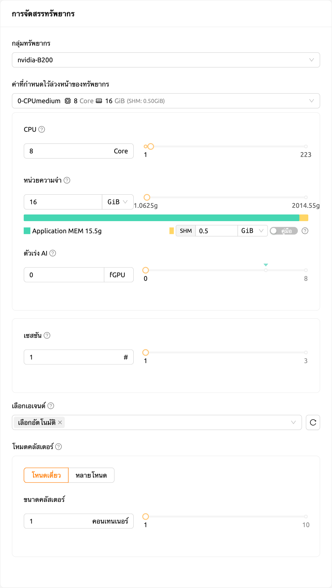

  The meaning of each item is as follows.
  Clicking the 'Help (?)' button will also give more information.

  * CPU: The CPU performs basic arithmetic, logic, controlling, and input/output
    (I/O) operations specified by the instructions. In general, more CPUs are beneficial for high-performance computing workloads.
    But, to reflect the advantage of more CPUs, program code must be written to adapt multiple CPUs.
  * Memory: Computer memory is a temporary storage area. It holds the data and
    instructions that the Central Processing Unit (CPU) needs. When using a GPU in
    a machine learning workload, at least twice the memory of the
    GPU to memory need to be allocated. Otherwise, GPU's idle time will increase, resulting
    penalty in a performance.
  * หน่วยความจำที่แชร์: ปริมาณหน่วยความจำที่แชร์ในหน่วย GB ที่จะจัดสรรสำหรับเซสชันการประมวลผล หน่วยความจำที่แชร์จะใช้บางส่วนของหน่วยความจำที่ตั้งค่าใน RAM ดังนั้นจึงไม่สามารถมากกว่าปริมาณที่ระบุใน RAM ได้
  * AI Accelerator: AI accelerator (GPU หรือ NPU) เหมาะสำหรับการคำนวณเมทริกซ์/เวกเตอร์ที่เกี่ยวข้องกับการเรียนรู้ของเครื่อง AI accelerator เร่งความเร็วอัลกอริธึมการฝึกอบรม / การอนุมานโดยมาก ทำให้เวลาในการประมวลผลลดลงจากหลายสัปดาห์เหลือไม่กี่วัน
  * เซสชัน: Session is a unit of computational environment that is created
    according to a specified environment and resources. If this value is set to a
    value greater than 1, multiple sessions corresponding to the resource set above
    are created. If there are not enough resources available, requests to create
    sessions that cannot be created are put on the waiting queue.

  

  * Select Agent: Select the agent to be assigned. By default, the agent is automatically selected
    by the scheduler. The agent selector displays the actual amount of available resources for each agent.
    Currently, this feature is only supported in single-node, single-container environments.
  * Cluster mode: Cluster mode allows ผู้ใช้s to create
    multiple compute sessions at once. For more information, refer to the
    [Overview of Backend.AI cluster compute session](#backendai-cluster-compute-session).

:::note
The Agent Select feature may not be available depending on the server environment.
:::

- High-Performance Computing Optimizations: Backend.AI provides configuring values
  related to HPC Optimizations.

  Backend.AI provides configuration UI for internal control variable in `nthreads-var`.
  Backend.AI sets this value equal to the number of session's CPU cores by default,
  which has the effect of accelerating typical high-performance computing workloads.
  Nevertheless, for some multi-thread workloads, multiple processes using OpenMP are used at same time,
  resulting in an abnormally large number of threads and significant performance degradation.
  To resolve this issue, setting the number of threads to 1 or 2 would work.

### ข้อมูลและการจัดเก็บ

Click the 'Next' button below, or the 'ข้อมูลและการจัดเก็บ' menu on the right to proceed to the next page.

When a compute session is destroyed, data deletion is set to default.
However, data stored in the mounted folders will survive.
Data in those folders can also be reused by mounting it when creating another compute session.
For further information on how to mount a folder and run a compute session, refer to
[Mounting Folders to a Compute Session](#session-mounts).

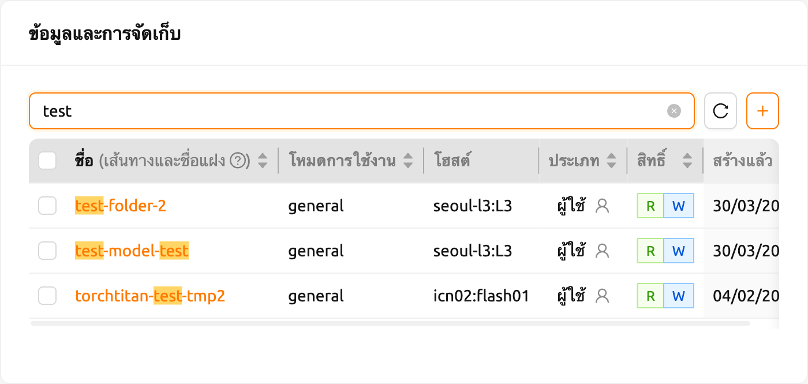

ผู้ใช้s can specify the data folders to mount in the compute session.
Folder explorer can be used by clicking folder name. For further information,
please refer [Explore Folder](#explore-folder) section.

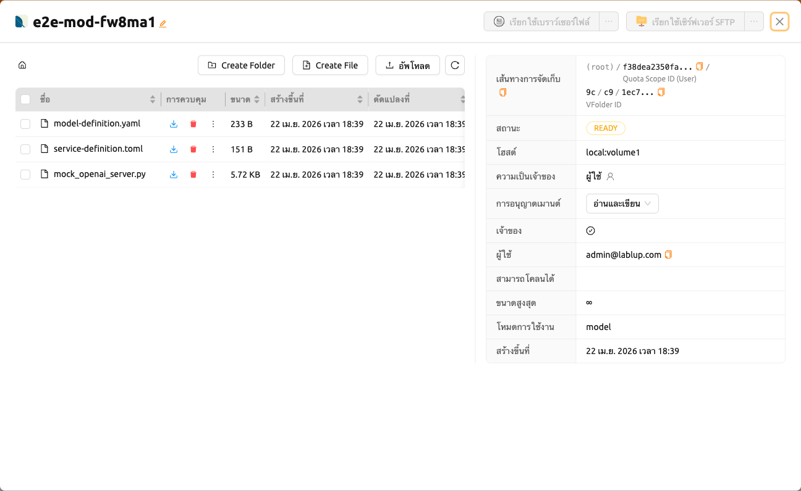

New folder can be created by clicking the '+' button next to the search box.
When new folder is created, it will automatically be selected as the folder to mount.
For further information, please refer [Create Storage Folder](#create-storage-folder) section.

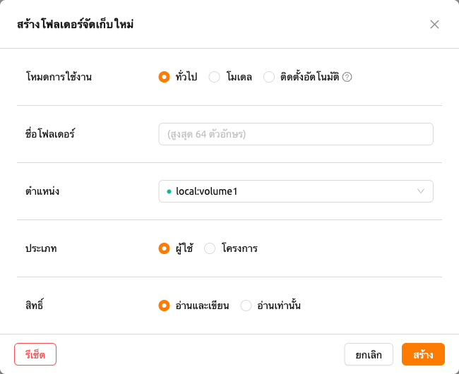

### Network

Click the 'Next' button below, or the 'Network' menu on the right to proceed to the next page.
On this page, Network configuration can be done such as Preopen Ports.

- Set Preopen Ports: Provides an interface for ผู้ใช้s to set preopen ports in a
  compute session. Refer to the [How to add preopen ports before session creation](#set-preopen-ports) for further information.

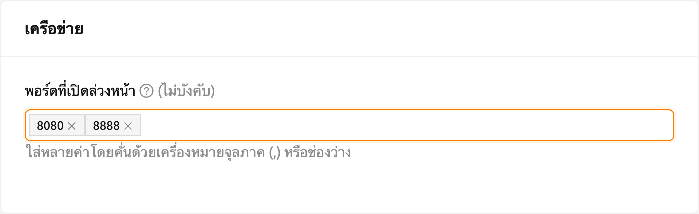

### Confirm and Launch

If you are done with the network setting, click the 'Next' button below, or
'Confirm and Launch' button on the right to proceed to the last page.

On the last page, ผู้ใช้s could view information of session(s) to create,
such as environment itself, allocated resources, mount information,
environment variables set on the previous pages, preopen ports, etc.,
Review the settings, ผู้ใช้s could launch the session by clicking 'Launch' button.
Click the 'Edit' button located at the top right of each card to redirect to relevant page.

If there is an issue with the settings, an error message will be displayed as follows.
Users can edit their settings when this happens.

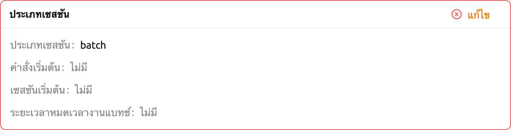

When you click the 'Launch' button, a warning dialog appears stating that there are no mounted folders.
If folder mounting is not required, you can ignore the warning and click the 'Start' button in the dialog to proceed.

When a new compute session is added in the **Running** tab, a notification appears at the bottom-right corner of the screen.
The bottom-left area of the notification displays the session status, while the bottom-right area includes buttons for opening the app dialog,
launching the terminal, viewing container logs, and terminating the session.
You can also view this session creation notification by clicking **Notifications** in the header.

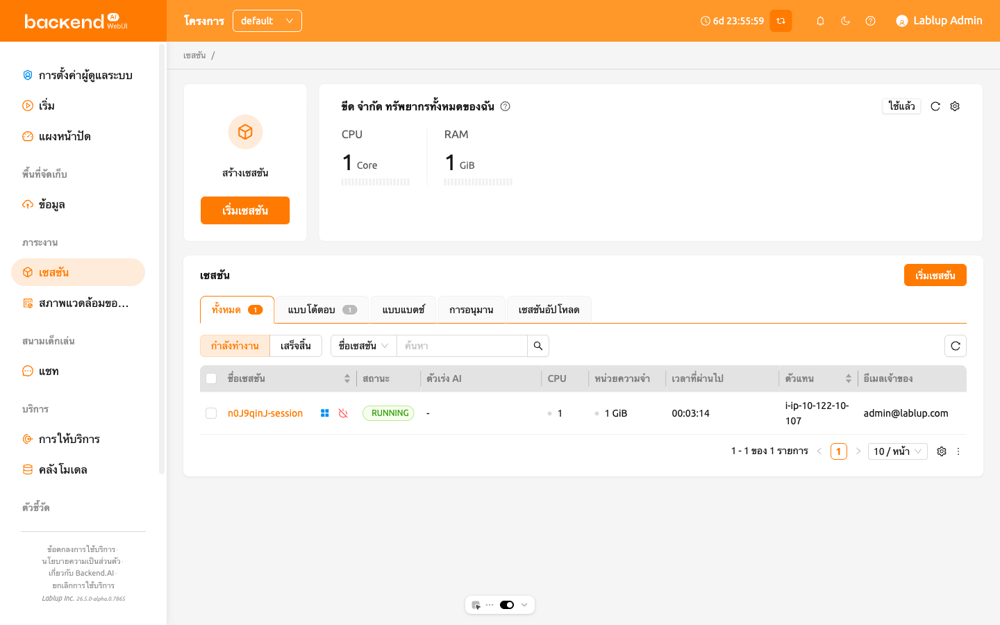

By clicking the app dialog button on the far left, you can view the available app services.

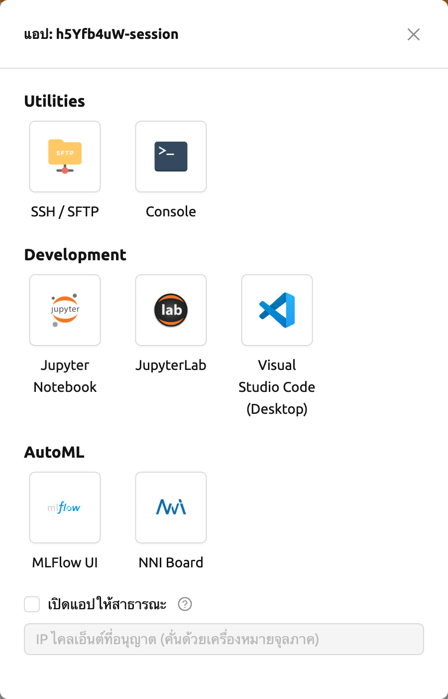

### Recent History

'Session Launcher' page provides a set of options for creating sessions. As of 24.09,
`Recent History` feature has been added to remember information about previously created sessions.

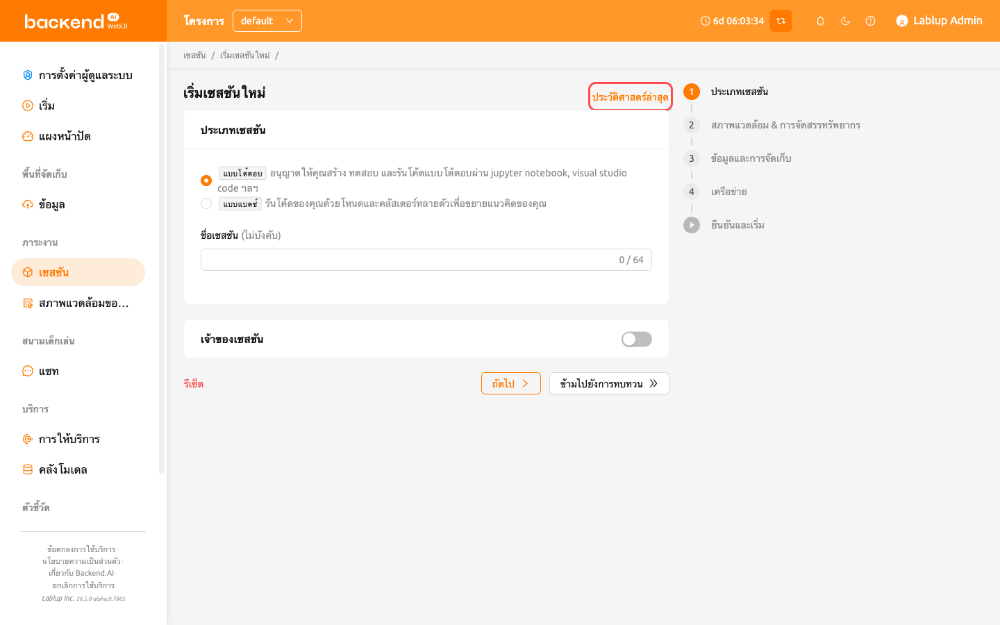

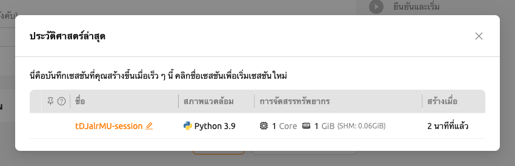

The `Recent History` modal stores information about the five most recently created sessions.
Clicking a session name takes you to the 'Confirm and Launch' page, which is the final step of session creation.
Each item can be renamed or pinned for easier access.

:::note
Superผู้ดูแลระบบs can query all compute session information currently running (or
terminated) in the cluster, and ผู้ใช้s can only view the sessions they have
created.
:::

:::note
Compute session list may not be displayed normally due to intermittent
network connection problems, and etc. This can be solved by refreshing the
browser.
:::

## Session Detail Panel

For detailed information on the session, click the session name in the session list.
The session details panel shows the information of the session, such as the
session ID, ผู้ใช้ ID, status, type, environments, mount information, resource allocation, reserved time,
elapsed time, agent, cluster mode, resource usage including network I/O, and kernel information.

Click the 'Log' button next to the 'Hostname' in 'Kernels' to view the logs of that kernel directly.

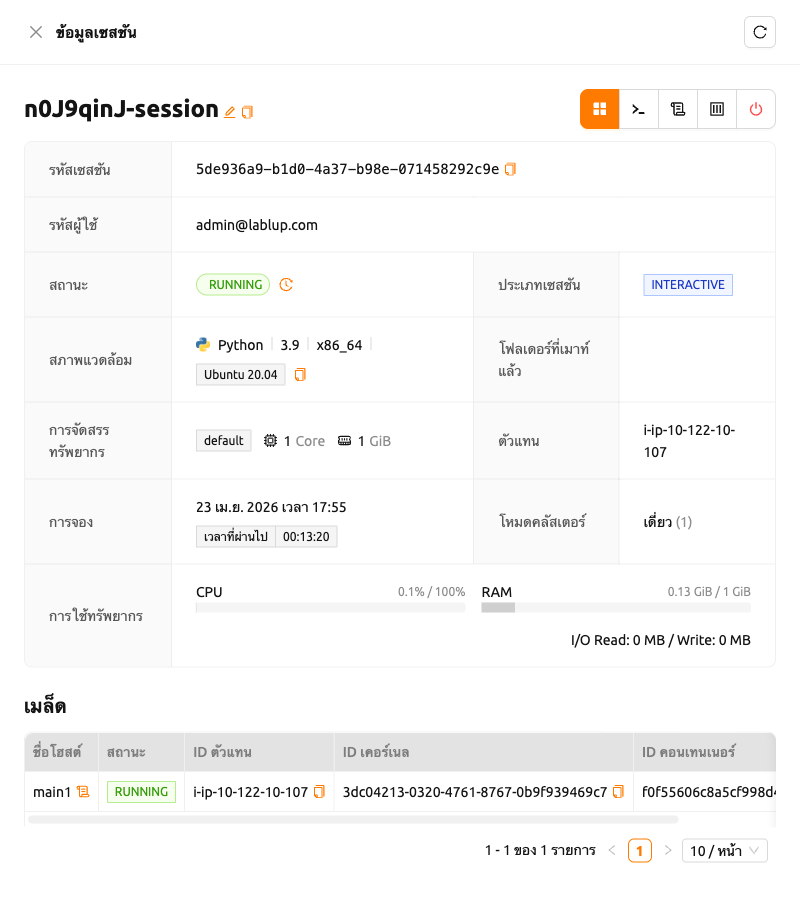

Backend.AI provides additional information for sessions in `PENDING`, `TERMINATED`, or `CANCELLED` states.
Click the 'Info' button to check the details when available.

## ใช้ Jupyter Notebook

Let's look at how to use and manage an already running compute session.
Click the first icon in the upper-right corner of the session detail panel to open the app launcher, which shows
the app services available for that session.

:::note
มีตัวเลือกตรวจสอบสองตัวเลือกใต้ไอคอนแอป การเปิดแอปด้วยแต่ละรายการที่เลือกจะใช้คุณลักษณะต่อไปนี้ตามลำดับ:

* เปิดแอปให้กับสาธารณะ: เปิดแอปให้กับสาธารณะ โดยพื้นฐานแล้ว บริการเว็บเช่น Terminal และ Jupyter Notebook จะไม่สามารถเข้าถึงได้โดยผู้ใช้รายอื่น แม้ว่าผู้ใช้จะทราบ URL ของบริการก็ตาม เนื่องจากถือว่าไม่มีการตรวจสอบสิทธิ์ อย่างไรก็ตาม การตรวจสอบตัวเลือกนี้ทำให้ใครก็ตามที่ทราบ URL ของบริการ (และหมายเลขพอร์ต) สามารถเข้าถึงและใช้งานได้ แน่นอนว่าผู้ใช้ต้องมีเส้นทางเครือข่ายเพื่อเข้าถึงบริการนั้น
* ลองพอร์ตที่ต้องการ: หากไม่เลือกตัวเลือกนี้ หมายเลขพอร์ตสำหรับบริการเว็บจะถูกกำหนดแบบสุ่มจากกลุ่มพอร์ตที่เตรียมไว้ล่วงหน้าโดย Backend.AI หากคุณเลือกจุดนี้และป้อนหมายเลขพอร์ตเฉพาะ หมายเลขพอร์ตที่ป้อนจะถูกลองใช้ก่อน อย่างไรก็ตาม ไม่มีการรับประกันว่าพอร์ตที่ต้องการจะถูกกำหนดเสมอไป เนื่องจากพอร์ตอาจไม่มีอยู่ในกลุ่มพอร์ตเลยหรือบริการอื่นอาจใช้พอร์ตนั้นอยู่แล้ว ในกรณีนี้ หมายเลขพอร์ตจะถูกกำหนดแบบสุ่ม

ขึ้นอยู่กับการตั้งค่าของระบบ ตัวเลือกเหล่านี้อาจไม่แสดงออกมา
:::

ให้คลิกที่ Jupyter Notebook

Pop up windows will show that Jupyter Notebook is running. This
notebook was created inside a running compute session and can be used easily
with the click of a button. Also, there is no need for a separate package installation process because the language environment and
library provided by the computation session can be used as it is. For detailed
instructions on how to use Jupyter Notebook, please refer to the official Jupyter Notebook
documentation.

`id_container file` in the notebook's file explorer, contains a private
SSH key. If necessary, ผู้ใช้s can download it and use it for SSH / SFTP access to
the container.

Click the 'NEW' button at the top right and select the Notebook for Backend.AI,
then the ipynb window appears where ผู้ใช้s can enter their own code.

In this window, ผู้ใช้s can enter and execute any code that they want by using the
environment that session provides. The code is executed on one of the
Backend.AI nodes where the compute session is actually created and there is no
need to configure a separate environment on the local machine.

When window is closed, `Untitled.ipynb` file can be founded in the notebook file explorer.
Note that the files created here are deleted when session is terminated. The way to preserve those files even
after the session is terminated is described in the ข้อมูลและการจัดเก็บ โฟลเดอร์ section.

## ใช้เทอร์มินัลเว็บ

This section will explain how to use the web terminal. Click the
terminal icon(second button) to use the container's ttyd app. A terminal will appear in a new window
and ผู้ใช้s can run shell commands to access the computational session as shown in the following figure.
If familiar with the commands, ผู้ใช้s can easily run various ลินุกซ์ commands. `Untitled.ipynb` file
can be found in Jupyter Notebook, which is listed with the `ls` command. This shows that both apps
are running in the same container environment.

Files created here can also be immediately seen in the Jupyter Notebook as well. Conversely, changes made to files in Jupyter
Notebook can also be checked right from the terminal. This is because they are using the same files in the same compute session.

In addition to this, ผู้ใช้s can use web-based services such as TensorBoard, Jupyter
Lab, etc., depending on the type of environments provided by the compute session.

## บันทึกเซสชันการคำนวณของการค้นหา

Users can view the log of the compute session by clicking the last icon in the
Control panel of the running compute session.

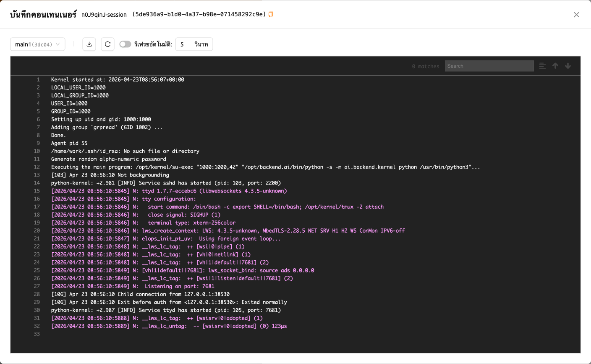

## เปลี่ยนชื่อเซสชันที่กำลังรัน

Name of the active session can be changed. Click the 'Edit' button in the session detail
panel to change the session name.
New session name should also follow the [the authoring rule](#session-naming-rule).

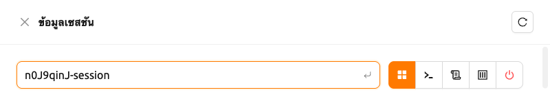

## ลบเซสชันการคอมพิวเตอร์

To terminate a specific session, simply click on the red power button and click
'Terminate' button in the dialog. Since the data in the folder inside the compute
session is deleted as soon as the compute session ends, it is recommended to
move the data to the mounted folder or upload it to the mounted folder from the
beginning.

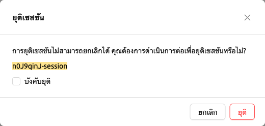

## Idleness checks

Backend.AI รองรับเกณฑ์การไร้กิจกรรม (ความเฉยเมย) สําหรับการเก็บขยะอัตโนมัติของเซสชันการประมวลผลสามประเภท: อายุขัยสูงสุดของเซสชัน, เวลาเงียบสงบของเครือข่าย, และการตรวจสอบการใช้ทรัพยากร.

The criteria for session termination can be found in the 'Idle Checks' section of the session detail panel.

The meaning of idle checkers are as follows, and more detailed explanations can be
found by clicking the information (i) button in the idle checks section.

- อายุการใช้งานเซสชันสูงสุด: บังคับยุติเซสชันหลังจากเวลานี้นับตั้งแต่การสร้าง มาตรการนี้ป้องกันไม่ให้เซสชันทำงานต่อไปไม่มีที่สิ้นสุด
- การหมดเวลาขณะว่างในการเชื่อมต่อเครือข่าย: บังคับยกเลิกเซสชันที่ไม่ได้แลกเปลี่ยนข้อมูลกับผู้ใช้ (เบราว์เซอร์หรือแอปเว็บ) หลังจากเวลานี้ การรับส่งข้อมูลระหว่างผู้ใช้และเซสชันการคอมพิวเตอร์จะเกิดขึ้นอย่างต่อเนื่องเมื่อผู้ใช้โต้ตอบกับแอป เช่น เทอร์มินัลหรือ Jupyter โดยการพิมพ์จากแป้นพิมพ์ การสร้างเซลล์ Jupyter ฯลฯ การสร้างเซลล์ Jupyter ฯลฯ หากไม่มีการโต้ตอบเป็นระยะเวลาหนึ่ง สภาวะการเก็บขยะจะถูกตอบสนอง แม้ว่าจะมีการประมวลผลที่กำลังดำเนินการงานในเซสชันการคอมพิวเตอร์ แต่ก็จะต้องถูกยกเลิกหากไม่มีการโต้ตอบจากผู้ใช้
- Utilization Checker: ทรัพยากรที่ถูกจัดสรรให้กับเซสชันการคอมพิวเตอร์จะถูกเรียกคืนตามการใช้ทรัพยากรเหล่านั้น การตัดสินใจในการลบขึ้นอยู่กับสองปัจจัยดังต่อไปนี้:

  - ระยะเวลาผ่อนผัน: ช่วงเวลาที่ตัวตรวจสอบการใช้งานที่ไม่ได้ใช้งานจะไม่ทำงาน แม้ว่าจะมีการใช้งานต่ำ เซสชันการคอมพิวเตอร์จะไม่ถูกยุติในระยะเวลานี้ อย่างไรก็ตาม เมื่อตัวระยะเวลาผ่อนผันสิ้นสุดลง หากการใช้งานเฉลี่ยยังคงต่ำกว่าค่ากำหนดในช่วงเวลารอที่ตั้งไว้ ระบบสามารถยุติเซสชันได้ตลอดเวลา ระยะเวลาผ่อนผันเป็นช่วงเวลาที่รับประกันเท่านั้นที่การยุติจะไม่เกิดขึ้น มาตรการนี้มีจุดประสงค์หลักเพื่อการจัดการทรัพยากร GPU ที่มีการใช้งานต่ำอย่างมีประสิทธิภาพ
  - Utilization Threshold: If the resource utilization of a compute session does
    not exceed the set threshold for a certain duration (idle timeout), that
    session will be automatically terminated. For example, if the accelerator
    utilization threshold is set to 1%, and a compute session shows a
    utilization of less than 1% over the idle timeout, it becomes a target for
    termination. Resources with empty values are excluded from the garbage
    collection criteria.

:::note
หลังจากช่วงเวลาให้อภัย เซสชันสามารถถูกยกเลิกได้ทุกเมื่อหากการใช้งานยังคงต่ำ การใช้ทรัพยากรอย่างสั้นๆ จะไม่ขยายช่วงเวลาให้อภัย จะพิจารณาเฉพาะการใช้งานเฉลี่ยในช่วงเวลาไม่ใช้งานล่าสุดเท่านั้น
:::

Hovering the mouse over the Utilization Checker will display a tooltip with the
utilization and threshold values. The text color changes to yellow and then red
as the current utilization approaches the threshold (indicating low resource
utilization).

:::note
ขึ้นอยู่กับการตั้งค่าของสภาพแวดล้อม ตัวตรวจสอบที่ไม่ทำงานและประเภทของทรัพยากรในการตรวจสอบการใช้งานอาจแตกต่างกันได้
:::

## วิธีการเพิ่มตัวแปรสภาพแวดล้อมก่อนที่จะสร้างเซสชัน

To give more convenient workspace for ผู้ใช้s, Backend.AI supports environment variable setting
in session launching. In this feature, ผู้ใช้s can add any envs such as `PATH` by filling out
variable name and value in environment configuration dialog.

To add environment variable, simply click '+ Add environment variables' button of the Variable.
Also, you can remove the variable by clicking '-' button of the row that you want to get rid of.

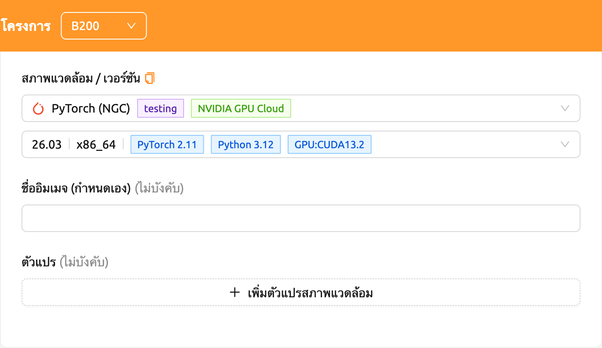

You can write down variable name and value in the same line of the input fields.

## วิธีการเพิ่มพอร์ตที่เปิดก่อนที่จะสร้างเซสชัน

Backend.AI รองรับการตั้งค่าพอร์ตที่เปิดใช้งานล่วงหน้าเมื่อเริ่มต้นคอนเทนเนอร์ เมื่อใช้ฟีเจอร์นี้ จะไม่จำเป็นต้องสร้างอิมเมจแยกต่างหากเมื่อคุณต้องการเปิดเผยพอร์ตการบริการ

เพื่อเพิ่มพอร์ตที่เปิดล่วงหน้า เพียงป้อนค่าหลายค่าโดยแยกด้วยเครื่องหมายจุลภาค (,) หรือช่องว่าง

In the forth page of session creation page, ผู้ใช้s can add, update and delete written preopen ports. To see more detail
information, please click 'Help (?)'' button.

Users can put port numbers in between 1024 ~ 65535, to the input fields. Then, press 'Enter'. Users can specify multiple ports, separated by commas (,).
Users can check the configured preopen ports in the session app launcher.

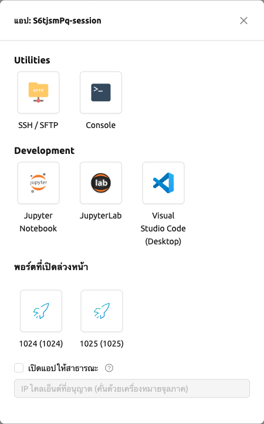

:::note
พอร์ตที่เปิดล่วงหน้าคือ **พอร์ตภายในภาชนะ** ดังนั้น ต่างจากแอปอื่น เมื่อผู้ใช้คลิกพอร์ตที่เปิดล่วงหน้าในตัวเปิดแอปเซสชัน จะมีหน้าว่างปรากฏขึ้น กรุณาผูกเซิร์ฟเวอร์กับพอร์ตที่เกี่ยวข้องก่อนใช้งาน
:::

## บันทึกการทำธุรกรรมการเซสชัน

Backend.AI supports \"Convert Session to Image\" feature from 24.03. Committing a `RUNNING` session will save the
current state of the session as a new image. Click the 'Commit' button (the fourth icon) in the session detail panel
to open a dialog displaying the session information. After entering the session name, ผู้ใช้s can convert the session to
a new image. The session name must be 4 to 32 characters long and can only contain alphanumeric letters, hyphens (`-`),
or underscores (`_`).

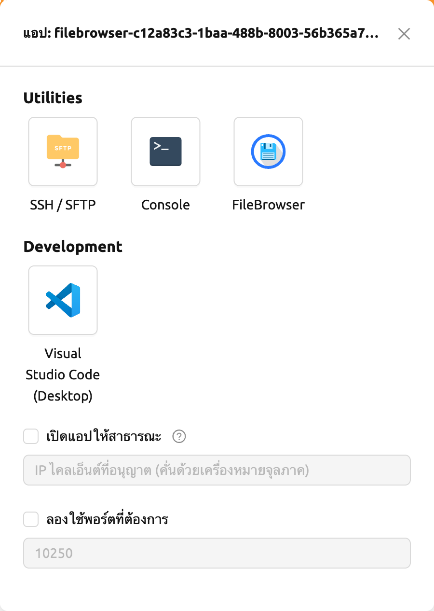

After filling out session name in the input field, click the 'PUSH SESSION TO CUSTOMIZED IMAGE' button.
The customized image created in this way can be used in future session creations. However, directories
mounted to the container for image commits are considered external resources and are not included in
the final image. Remember that `/home/work` is a mount folder (scratch directory), so it is not included.

:::note
Currently, Backend.AI supports "Convert Session to Image" only when the session is in `INTERACTIVE` mode.
To prevent unexpected error, ผู้ใช้s may not be able to terminate the session during committing process.
To stop the ongoing process, check the session, and force-terminate it.
:::

:::note
The number of times to "Convert Session to Image" may be limited by the ผู้ใช้ resource policy. In this case,
[remove the existing customized image](#delete-customized-image) and try again. If this does not resolves
the problem, please contact the ผู้ดูแลระบบistrator.
:::

## การใช้ภาพที่ถูกแปลงจากเซสชันที่กำลังดำเนินอยู่

Converting an ongoing session into an image allows ผู้ใช้s to select this image from the environments in the session launcher
when creating a new session. This image is not exposed to other ผู้ใช้s and is useful for continuing to use the current session
state as is. The converted image is tagged with `Customized<session name>`.

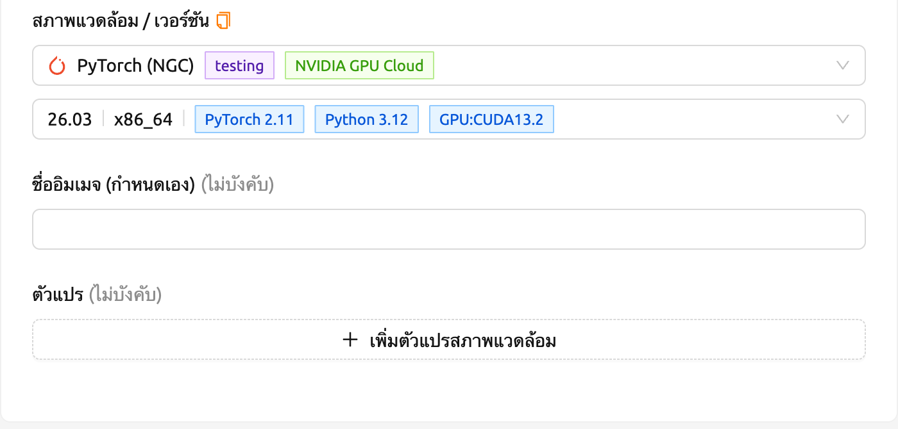

ในการป้อนชื่อสภาพแวดล้อมด้วยตนเองเพื่อสร้างเซสชันในอนาคต โปรดคลิกที่ไอคอนคัดลอก

## การใช้งานเทอร์มินัลเว็บขั้นสูง

The web-based terminal internally embeds a utility called
[tmux](https://github.com/tmux/tmux/wiki). tmux is a terminal multiplexer that
supports to open multiple shell windows within a single shell, so as to allow
multiple programs to run in foreground simultaneously. If ผู้ใช้s want to take
advantage of more powerful tmux features, they can refer to the official tmux
documentation and other usage examples on the Internet.

ที่นี่เรากำลังแนะนำฟีเจอร์ที่ง่ายแต่มีประโยชน์บางอย่าง

### คัดลอกเนื้อหาของเทอร์มินัล

tmux offers a number of useful features, but it's a bit confusing for first-time
ผู้ใช้s. In particular, tmux has its own clipboard buffer, so when copying the
contents of the terminal, ผู้ใช้s can suffer from the fact that it can be pasted
only within tmux by default. Furthermore, it is difficult to expose ผู้ใช้
system's clipboard to tmux inside web browser, so the terminal
contents cannot be copied and pasted to other programs of ผู้ใช้'s computer. The
so-called `Ctrl-C` / `Ctrl-V` is not working with tmux.

If copy and paste of terminal contents is needed to system's clipboard,
ผู้ใช้s can temporarily turn off tmux's mouse support. First, press `Ctrl-B` key
to enter tmux control mode. Then type `:set -g mouse off` and press `Enter`
(note to type the first colon as well). Users can check what they are
typing in the status bar at the bottom of the screen. Then drag the desired text
from the terminal with the mouse and press the `Ctrl-C` or `Cmd-C` (in แมค)
to copy them to the clipboard of the ผู้ใช้'s computer.

With mouse support turned off, scrolling through the mouse wheel is not supprted, to see
the contents of the previous page from the terminal. In this case, ผู้ใช้s can turn
on mouse support. Press `Ctrl-B`, and this time, type `:set -g mouse
on`. Now scrolling through mouse wheelis available to see the contents of the previous page.

If you remember `:set -g mouse off` or `:set -g mouse on` after `Ctrl-B`,
you can use the web terminal more conveniently.

:::note
`Ctrl-B` is tmux's default control mode key. If ผู้ใช้s set another control key
by modifying `.tmux.conf` in ผู้ใช้ home directory, they should press the set
key combination instead of `Ctrl-B`.
:::

:::note
ในสภาพแวดล้อม หน้าต่าง ให้ดูที่ทางลัดต่อไปนี้

* Copy: Hold down `Shift`, right-click and drag
* Paste: Press `Ctrl-Shift-V`
:::

### ตรวจสอบประวัติเทอร์มินัลโดยใช้แป้นพิมพ์

There is also a way to copy the terminal contents and check the previous
contents of the terminal simultaneously. It is to check the previous contents
using the keyboard. Again, click `Ctrl-B` first, and then press the `Page
Up` and/or `Page Down` keys. To exit search mode, just press the `q`
key. With this method, ผู้ใช้s can check the contents of the terminal history even
when the mouse support is turned off.

### สร้างเชลล์หลายตัว

The main advantage of tmux is to launch and use multiple shells in one
terminal window. Pressing `Ctrl-B` key and `c`. will show the new shell environment.
Previous window is not visible at this point, but is not terminated.
Press `Ctrl-B` and `w`. List of shells currently open on tmux is shown.
Shell starting with `0:` is the initial shell environment, and the shell
starting with `1:` is the one just created. Users can move between shells
using the up/down keys. Place the cursor on the shell `0:` and press the Enter
key to select it.

In this way, ผู้ใช้s can use multiple shell environments within a web terminal. To exit or terminate the
current shell, just enter `exit` command or press `Ctrl-B x` key and then
type `y`.

โดยสรุป:

- `Ctrl-B c`: create a new tmux shell
- `Ctrl-B w`: query current tmux shells and move around among them
- `exit` or `Ctrl-B x`: terminate the current shell

Combining the above commands allows ผู้ใช้s to perform various tasks simultaneously
on multiple shells.