# เซสชันการคำนวณ

หน้าที่เข้าชมบ่อยที่สุดใน Backend.AI WebUI คือหน้า 'เซสชัน' และหน้า 'ข้อมูล'
เอกสารนี้จะครอบคลุมวิธีการค้นหาและสร้างเซสชันการคำนวณที่ใช้คอนเทนเนอร์ รวมถึงการใช้งานแอปพลิเคชันเว็บต่าง ๆ ในหน้า 'เซสชัน'

## เริ่มเซสชันใหม่

หลังจากเข้าสู่ระบบด้วยบัญชีผู้ใช้ ให้คลิก 'เซสชัน' บนแถบด้านข้างซ้าย
หน้า 'เซสชัน' ช่วยให้คุณสามารถเริ่มเซสชันใหม่ หรือใช้งานและจัดการเซสชันที่กำลังทำงานอยู่ได้

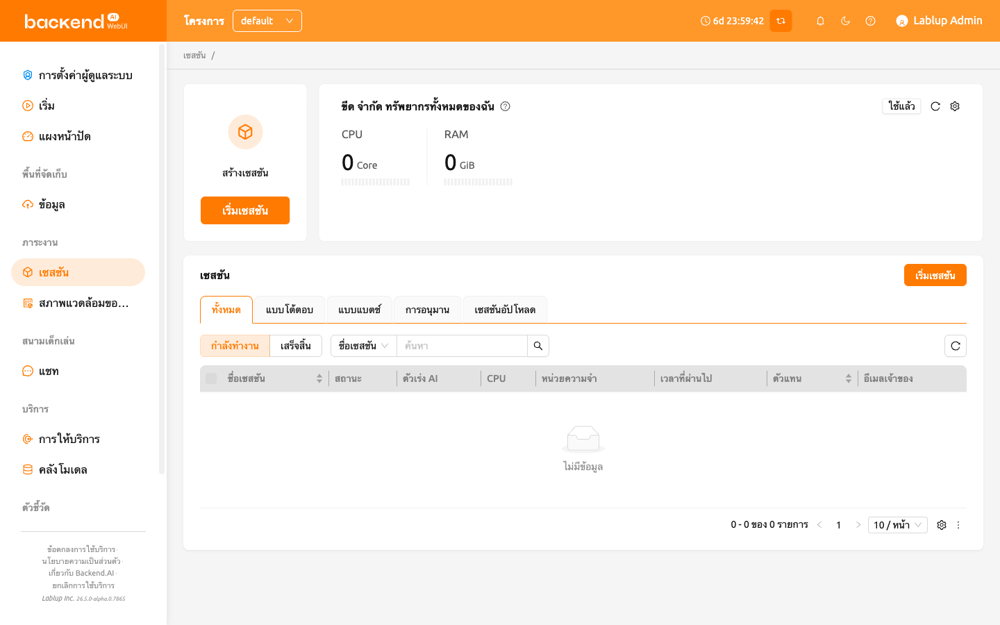

คลิกปุ่ม 'START' เพื่อเริ่มเซสชันการคำนวณใหม่

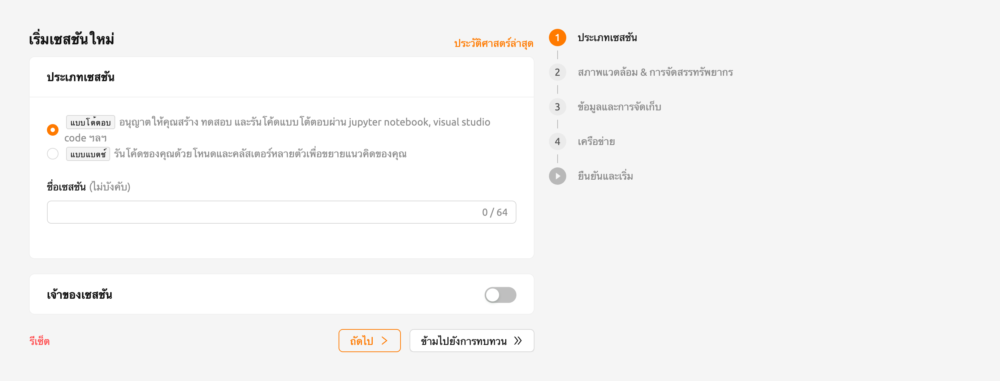

### ประเภทเซสชัน

ในหน้าแรก ผู้ใช้สามารถเลือกประเภทของเซสชันได้ ไม่ว่าจะเป็น 'interactive' หรือ 'batch'
หากจำเป็น สามารถตั้งชื่อของเซสชันได้ด้วย (เป็นตัวเลือก)

- ประเภทเซสชัน: กำหนดประเภทของเซสชัน มีเซสชันสองประเภทที่แตกต่างกัน ได้แก่ \"Interactive\" และ \"Batch\"
  ข้อแตกต่างหลักระหว่างสองประเภทมีดังต่อไปนี้:

  - เซสชันการคำนวณแบบโต้ตอบ (Interactive)

    - เป็นประเภทที่ได้รับการสนับสนุนมาตั้งแต่ Backend.AI เวอร์ชันแรก
    - เซสชันการคำนวณถูกใช้งานในลักษณะที่ผู้ใช้มีปฏิสัมพันธ์หลังจากสร้างเซสชันโดยไม่ต้องระบุสคริปต์หรือคำสั่งการดำเนินการที่กำหนดไว้ล่วงหน้า
    - เซสชันจะไม่ถูกยกเลิกโดยอัตโนมัติ เว้นแต่ผู้ใช้จะทำการทำลายเซสชันอย่างชัดเจนหรือผู้ดูแลระบบตั้งค่าโปรแกรมทำความสะอาดเซสชัน

  - เซสชันการคำนวณแบบชุด (Batch)

    - ประเภทเซสชันนี้รองรับผ่าน GUI ตั้งแต่ Backend.AI 22.03 (CLI รองรับเซสชันประเภท batch มาก่อน 22.03)
    - กำหนดสคริปต์ล่วงหน้าที่จะถูกดำเนินการเมื่อเซสชันการคำนวณพร้อมใช้งาน
    - เซสชันนี้จะดำเนินการสคริปต์ทันทีที่เซสชันการคำนวณพร้อมใช้งาน จากนั้นจะยุติเซสชันโดยอัตโนมัติทันทีที่การดำเนินการเสร็จสิ้น
      ซึ่งจะใช้ทรัพยากรของฟาร์มเซิร์ฟเวอร์ได้อย่างมีประสิทธิภาพและยืดหยุ่นหากผู้ใช้สามารถเขียนสคริปต์การดำเนินการล่วงหน้าหรือกำลังสร้างไปป์ไลน์ของภาระงานได้
    - ผู้ใช้สามารถตั้งเวลาเริ่มต้นของเซสชันการคำนวณแบบ batch ได้
      อย่างไรก็ตาม โปรดจำไว้ว่าฟีเจอร์นี้ไม่รับประกันว่าเซสชันจะเริ่มต้นตามเวลาที่ลงทะเบียนไว้
      เซสชันอาจยังคงอยู่ในสถานะ 'PENDING' เนื่องจากทรัพยากรไม่เพียงพอ เป็นต้น แต่จะรับประกันว่าเซสชันจะไม่ทำงานก่อนเวลาเริ่มต้น
    - ผู้ใช้ยังสามารถตั้งค่า 'Timeout Duration' ของเซสชันการคำนวณแบบ batch ได้
      เมื่อผู้ใช้ตั้งค่าระยะเวลาหมดเวลา เซสชันจะยุติโดยอัตโนมัติหากเกินเวลาที่กำหนด

    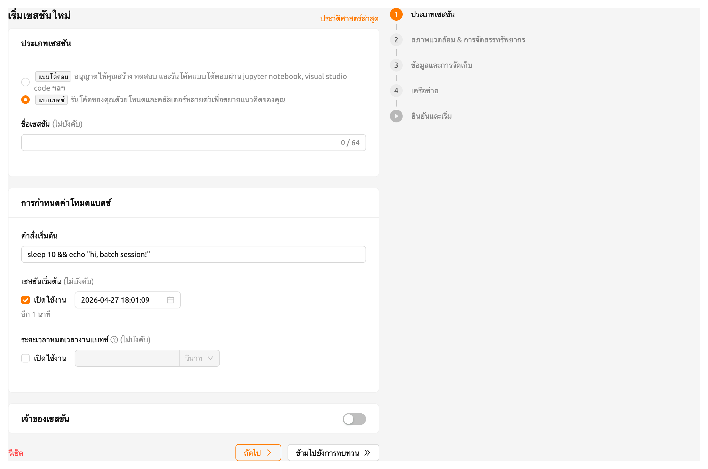

- ชื่อเซสชัน: ผู้ใช้สามารถระบุชื่อของเซสชันการคำนวณที่จะสร้างได้
  หากตั้งค่าไว้ ชื่อนี้จะปรากฏในข้อมูลเซสชัน ทำให้สามารถแยกแยะระหว่างเซสชันการคำนวณหลายรายการได้
  หากไม่ได้ระบุ ระบบจะกำหนดคำแบบสุ่มให้โดยอัตโนมัติ ชื่อเซสชันยอมรับเฉพาะตัวอักษรและตัวเลขที่มีความยาว 4 ถึง 64 ตัวอักษรโดยไม่มีช่องว่าง

หากผู้ใช้สร้างเซสชันด้วยบัญชี `super admin` หรือ `admin`
ผู้ใช้สามารถมอบหมายเจ้าของเซสชันเพิ่มเติมได้ หากคุณเปิดใช้งานสวิตช์สลับ
จะมีช่องอีเมลของผู้ใช้ปรากฏขึ้น

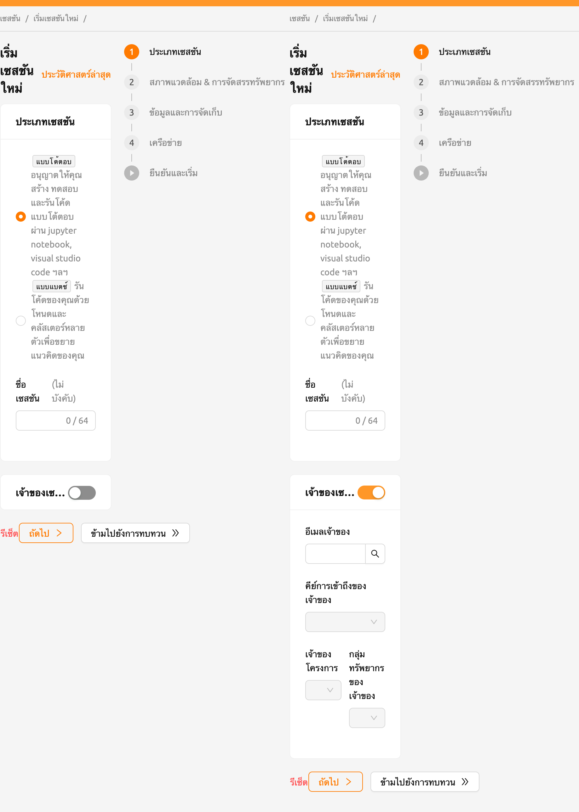

ป้อนอีเมลของผู้ใช้ที่คุณต้องการมอบหมายเซสชันให้
คลิกปุ่ม 'search' และคีย์การเข้าถึงของผู้ใช้จะถูกลงทะเบียนโดยอัตโนมัติ
คุณยังสามารถเลือกโปรเจกต์และกลุ่มทรัพยากรได้อีกด้วย

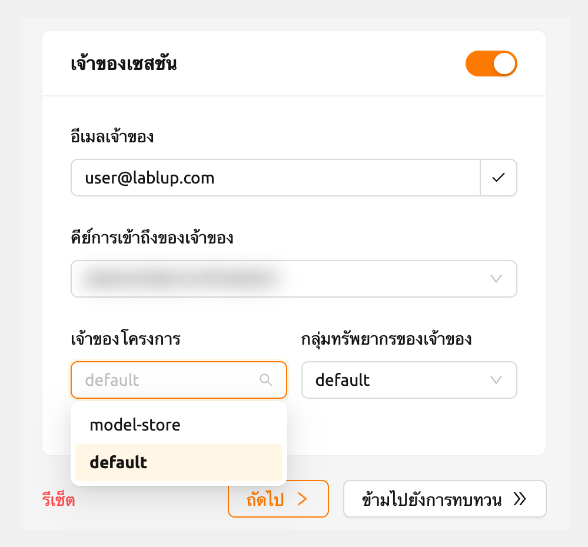

### สภาพแวดล้อมและการจัดสรรทรัพยากร

คลิกปุ่ม 'Next' ที่ด้านล่าง หรือเมนู 'Environments & Resource allocation' ทางด้านขวา
เพื่อไปยังหน้าถัดไป หากคุณต้องการสร้างเซสชันโดยไม่มีการตั้งค่าเพิ่มเติม
ให้กดปุ่ม 'Skip to review' ในกรณีนี้ การตั้งค่าในหน้าอื่น ๆ
จะใช้ค่าเริ่มต้นทั้งหมด

  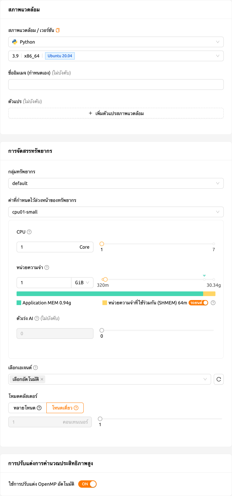

### สภาพแวดล้อม

สำหรับคำอธิบายโดยละเอียดของแต่ละรายการที่สามารถตั้งค่าได้ในหน้าที่สอง โปรดดูที่รายการต่อไปนี้:

- สภาพแวดล้อม (Environments): ผู้ใช้สามารถเลือกสภาพแวดล้อมพื้นฐานสำหรับเซสชันการคำนวณ เช่น
  TensorFlow, PyTorch, C++ เป็นต้น เซสชันการคำนวณจะถูกรวมเข้ากับไลบรารีสภาพแวดล้อมพื้นฐานโดยอัตโนมัติ
  หากผู้ใช้เลือกสภาพแวดล้อมอื่น แพ็กเกจที่เกี่ยวข้องจะถูกติดตั้งตามค่าเริ่มต้น
- เวอร์ชัน (Version): ผู้ใช้สามารถระบุเวอร์ชันของสภาพแวดล้อมได้
  มีหลายเวอร์ชันในสภาพแวดล้อมเดียว ตัวอย่างเช่น TensorFlow มีหลายเวอร์ชัน เช่น 1.15, 2.3 เป็นต้น
- ชื่ออิมเมจ (Image Name): ผู้ใช้สามารถระบุชื่อของอิมเมจที่จะใช้สำหรับเซสชันการคำนวณได้
  การกำหนดค่านี้อาจไม่สามารถใช้งานได้ขึ้นอยู่กับการตั้งค่าสภาพแวดล้อม
- ตั้งค่าตัวแปรสภาพแวดล้อม (Set Environment Variable): เพื่อให้พื้นที่ทำงานที่สะดวกยิ่งขึ้นสำหรับผู้ใช้ Backend.AI รองรับการตั้งค่าตัวแปรสภาพแวดล้อม
  ในการเริ่มต้นเซสชัน ในฟีเจอร์นี้ ผู้ใช้สามารถเพิ่มตัวแปรสภาพแวดล้อมใด ๆ เช่น `PATH` โดยการกรอก
  ชื่อตัวแปรและค่าในกล่องโต้ตอบการกำหนดค่าสภาพแวดล้อม

  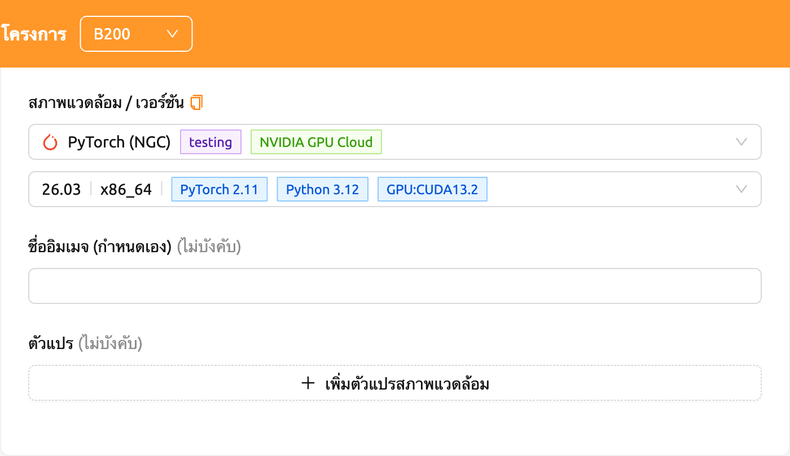

### การจัดสรรทรัพยากร

- กลุ่มทรัพยากร (Resource Group): ระบุกลุ่มทรัพยากรที่จะสร้างเซสชันการคำนวณ
  กลุ่มทรัพยากรเป็นหน่วยที่จัดกลุ่มเซิร์ฟเวอร์โฮสต์ที่ผู้ใช้แต่ละคนสามารถเข้าถึงได้
  โดยทั่วไป เซิร์ฟเวอร์ในกลุ่มทรัพยากรจะมีทรัพยากร GPU ประเภทเดียวกัน
  ผู้ดูแลระบบสามารถจำแนกเซิร์ฟเวอร์ตามเกณฑ์ใด ๆ จัดกลุ่มเป็นกลุ่มทรัพยากรหนึ่งหรือหลายกลุ่ม
  และกำหนดค่าว่าผู้ใช้สามารถใช้กลุ่มทรัพยากรใดได้บ้าง ผู้ใช้สามารถเริ่มเซสชันการคำนวณได้เฉพาะบนเซิร์ฟเวอร์ในกลุ่มทรัพยากร
  ที่ผู้ดูแลระบบอนุญาตเท่านั้น หากได้รับอนุญาตหลายกลุ่มทรัพยากร ผู้ใช้สามารถเลือกกลุ่มใดก็ได้ที่ต้องการ
  อย่างไรก็ตาม ไม่สามารถเปลี่ยนแปลงได้เมื่อระบบอนุญาตให้ตั้งค่าเพียงกลุ่มเดียว
- Resource Presets: เทมเพลตเหล่านี้มีชุดทรัพยากรที่กำหนดไว้ล่วงหน้า เช่น
  CPU หน่วยความจำ และ GPU ที่จะจัดสรรให้กับเซสชันการคำนวณ ผู้ดูแลระบบสามารถ
  กำหนดการตั้งค่าทรัพยากรที่ใช้บ่อยไว้ล่วงหน้าได้ โดยการปรับค่าตัวเลข
  หรือเลื่อนแถบเลื่อน ผู้ใช้สามารถจัดสรรทรัพยากรตามจำนวนที่ต้องการได้

  

  ความหมายของแต่ละรายการมีดังนี้
  การคลิกปุ่ม 'Help (?)' จะให้ข้อมูลเพิ่มเติมด้วย

  * CPU: CPU ทำการคำนวณเลขคณิต ตรรกะ การควบคุม และการดำเนินการอินพุต/เอาต์พุต
    (I/O) ขั้นพื้นฐานตามคำสั่งที่ระบุ โดยทั่วไปแล้ว CPU ที่มากขึ้นจะเป็นประโยชน์สำหรับภาระงานการคำนวณสมรรถนะสูง
    แต่เพื่อให้ได้ประโยชน์จาก CPU ที่มากขึ้น โค้ดโปรแกรมต้องเขียนให้สามารถรองรับ CPU หลายตัวได้
  * หน่วยความจำ (Memory): หน่วยความจำคอมพิวเตอร์เป็นพื้นที่จัดเก็บข้อมูลชั่วคราว โดยเก็บข้อมูล
    และคำสั่งที่ Central Processing Unit (CPU) ต้องการ เมื่อใช้ GPU ในภาระงาน
    การเรียนรู้ของเครื่อง จำเป็นต้องจัดสรรหน่วยความจำอย่างน้อยสองเท่าของ
    หน่วยความจำ GPU มิฉะนั้น เวลาว่างของ GPU จะเพิ่มขึ้น ส่งผลให้ประสิทธิภาพลดลง
  * หน่วยความจำที่แชร์: ปริมาณหน่วยความจำที่แชร์ในหน่วย GB ที่จะจัดสรรสำหรับเซสชันการคำนวณ หน่วยความจำที่แชร์จะใช้บางส่วนของหน่วยความจำที่ตั้งค่าใน RAM ดังนั้นจึงไม่สามารถมากกว่าปริมาณที่ระบุใน RAM ได้
  * AI Accelerator: AI accelerator (GPU หรือ NPU) เหมาะสำหรับการคำนวณเมทริกซ์/เวกเตอร์ที่เกี่ยวข้องกับการเรียนรู้ของเครื่อง AI accelerator เร่งความเร็วอัลกอริธึมการฝึกอบรม / การอนุมานโดยมาก ทำให้เวลาในการประมวลผลลดลงจากหลายสัปดาห์เหลือไม่กี่วัน
  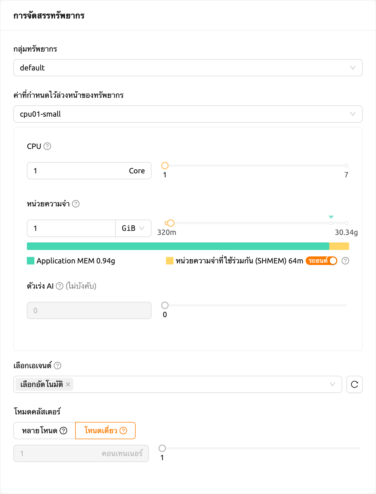

  :::note
  ตัวเลือก **จำนวนเซสชัน** ไม่ได้ถูกตั้งค่าในฟอร์มนี้อีกต่อไป หากต้องการเริ่ม
  หลายเซสชันด้วยการตั้งค่าเดียวกันในคราวเดียว ให้ใช้เมนูดรอปดาวน์ของปุ่มเริ่ม
  ในขั้นตอน **ยืนยันและเปิดใช้งาน** ดูรายละเอียดได้ที่ส่วน
  [ยืนยันและเปิดใช้งาน](#confirm-and-launch)
  :::

  * เลือกเอเจนต์ (Select Agent): เลือกเอเจนต์ที่จะมอบหมายให้ โดยค่าเริ่มต้น เอเจนต์จะถูกเลือกโดยอัตโนมัติ
    โดยตัวจัดตาราง ตัวเลือกเอเจนต์จะแสดงปริมาณทรัพยากรที่ใช้งานได้จริงสำหรับแต่ละเอเจนต์
    ปัจจุบัน ฟีเจอร์นี้รองรับเฉพาะในสภาพแวดล้อมโหนดเดียว คอนเทนเนอร์เดียวเท่านั้น
  * โหมดคลัสเตอร์ (Cluster mode): โหมดคลัสเตอร์ช่วยให้ผู้ใช้สามารถสร้าง
    เซสชันการคำนวณหลายรายการพร้อมกันได้ สำหรับข้อมูลเพิ่มเติม โปรดดูที่
    [ภาพรวมของเซสชันการคำนวณแบบคลัสเตอร์ของ Backend.AI](#backendai-cluster-compute-session)

:::note
ฟีเจอร์ Agent Select อาจไม่สามารถใช้งานได้ขึ้นอยู่กับสภาพแวดล้อมของเซิร์ฟเวอร์
:::

- การปรับแต่งการคำนวณสมรรถนะสูง (High-Performance Computing Optimizations): Backend.AI ให้การกำหนดค่า
  ที่เกี่ยวข้องกับการปรับแต่ง HPC

  Backend.AI มี UI การกำหนดค่าสำหรับตัวแปรควบคุมภายในใน `nthreads-var`
  Backend.AI ตั้งค่านี้ให้เท่ากับจำนวนแกน CPU ของเซสชันโดยค่าเริ่มต้น
  ซึ่งมีผลในการเร่งความเร็วภาระงานการคำนวณสมรรถนะสูงทั่วไป
  อย่างไรก็ตาม สำหรับภาระงานแบบหลายเธรดบางประเภท มีการใช้กระบวนการหลายกระบวนการที่ใช้ OpenMP พร้อมกัน
  ส่งผลให้มีจำนวนเธรดที่มากผิดปกติและประสิทธิภาพลดลงอย่างมาก
  เพื่อแก้ไขปัญหานี้ การตั้งค่าจำนวนเธรดเป็น 1 หรือ 2 จะช่วยแก้ไขได้

### ข้อมูลและการจัดเก็บ

คลิกปุ่ม 'Next' ที่ด้านล่าง หรือเมนู 'ข้อมูลและการจัดเก็บ' ทางด้านขวาเพื่อไปยังหน้าถัดไป

เมื่อเซสชันการคำนวณถูกทำลาย การลบข้อมูลจะถูกตั้งค่าเป็นค่าเริ่มต้น
อย่างไรก็ตาม ข้อมูลที่จัดเก็บในโฟลเดอร์ที่ถูกเมานต์จะยังคงอยู่
ข้อมูลในโฟลเดอร์เหล่านั้นยังสามารถนำกลับมาใช้ใหม่ได้โดยการเมานต์เมื่อสร้างเซสชันการคำนวณใหม่
สำหรับข้อมูลเพิ่มเติมเกี่ยวกับวิธีการเมานต์โฟลเดอร์และเรียกใช้เซสชันการคำนวณ โปรดดูที่
[การเมานต์โฟลเดอร์ไปยังเซสชันการคำนวณ](#session-mounts)

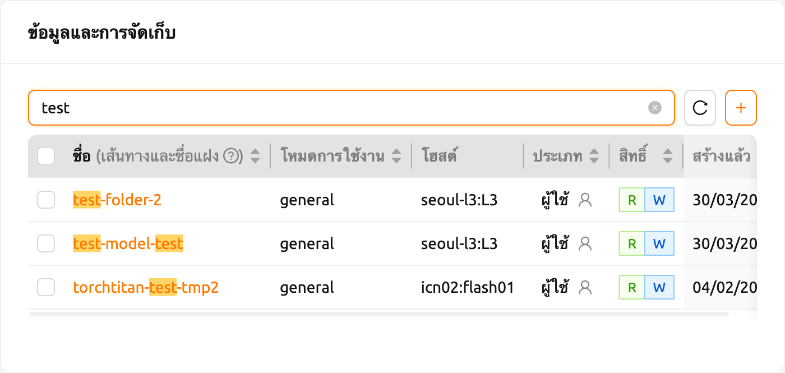

ผู้ใช้สามารถระบุโฟลเดอร์ข้อมูลที่จะเมานต์ในเซสชันการคำนวณได้
สามารถใช้ตัวสำรวจโฟลเดอร์ได้โดยการคลิกที่ชื่อโฟลเดอร์ สำหรับข้อมูลเพิ่มเติม
โปรดดูที่ส่วน [สำรวจโฟลเดอร์](#explore-folder)

สามารถสร้างโฟลเดอร์ใหม่ได้โดยการคลิกปุ่ม '+' ถัดจากช่องค้นหา
เมื่อสร้างโฟลเดอร์ใหม่ โฟลเดอร์นั้นจะถูกเลือกเป็นโฟลเดอร์ที่จะเมานต์โดยอัตโนมัติ
สำหรับข้อมูลเพิ่มเติม โปรดดูที่ส่วน [สร้างโฟลเดอร์จัดเก็บ](#create-storage-folder)

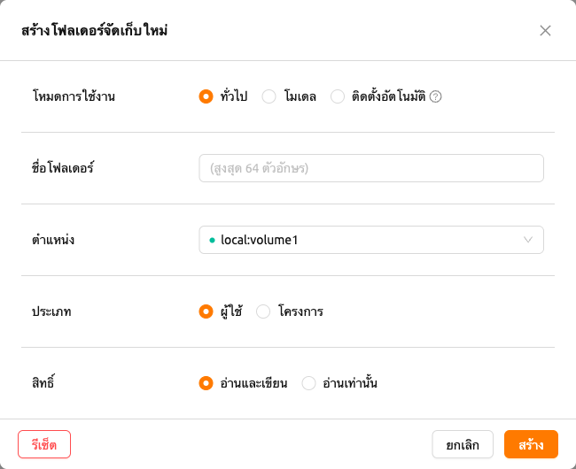

### เครือข่าย

คลิกปุ่ม 'Next' ที่ด้านล่าง หรือเมนู 'Network' ทางด้านขวาเพื่อไปยังหน้าถัดไป
ในหน้านี้ สามารถทำการกำหนดค่าเครือข่าย เช่น Preopen Ports ได้

- ตั้งค่าพอร์ตที่เปิดล่วงหน้า (Set Preopen Ports): จัดเตรียมอินเทอร์เฟซสำหรับผู้ใช้ในการตั้งค่าพอร์ตที่เปิดล่วงหน้า
  ในเซสชันการคำนวณ ดูที่ [วิธีเพิ่มพอร์ตที่เปิดล่วงหน้าก่อนสร้างเซสชัน](#set-preopen-ports) สำหรับข้อมูลเพิ่มเติม

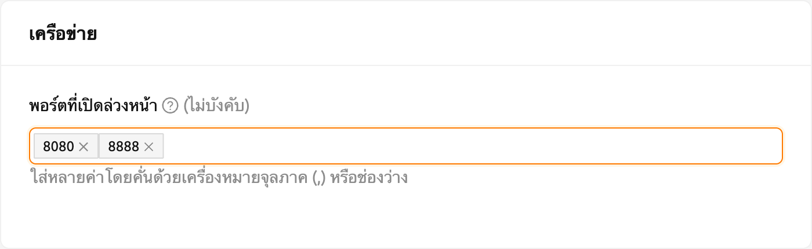

### ยืนยันและเปิดใช้งาน

เมื่อคุณตั้งค่าเครือข่ายเสร็จแล้ว ให้คลิกปุ่ม 'Next' ที่ด้านล่าง หรือ
ปุ่ม 'Confirm and Launch' ทางด้านขวาเพื่อไปยังหน้าสุดท้าย

ในหน้าสุดท้าย ผู้ใช้สามารถดูข้อมูลของเซสชันที่จะสร้างได้
เช่น สภาพแวดล้อม ทรัพยากรที่จัดสรร ข้อมูลการเมานต์
ตัวแปรสภาพแวดล้อมที่ตั้งค่าไว้ในหน้าก่อนหน้า พอร์ตที่เปิดล่วงหน้า เป็นต้น
เมื่อตรวจสอบการตั้งค่าแล้ว ผู้ใช้สามารถเริ่มเซสชันได้โดยคลิกปุ่ม 'Launch'
คลิกปุ่ม 'Edit' ที่อยู่มุมขวาบนของแต่ละการ์ดเพื่อไปยังหน้าที่เกี่ยวข้อง

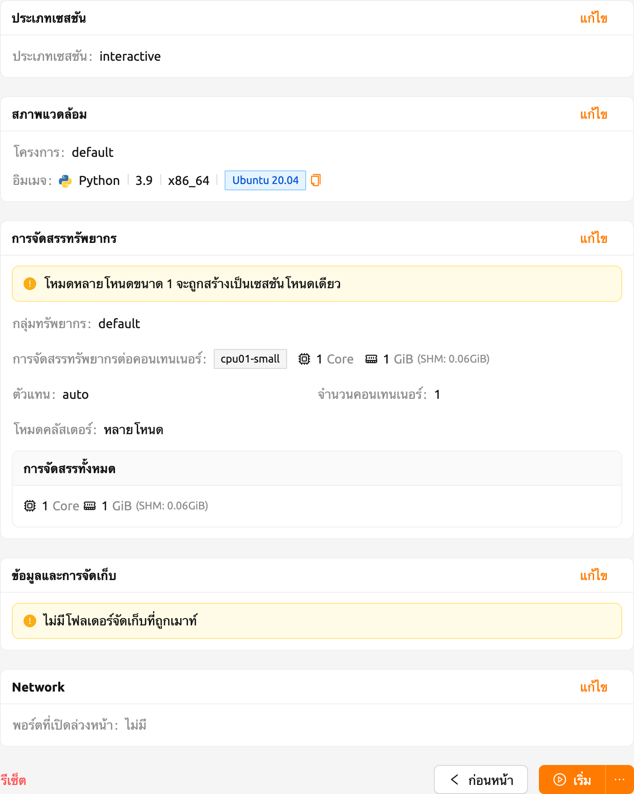

หากต้องการเริ่มหลายเซสชันพร้อมกันด้วยการตั้งค่าเดียวกัน ให้คลิกไอคอนเพิ่มเติม (`...`)
ถัดจากปุ่ม 'Launch' เพื่อเปิดเมนูดรอปดาวน์ แล้วเลือก **เริ่มหลายเซสชัน**
กล่องโต้ตอบจะปรากฏขึ้นเพื่อให้คุณกำหนด **จำนวนเซสชัน** ที่จะสร้าง โดยแต่ละเซสชัน
ถูกสร้างขึ้นอย่างอิสระด้วยทรัพยากรที่แสดงในฟอร์ม การคลิกปุ่ม 'Launch' เพียงครั้งเดียว
จะเริ่มเซสชันเพียงหนึ่งเซสชันตามค่าเริ่มต้น

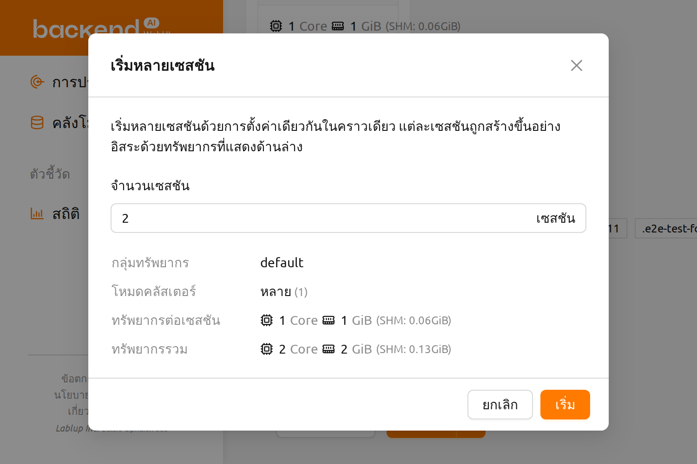
<!-- TODO: Capture screenshot of the start button dropdown showing "เริ่มหลายเซสชัน" -->

:::note
การเปิดเซสชันพร้อมกันถูกจำกัดโดยระบบ หากจำนวนรวมที่ขอเกินโควตาเซสชันที่เหลืออยู่
จะมีคำเตือนปรากฏขึ้นและบางเซสชันอาจถูกจัดคิวจนกว่าจะมีทรัพยากรพร้อมใช้งาน
:::

หากมีปัญหากับการตั้งค่า จะมีข้อความแสดงข้อผิดพลาดปรากฏขึ้นดังต่อไปนี้
ผู้ใช้สามารถแก้ไขการตั้งค่าของตนได้เมื่อสิ่งนี้เกิดขึ้น

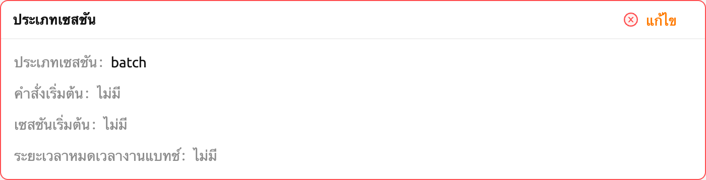

เมื่อคุณคลิกปุ่ม 'Launch' จะมีกล่องโต้ตอบคำเตือนปรากฏขึ้นระบุว่าไม่มีโฟลเดอร์ที่ถูกเมานต์
หากไม่จำเป็นต้องเมานต์โฟลเดอร์ คุณสามารถเพิกเฉยต่อคำเตือนและคลิกปุ่ม 'Start' ในกล่องโต้ตอบเพื่อดำเนินการต่อได้

เมื่อมีการเพิ่มเซสชันการคำนวณใหม่ในแท็บ **Running** จะมีการแจ้งเตือนปรากฏที่มุมล่างขวาของหน้าจอ
พื้นที่ด้านล่างซ้ายของการแจ้งเตือนจะแสดงสถานะเซสชัน ในขณะที่พื้นที่ด้านล่างขวาจะมีปุ่มสำหรับเปิดกล่องโต้ตอบแอป
เริ่มเทอร์มินัล ดูบันทึกของคอนเทนเนอร์ และยุติเซสชัน
คุณยังสามารถดูการแจ้งเตือนการสร้างเซสชันนี้ได้โดยคลิก **Notifications** ในส่วนหัว

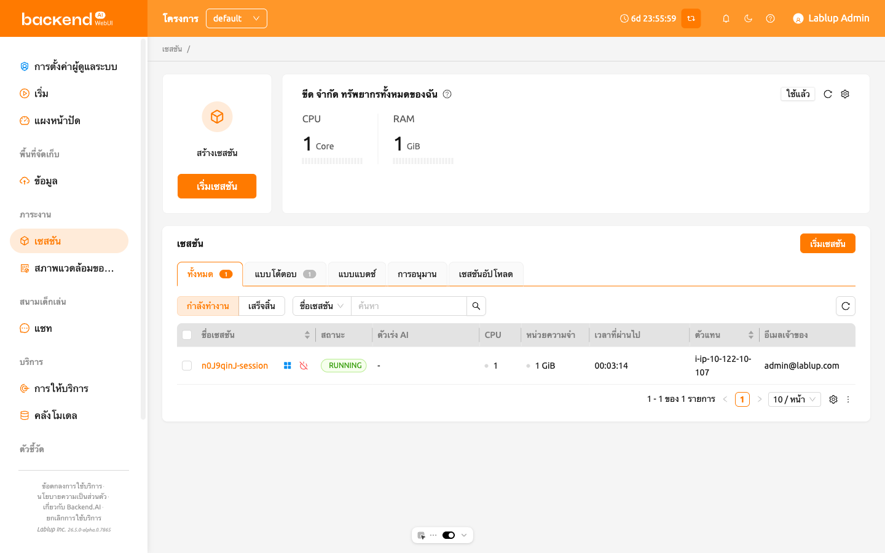

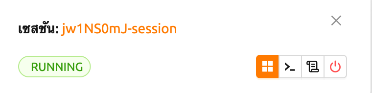

โดยการคลิกปุ่มกล่องโต้ตอบแอปที่อยู่ซ้ายสุด คุณสามารถดูบริการแอปที่พร้อมใช้งานได้

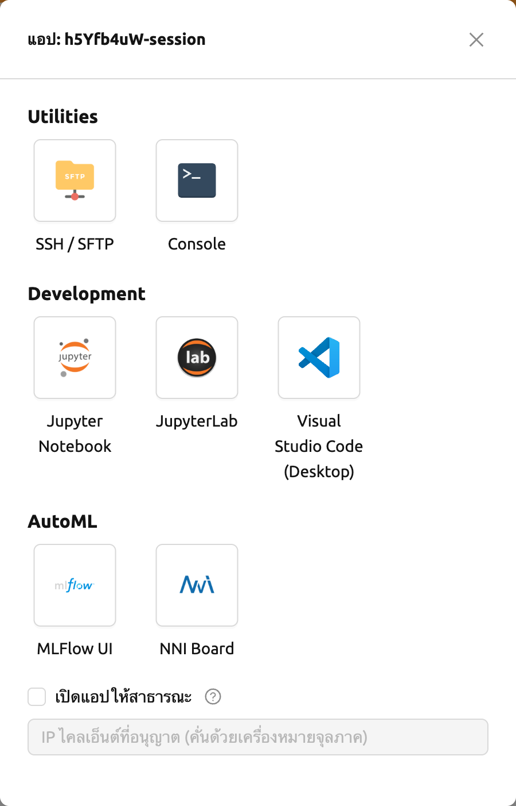

### ประวัติล่าสุด

หน้า 'Session Launcher' มีชุดตัวเลือกสำหรับการสร้างเซสชัน ตั้งแต่เวอร์ชัน 24.09 เป็นต้นไป
ได้มีการเพิ่มฟีเจอร์ `Recent History` เพื่อจดจำข้อมูลเกี่ยวกับเซสชันที่สร้างไว้ก่อนหน้า

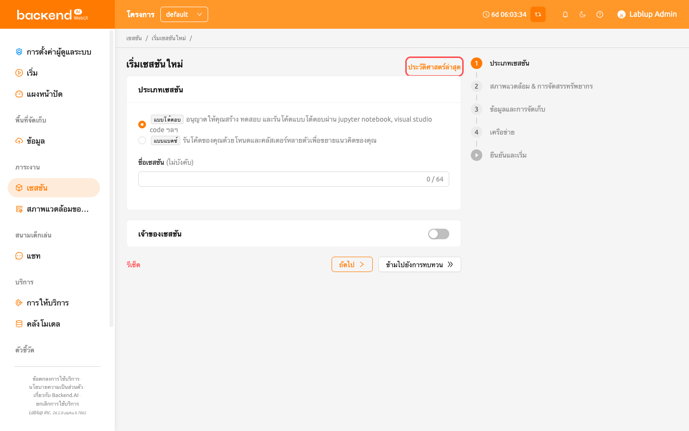

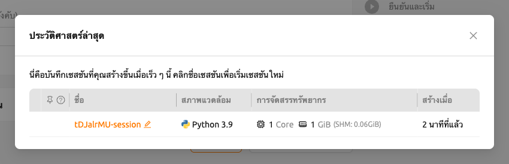

โมดัล `Recent History` จะจัดเก็บข้อมูลเกี่ยวกับเซสชันห้ารายการที่สร้างล่าสุด
การคลิกชื่อเซสชันจะนำคุณไปยังหน้า 'Confirm and Launch' ซึ่งเป็นขั้นตอนสุดท้ายของการสร้างเซสชัน
แต่ละรายการสามารถเปลี่ยนชื่อหรือปักหมุดเพื่อการเข้าถึงที่ง่ายขึ้นได้

:::note
ผู้ดูแลระบบสูงสุด (Superadmin) สามารถค้นหาข้อมูลเซสชันการคำนวณทั้งหมดที่กำลังทำงาน (หรือ
ยุติแล้ว) ในคลัสเตอร์ได้ และผู้ใช้สามารถดูได้เฉพาะเซสชันที่ตนเอง
สร้างขึ้นเท่านั้น
:::

:::note
รายการเซสชันการคำนวณอาจแสดงผลไม่เป็นปกติเนื่องจากปัญหาการเชื่อมต่อเครือข่าย
เป็นระยะ ๆ เป็นต้น สามารถแก้ไขได้โดยการรีเฟรช
เบราว์เซอร์
:::

## แผงรายละเอียดเซสชัน

สำหรับข้อมูลโดยละเอียดเกี่ยวกับเซสชัน ให้คลิกชื่อเซสชันในรายการเซสชัน
แผงรายละเอียดเซสชันจะแสดงข้อมูลของเซสชัน เช่น
ID เซสชัน ID ผู้ใช้ สถานะ ประเภท สภาพแวดล้อม ข้อมูลการเมานต์ การจัดสรรทรัพยากร เวลาที่จอง
เวลาที่ผ่านไป เอเจนต์ โหมดคลัสเตอร์ การใช้ทรัพยากรรวมถึงเครือข่าย I/O และข้อมูลเคอร์เนล

คลิกปุ่ม 'Log' ถัดจาก 'Hostname' ใน 'Kernels' เพื่อดูบันทึกของเคอร์เนลนั้นโดยตรง

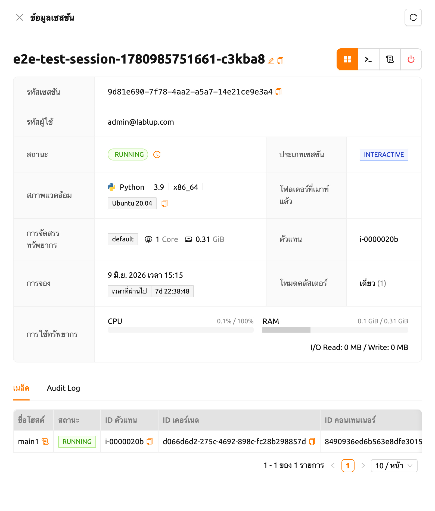

Backend.AI ให้ข้อมูลเพิ่มเติมสำหรับเซสชันในสถานะ `PENDING`, `TERMINATED` หรือ `CANCELLED`
คลิกปุ่ม 'Info' เพื่อตรวจสอบรายละเอียดเมื่อพร้อมใช้งาน

เมื่อใช้ Backend.AI Manager v26.2.0 หรือใหม่กว่า ปุ่มไอคอนนาฬิกาจะปรากฏข้างแท็กสถานะเซสชันในแผงรายละเอียดเซสชัน การคลิกไอคอนนี้จะเปิดโมดัลประวัติการจัดตารางเซสชัน ซึ่งแสดงบันทึกรายละเอียดของการตัดสินใจในการจัดตารางทั้งหมดที่ระบบได้ทำสำหรับเซสชันนั้น สำหรับข้อมูลเพิ่มเติม โปรดดูที่ส่วน[ประวัติการจัดตารางเซสชัน](#session-scheduling-history)

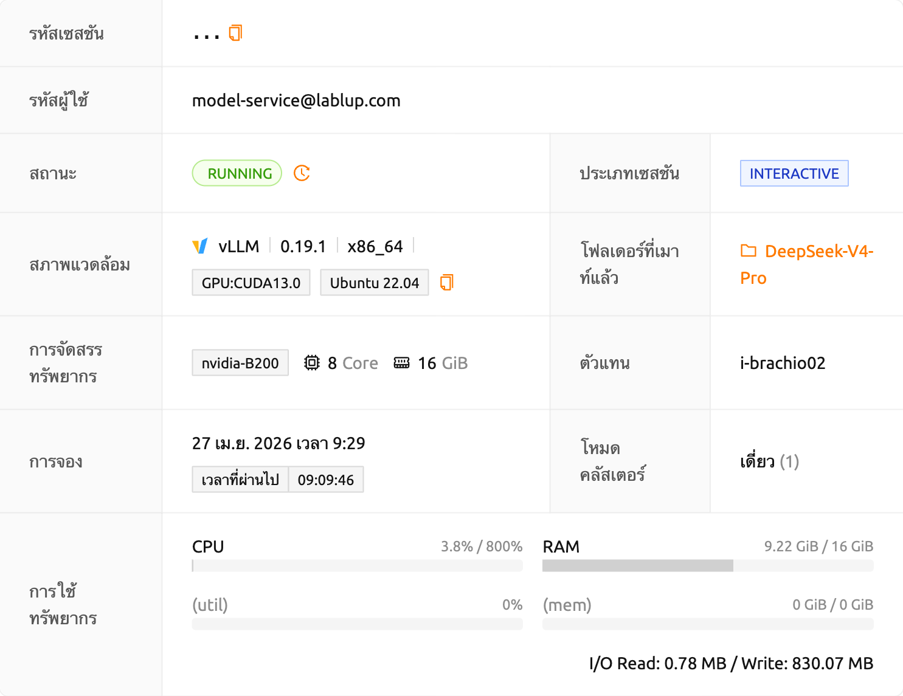

### ประวัติการจัดตารางเซสชัน

โมดัลประวัติการจัดตารางเซสชันช่วยให้มองเห็นวงจรชีวิตการจัดตารางภายในของเซสชันการคำนวณได้อย่างโปร่งใส โดยแสดงบันทึกรายละเอียดของทุกระยะการจัดตารางที่เซสชันได้ผ่าน รวมถึงการเปลี่ยนสถานะ ผลลัพธ์ จำนวนครั้งที่ลองใหม่ และข้อผิดพลาดที่พบ ฟีเจอร์นี้มีประโยชน์อย่างยิ่งสำหรับการทำความเข้าใจว่าทำไมเซสชันจึงล่าช้า ค้างอยู่ในสถานะ `PENDING` หรือไม่สามารถเริ่มต้นได้

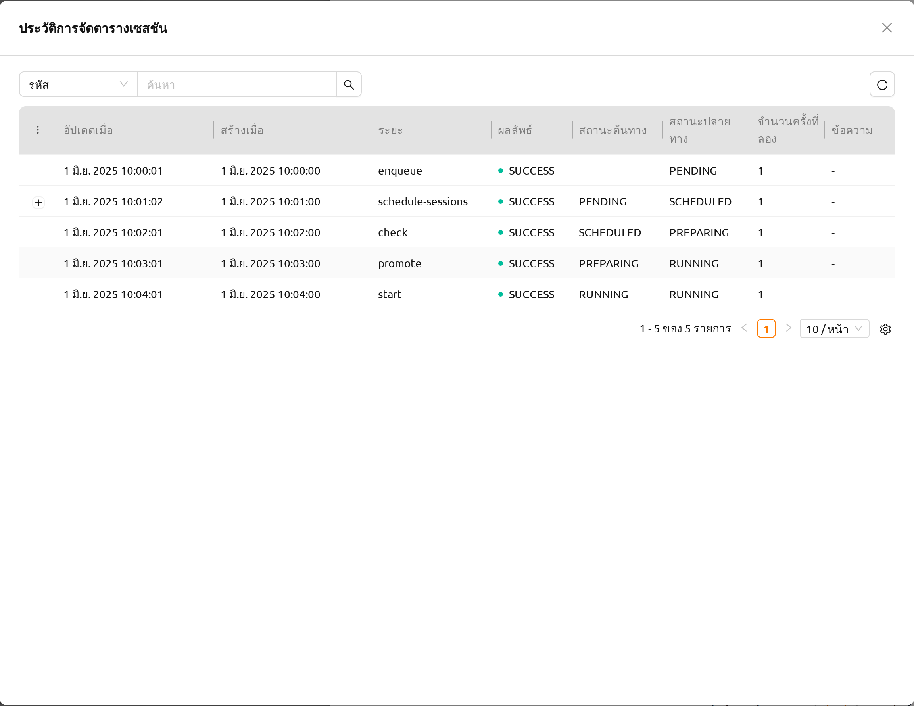

:::note
ฟีเจอร์นี้ใช้งานได้ตั้งแต่ Backend.AI Manager v26.2.0 เป็นต้นไป หากไอคอนประวัติไม่ปรากฏข้างสถานะเซสชัน แสดงว่า Backend.AI Manager ของคุณอาจยังไม่รองรับฟีเจอร์นี้
:::

#### แถบตัวกรอง

ที่ด้านบนของโมดัล แถบตัวกรองช่วยให้คุณจำกัดบันทึกประวัติการจัดตารางได้ คุณสามารถกรองตามคุณสมบัติต่อไปนี้:

- **ID**: กรองตาม ID ของบันทึกประวัติ (UUID, ตรงกันทั้งหมด)
- **ขั้นตอน**: กรองตามชื่อระยะการจัดตาราง
- **ผลลัพธ์**: กรองตามประเภทผลลัพธ์ (SUCCESS, FAILURE, STALE, NEED_RETRY, EXPIRED, GIVE_UP, SKIPPED)
- **จากสถานะ**: กรองตามสถานะเซสชันก่อนขั้นตอนการจัดตาราง
- **สู่สถานะ**: กรองตามสถานะเซสชันหลังขั้นตอนการจัดตาราง
- **รหัสข้อผิดพลาด**: กรองตามรหัสข้อผิดพลาด
- **ข้อความ**: กรองตามเนื้อหาข้อความ

ปุ่มรีเฟรชอยู่ข้างแถบตัวกรองเพื่อโหลดข้อมูลประวัติการจัดตารางใหม่

#### ตารางประวัติ

ตารางประวัติการจัดตารางแสดงบันทึกพร้อมคอลัมน์ต่อไปนี้:

- **ระยะ**: ชื่อของระยะการจัดตาราง
- **ผลลัพธ์**: ผลลัพธ์ของขั้นตอนการจัดตารางนี้ แสดงเป็นป้ายที่มีรหัสสี
- **การเปลี่ยนสถานะ (จาก / ถึง)**: สถานะเซสชันก่อนและหลังขั้นตอนการจัดตารางนี้
- **จำนวนครั้งที่ลอง**: จำนวนครั้งที่ขั้นตอนการจัดตารางนี้ถูกลอง
- **อัปเดตเมื่อ**: เวลาที่บันทึกนี้ได้รับการอัปเดตล่าสุด
- **สร้างเมื่อ**: เวลาที่บันทึกนี้ถูกสร้างขึ้น

คุณสามารถเรียงลำดับตารางตามคอลัมน์**สร้างเมื่อ**หรือ**อัปเดตเมื่อ**เพื่อดูบันทึกในลำดับที่ต้องการ

#### ขั้นตอนย่อยที่ขยายได้

บันทึกประวัติบางรายการมีขั้นตอนย่อยอย่างละเอียด เมื่อมีขั้นตอนย่อย ลูกศรขยายจะปรากฏที่ด้านซ้ายของแถว คลิกเพื่อแสดงตารางซ้อนที่แสดงขั้นตอนย่อยแต่ละขั้นตอนของระยะการจัดตารางนั้น

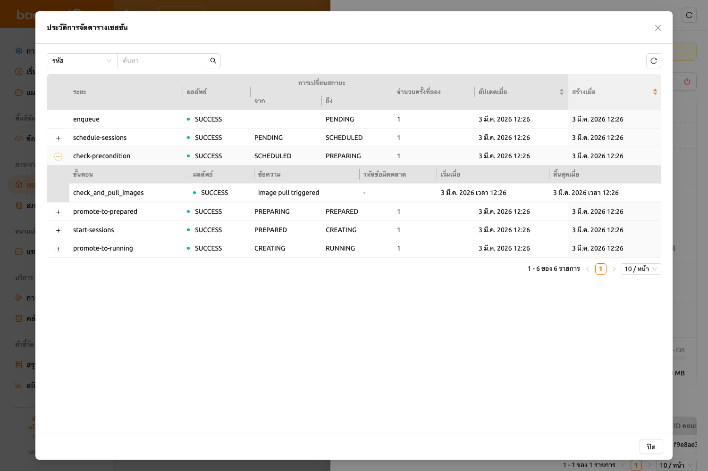

ตารางขั้นตอนย่อยประกอบด้วยคอลัมน์ต่อไปนี้:

- **ขั้นตอน**: ชื่อของขั้นตอนย่อย
- **ผลลัพธ์**: ผลลัพธ์ของขั้นตอนย่อย แสดงเป็นป้ายที่มีรหัสสี
- **ข้อความ**: ข้อมูลรายละเอียดหรือคำอธิบายข้อผิดพลาด
- **รหัสข้อผิดพลาด**: รหัสข้อผิดพลาดเฉพาะหากขั้นตอนล้มเหลว
- **เริ่มเมื่อ**: เวลาที่ขั้นตอนย่อยเริ่มต้น
- **สิ้นสุดเมื่อ**: เวลาที่ขั้นตอนย่อยเสร็จสิ้น

#### สีของป้ายผลลัพธ์

แต่ละขั้นตอนการจัดตารางและขั้นตอนย่อยจะแสดงป้ายผลลัพธ์ที่มีรหัสสีระบุผลลัพธ์:

| ผลลัพธ์ | สี | ความหมาย |
|--------|-------|---------|
| SUCCESS | เขียว | ขั้นตอนเสร็จสมบูรณ์สำเร็จ |
| FAILURE | แดง | ขั้นตอนล้มเหลว |
| STALE | เทา | บันทึกเก่าหรือไม่เป็นปัจจุบัน |
| NEED_RETRY | เหลือง | ขั้นตอนต้องลองใหม่ |
| EXPIRED | แดง | การลองจัดตารางหมดอายุ |
| GIVE_UP | แดง | ระบบยกเลิกการจัดตาราง |
| SKIPPED | เทา | ขั้นตอนถูกข้าม |

## ใช้ Jupyter Notebook

มาดูวิธีการใช้และจัดการเซสชันการคำนวณที่กำลังทำงานอยู่แล้วกัน
คลิกไอคอนแรกที่มุมขวาบนของแผงรายละเอียดเซสชันเพื่อเปิดตัวเปิดแอป ซึ่งจะแสดง
บริการแอปที่พร้อมใช้งานสำหรับเซสชันนั้น

:::note
มีตัวเลือกตรวจสอบสองตัวเลือกใต้ไอคอนแอป การเปิดแอปด้วยแต่ละรายการที่เลือกจะใช้คุณลักษณะต่อไปนี้ตามลำดับ:

* เปิดแอปให้กับสาธารณะ: เปิดแอปให้กับสาธารณะ โดยพื้นฐานแล้ว บริการเว็บเช่น Terminal และ Jupyter Notebook จะไม่สามารถเข้าถึงได้โดยผู้ใช้รายอื่น แม้ว่าผู้ใช้จะทราบ URL ของบริการก็ตาม เนื่องจากถือว่าไม่มีการตรวจสอบสิทธิ์ อย่างไรก็ตาม การตรวจสอบตัวเลือกนี้ทำให้ใครก็ตามที่ทราบ URL ของบริการ (และหมายเลขพอร์ต) สามารถเข้าถึงและใช้งานได้ แน่นอนว่าผู้ใช้ต้องมีเส้นทางเครือข่ายเพื่อเข้าถึงบริการนั้น
* ลองพอร์ตที่ต้องการ: หากไม่เลือกตัวเลือกนี้ หมายเลขพอร์ตสำหรับบริการเว็บจะถูกกำหนดแบบสุ่มจากกลุ่มพอร์ตที่เตรียมไว้ล่วงหน้าโดย Backend.AI หากคุณเลือกจุดนี้และป้อนหมายเลขพอร์ตเฉพาะ หมายเลขพอร์ตที่ป้อนจะถูกลองใช้ก่อน อย่างไรก็ตาม ไม่มีการรับประกันว่าพอร์ตที่ต้องการจะถูกกำหนดเสมอไป เนื่องจากพอร์ตอาจไม่มีอยู่ในกลุ่มพอร์ตเลยหรือบริการอื่นอาจใช้พอร์ตนั้นอยู่แล้ว ในกรณีนี้ หมายเลขพอร์ตจะถูกกำหนดแบบสุ่ม

ขึ้นอยู่กับการตั้งค่าของระบบ ตัวเลือกเหล่านี้อาจไม่แสดงออกมา
:::

ให้คลิกที่ Jupyter Notebook

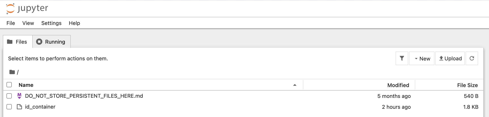

หน้าต่างป๊อปอัปจะแสดงว่า Jupyter Notebook กำลังทำงาน
โน้ตบุ๊กนี้ถูกสร้างขึ้นภายในเซสชันการคำนวณที่กำลังทำงานอยู่ และสามารถใช้งานได้อย่างง่ายดาย
ด้วยการคลิกปุ่มเพียงครั้งเดียว นอกจากนี้ ไม่จำเป็นต้องมีขั้นตอนการติดตั้งแพ็กเกจแยกต่างหาก เนื่องจากสภาพแวดล้อมภาษาและ
ไลบรารีที่เซสชันการคำนวณจัดเตรียมไว้สามารถใช้งานได้เลย สำหรับคำแนะนำ
โดยละเอียดเกี่ยวกับวิธีการใช้ Jupyter Notebook โปรดดูเอกสารอย่างเป็นทางการของ Jupyter Notebook

ไฟล์ `id_container` ในตัวสำรวจไฟล์ของโน้ตบุ๊กประกอบด้วยคีย์ส่วนตัว
SSH หากจำเป็น ผู้ใช้สามารถดาวน์โหลดและใช้งานเพื่อการเข้าถึง SSH / SFTP ไปยัง
คอนเทนเนอร์ได้

คลิกปุ่ม 'NEW' ที่มุมขวาบนและเลือก Notebook สำหรับ Backend.AI
จากนั้นหน้าต่าง ipynb จะปรากฏขึ้นซึ่งผู้ใช้สามารถป้อนโค้ดของตนเองได้

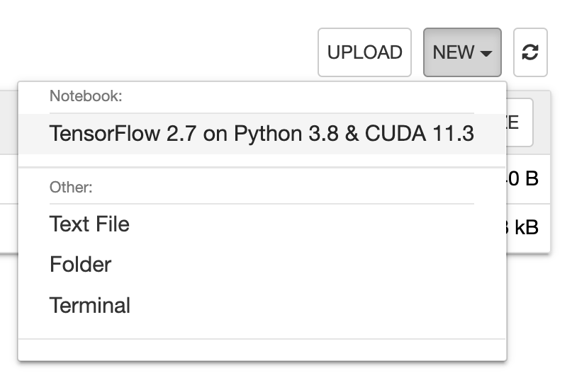

ในหน้าต่างนี้ ผู้ใช้สามารถป้อนและดำเนินการโค้ดใด ๆ ที่ต้องการโดยใช้
สภาพแวดล้อมที่เซสชันจัดเตรียมไว้ โค้ดจะถูกดำเนินการบนหนึ่งใน
โหนด Backend.AI ที่เซสชันการคำนวณถูกสร้างขึ้นจริง และไม่จำเป็นต้อง
กำหนดค่าสภาพแวดล้อมแยกต่างหากบนเครื่องในพื้นที่

เมื่อปิดหน้าต่าง สามารถพบไฟล์ `Untitled.ipynb` ได้ในตัวสำรวจไฟล์ของโน้ตบุ๊ก
โปรดทราบว่าไฟล์ที่สร้างที่นี่จะถูกลบเมื่อเซสชันสิ้นสุดลง วิธีการรักษาไฟล์เหล่านั้นแม้
หลังจากเซสชันสิ้นสุดลงจะอธิบายไว้ในส่วนโฟลเดอร์ข้อมูลและการจัดเก็บ

## ใช้เทอร์มินัลเว็บ

ส่วนนี้จะอธิบายวิธีการใช้งานเทอร์มินัลเว็บ คลิก
ไอคอนเทอร์มินัล (ปุ่มที่สอง) เพื่อใช้แอป ttyd ของคอนเทนเนอร์ เทอร์มินัลจะปรากฏในหน้าต่างใหม่
และผู้ใช้สามารถเรียกใช้คำสั่งเชลล์เพื่อเข้าถึงเซสชันการคำนวณได้ดังแสดงในรูปต่อไปนี้
หากคุ้นเคยกับคำสั่ง ผู้ใช้สามารถเรียกใช้คำสั่ง Linux ต่าง ๆ ได้อย่างง่ายดาย ไฟล์ `Untitled.ipynb`
สามารถพบได้ใน Jupyter Notebook ซึ่งแสดงด้วยคำสั่ง `ls` นี่แสดงให้เห็นว่าทั้งสองแอป
กำลังทำงานในสภาพแวดล้อมคอนเทนเนอร์เดียวกัน

ไฟล์ที่สร้างที่นี่ยังสามารถเห็นได้ทันทีใน Jupyter Notebook ด้วย ในทางกลับกัน การเปลี่ยนแปลงที่ทำกับไฟล์ใน Jupyter
Notebook ก็สามารถตรวจสอบได้จากเทอร์มินัลทันที นี่เป็นเพราะทั้งสองแอปใช้ไฟล์เดียวกันในเซสชันการคำนวณเดียวกัน

นอกจากนี้ ผู้ใช้ยังสามารถใช้บริการที่ใช้เว็บ เช่น TensorBoard, Jupyter
Lab เป็นต้น ขึ้นอยู่กับประเภทของสภาพแวดล้อมที่เซสชันการคำนวณจัดเตรียมไว้

## ค้นหาบันทึกของเซสชันการคำนวณ

ผู้ใช้สามารถดูบันทึกของเซสชันการคำนวณได้โดยคลิกไอคอนสุดท้ายใน
แผงควบคุมของเซสชันการคำนวณที่กำลังทำงานอยู่

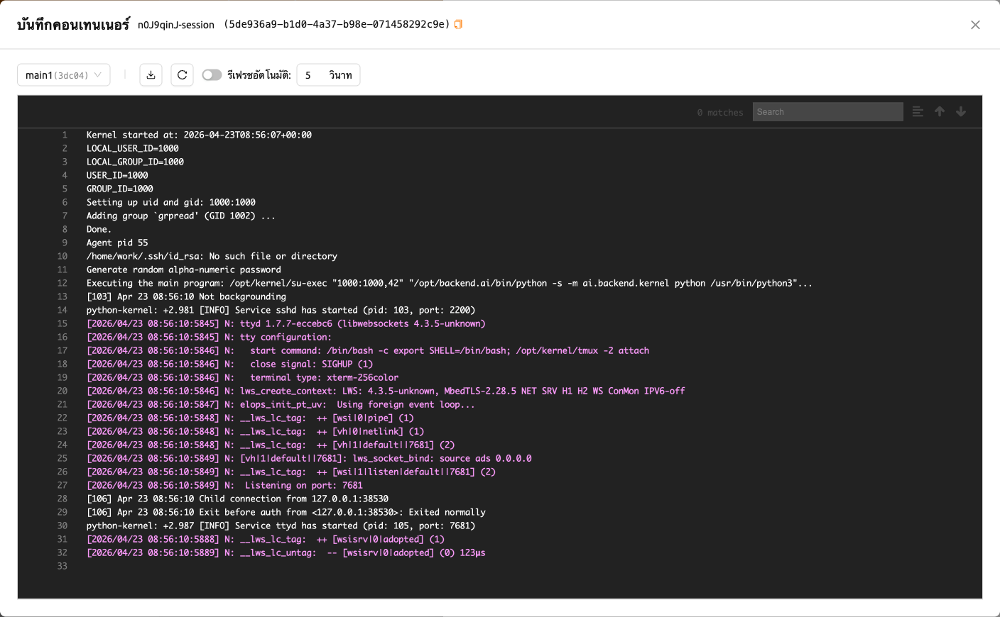

## เปลี่ยนชื่อเซสชันที่กำลังรัน

สามารถเปลี่ยนชื่อของเซสชันที่กำลังทำงานอยู่ได้ คลิกปุ่ม 'Edit' ในแผงรายละเอียดเซสชัน
เพื่อเปลี่ยนชื่อเซสชัน
ชื่อเซสชันใหม่ควรเป็นไปตาม[กฎการตั้งชื่อ](#session-naming-rule) ด้วย

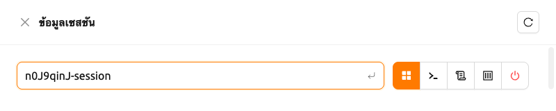

## ลบเซสชันการคำนวณ

หากต้องการยุติเซสชันที่ระบุ เพียงคลิกที่ปุ่มเปิดปิดสีแดงและคลิก
ปุ่ม 'Terminate' ในกล่องโต้ตอบ เนื่องจากข้อมูลในโฟลเดอร์ภายในเซสชันการคำนวณ
จะถูกลบทันทีที่เซสชันการคำนวณสิ้นสุดลง จึงแนะนำให้
ย้ายข้อมูลไปยังโฟลเดอร์ที่ถูกเมานต์หรืออัปโหลดไปยังโฟลเดอร์ที่ถูกเมานต์ตั้งแต่
เริ่มต้น

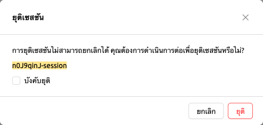

## การตรวจสอบสถานะไม่ใช้งาน

Backend.AI รองรับเกณฑ์การไร้กิจกรรม (ความเฉยเมย) สําหรับการเก็บขยะอัตโนมัติของเซสชันการคำนวณสามประเภท: อายุขัยสูงสุดของเซสชัน, เวลาเงียบสงบของเครือข่าย, และการตรวจสอบการใช้ทรัพยากร.

เกณฑ์สำหรับการยุติเซสชันสามารถพบได้ในส่วน 'Idle Checks' ของแผงรายละเอียดเซสชัน

ความหมายของตัวตรวจสอบสถานะไม่ใช้งานมีดังต่อไปนี้ และสามารถดูคำอธิบายโดยละเอียดเพิ่มเติมได้
โดยคลิกปุ่มข้อมูล (i) ในส่วนการตรวจสอบสถานะไม่ใช้งาน

- อายุการใช้งานเซสชันสูงสุด: บังคับยุติเซสชันหลังจากเวลานี้นับตั้งแต่การสร้าง มาตรการนี้ป้องกันไม่ให้เซสชันทำงานต่อไปไม่มีที่สิ้นสุด
- การหมดเวลาขณะว่างในการเชื่อมต่อเครือข่าย: บังคับยกเลิกเซสชันที่ไม่ได้แลกเปลี่ยนข้อมูลกับผู้ใช้ (เบราว์เซอร์หรือแอปเว็บ) หลังจากเวลานี้ การรับส่งข้อมูลระหว่างผู้ใช้และเซสชันการคำนวณจะเกิดขึ้นอย่างต่อเนื่องเมื่อผู้ใช้โต้ตอบกับแอป เช่น เทอร์มินัลหรือ Jupyter โดยการพิมพ์จากแป้นพิมพ์ การสร้างเซลล์ Jupyter ฯลฯ การสร้างเซลล์ Jupyter ฯลฯ หากไม่มีการโต้ตอบเป็นระยะเวลาหนึ่ง สภาวะการเก็บขยะจะถูกตอบสนอง แม้ว่าจะมีการประมวลผลที่กำลังดำเนินการงานในเซสชันการคำนวณ แต่ก็จะต้องถูกยกเลิกหากไม่มีการโต้ตอบจากผู้ใช้
- Utilization Checker: ทรัพยากรที่ถูกจัดสรรให้กับเซสชันการคำนวณจะถูกเรียกคืนตามการใช้ทรัพยากรเหล่านั้น การตัดสินใจในการลบขึ้นอยู่กับสองปัจจัยดังต่อไปนี้:

  - ระยะเวลาผ่อนผัน: ช่วงเวลาที่ตัวตรวจสอบการใช้งานที่ไม่ได้ใช้งานจะไม่ทำงาน แม้ว่าจะมีการใช้งานต่ำ เซสชันการคำนวณจะไม่ถูกยุติในระยะเวลานี้ อย่างไรก็ตาม เมื่อตัวระยะเวลาผ่อนผันสิ้นสุดลง หากการใช้งานเฉลี่ยยังคงต่ำกว่าค่ากำหนดในช่วงเวลารอที่ตั้งไว้ ระบบสามารถยุติเซสชันได้ตลอดเวลา ระยะเวลาผ่อนผันเป็นช่วงเวลาที่รับประกันเท่านั้นที่การยุติจะไม่เกิดขึ้น มาตรการนี้มีจุดประสงค์หลักเพื่อการจัดการทรัพยากร GPU ที่มีการใช้งานต่ำอย่างมีประสิทธิภาพ
  - เกณฑ์การใช้งาน (Utilization Threshold): หากการใช้ทรัพยากรของเซสชันการคำนวณ
    ไม่เกินเกณฑ์ที่กำหนดในระยะเวลาที่กำหนด (idle timeout) เซสชันนั้น
    จะถูกยุติโดยอัตโนมัติ ตัวอย่างเช่น หากเกณฑ์การใช้งานตัวเร่งความเร็ว
    ถูกตั้งค่าเป็น 1% และเซสชันการคำนวณแสดง
    การใช้งานน้อยกว่า 1% ในช่วง idle timeout เซสชันนั้นจะกลายเป็นเป้าหมายสำหรับ
    การยุติ ทรัพยากรที่มีค่าว่างจะถูกยกเว้นจากเกณฑ์การเก็บขยะ

:::note
หลังจากช่วงเวลาให้อภัย เซสชันสามารถถูกยกเลิกได้ทุกเมื่อหากการใช้งานยังคงต่ำ การใช้ทรัพยากรอย่างสั้นๆ จะไม่ขยายช่วงเวลาให้อภัย จะพิจารณาเฉพาะการใช้งานเฉลี่ยในช่วงเวลาไม่ใช้งานล่าสุดเท่านั้น
:::

การวางเมาส์เหนือ Utilization Checker จะแสดงคำแนะนำเครื่องมือพร้อมกับ
ค่าการใช้งานและค่าเกณฑ์ สีข้อความจะเปลี่ยนเป็นสีเหลืองและต่อมาเป็นสีแดง
เมื่อการใช้งานปัจจุบันเข้าใกล้เกณฑ์ (แสดงถึงการใช้ทรัพยากรต่ำ)

:::note
ขึ้นอยู่กับการตั้งค่าของสภาพแวดล้อม ตัวตรวจสอบที่ไม่ทำงานและประเภทของทรัพยากรในการตรวจสอบการใช้งานอาจแตกต่างกันได้
:::

## วิธีการเพิ่มตัวแปรสภาพแวดล้อมก่อนที่จะสร้างเซสชัน

เพื่อให้พื้นที่ทำงานที่สะดวกยิ่งขึ้นสำหรับผู้ใช้ Backend.AI รองรับการตั้งค่าตัวแปรสภาพแวดล้อม
ในการเริ่มต้นเซสชัน ในฟีเจอร์นี้ ผู้ใช้สามารถเพิ่มตัวแปรสภาพแวดล้อมใด ๆ เช่น `PATH` ได้โดยการกรอก
ชื่อตัวแปรและค่าในกล่องโต้ตอบการกำหนดค่าสภาพแวดล้อม

หากต้องการเพิ่มตัวแปรสภาพแวดล้อม เพียงคลิกปุ่ม '+ Add environment variables' ของตัวแปร
นอกจากนี้ คุณยังสามารถลบตัวแปรได้โดยการคลิกปุ่ม '-' ของแถวที่คุณต้องการลบออก

คุณสามารถเขียนชื่อตัวแปรและค่าในบรรทัดเดียวกันของช่องป้อนข้อมูลได้

## วิธีการเพิ่มพอร์ตที่เปิดก่อนที่จะสร้างเซสชัน

Backend.AI รองรับการตั้งค่าพอร์ตที่เปิดใช้งานล่วงหน้าเมื่อเริ่มต้นคอนเทนเนอร์ เมื่อใช้ฟีเจอร์นี้ จะไม่จำเป็นต้องสร้างอิมเมจแยกต่างหากเมื่อคุณต้องการเปิดเผยพอร์ตการบริการ

เพื่อเพิ่มพอร์ตที่เปิดล่วงหน้า เพียงป้อนค่าหลายค่าโดยแยกด้วยเครื่องหมายจุลภาค (,) หรือช่องว่าง

ในหน้าที่สี่ของหน้าการสร้างเซสชัน ผู้ใช้สามารถเพิ่ม อัปเดต และลบพอร์ตที่เปิดล่วงหน้าที่เขียนไว้ได้ หากต้องการดูข้อมูลโดยละเอียด
เพิ่มเติม โปรดคลิกปุ่ม 'Help (?)'

ผู้ใช้สามารถใส่หมายเลขพอร์ตระหว่าง 1024 ~ 65535 ในช่องป้อนข้อมูล จากนั้นกด 'Enter' ผู้ใช้สามารถระบุพอร์ตได้หลายพอร์ตโดยคั่นด้วยเครื่องหมายจุลภาค (,)
ผู้ใช้สามารถตรวจสอบพอร์ตที่เปิดล่วงหน้าที่กำหนดค่าไว้ได้ในตัวเปิดแอปเซสชัน

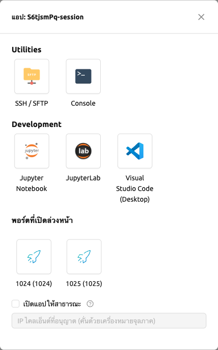

:::note
พอร์ตที่เปิดล่วงหน้าคือ **พอร์ตภายในคอนเทนเนอร์** ดังนั้น ต่างจากแอปอื่น เมื่อผู้ใช้คลิกพอร์ตที่เปิดล่วงหน้าในตัวเปิดแอปเซสชัน จะมีหน้าว่างปรากฏขึ้น กรุณาผูกเซิร์ฟเวอร์กับพอร์ตที่เกี่ยวข้องก่อนใช้งาน
:::

## บันทึกการคอมมิตเซสชัน

Backend.AI รองรับฟีเจอร์ \"Convert Session to Image\" ตั้งแต่เวอร์ชัน 24.03 การคอมมิตเซสชันที่อยู่ในสถานะ `RUNNING` จะบันทึก
สถานะปัจจุบันของเซสชันเป็นอิมเมจใหม่ คลิกปุ่ม 'Commit' (ไอคอนที่สี่) ในแผงรายละเอียดเซสชัน
เพื่อเปิดกล่องโต้ตอบที่แสดงข้อมูลเซสชัน หลังจากป้อนชื่อเซสชัน ผู้ใช้สามารถแปลงเซสชันเป็น
อิมเมจใหม่ได้ ชื่อเซสชันต้องมีความยาว 4 ถึง 32 ตัวอักษร และสามารถประกอบด้วยตัวอักษรและตัวเลข เครื่องหมายยัติภังค์ (`-`)
หรือเครื่องหมายขีดล่าง (`_`) เท่านั้น

หลังจากกรอกชื่อเซสชันในช่องป้อนข้อมูลแล้ว ให้คลิกปุ่ม 'PUSH SESSION TO CUSTOMIZED IMAGE'
อิมเมจแบบกำหนดเองที่สร้างขึ้นด้วยวิธีนี้สามารถใช้ในการสร้างเซสชันในอนาคตได้ อย่างไรก็ตาม ไดเรกทอรี
ที่เมานต์ไปยังคอนเทนเนอร์สำหรับการคอมมิตอิมเมจจะถือเป็นทรัพยากรภายนอกและจะไม่รวมอยู่ใน
อิมเมจสุดท้าย โปรดจำไว้ว่า `/home/work` เป็นโฟลเดอร์เมานต์ (scratch directory) ดังนั้นจึงไม่รวมอยู่ด้วย

:::note
ปัจจุบัน Backend.AI รองรับ "Convert Session to Image" เฉพาะเมื่อเซสชันอยู่ในโหมด `INTERACTIVE` เท่านั้น
เพื่อป้องกันข้อผิดพลาดที่ไม่คาดคิด ผู้ใช้อาจไม่สามารถยุติเซสชันในระหว่างขั้นตอนการคอมมิตได้
หากต้องการหยุดขั้นตอนที่กำลังดำเนินการ ให้เลือกเซสชันและบังคับยุติ
:::

:::note
จำนวนครั้งในการทำ "Convert Session to Image" อาจถูกจำกัดโดยนโยบายทรัพยากรของผู้ใช้ ในกรณีนี้
ให้[ลบอิมเมจแบบกำหนดเองที่มีอยู่](#delete-customized-image) และลองอีกครั้ง หากยังไม่สามารถแก้ไข
ปัญหาได้ โปรดติดต่อผู้ดูแลระบบ
:::

## การใช้งานอิมเมจที่ถูกแปลงจากเซสชันที่กำลังดำเนินอยู่

การแปลงเซสชันที่กำลังดำเนินอยู่ให้เป็นอิมเมจช่วยให้ผู้ใช้สามารถเลือกอิมเมจนี้ได้จากสภาพแวดล้อมในตัวเปิดเซสชัน
เมื่อสร้างเซสชันใหม่ อิมเมจนี้จะไม่ถูกเปิดเผยต่อผู้ใช้คนอื่น และมีประโยชน์สำหรับการใช้งานสถานะเซสชันปัจจุบัน
ต่อไปตามเดิม อิมเมจที่แปลงแล้วจะถูกติดแท็กด้วย `Customized<session name>`

ในการป้อนชื่อสภาพแวดล้อมด้วยตนเองเพื่อสร้างเซสชันในอนาคต โปรดคลิกที่ไอคอนคัดลอก

## การใช้งานเทอร์มินัลเว็บขั้นสูง

เทอร์มินัลที่ใช้เว็บจะฝังยูทิลิตี้ที่เรียกว่า
[tmux](https://github.com/tmux/tmux/wiki) ไว้ภายใน tmux เป็น terminal multiplexer ที่
รองรับการเปิดหน้าต่างเชลล์หลายหน้าต่างภายในเชลล์เดียว เพื่อให้
โปรแกรมหลายโปรแกรมสามารถทำงานในเบื้องหน้าพร้อมกันได้ หากผู้ใช้ต้องการใช้ประโยชน์
จากฟีเจอร์ tmux ที่ทรงพลังยิ่งขึ้น สามารถดูเอกสารอย่างเป็นทางการของ tmux
และตัวอย่างการใช้งานอื่น ๆ บนอินเทอร์เน็ตได้

ที่นี่เรากำลังแนะนำฟีเจอร์ที่ง่ายแต่มีประโยชน์บางอย่าง

### คัดลอกเนื้อหาของเทอร์มินัล

tmux มีฟีเจอร์ที่มีประโยชน์จำนวนมาก แต่ค่อนข้างสับสนสำหรับ
ผู้ใช้ครั้งแรก โดยเฉพาะอย่างยิ่ง tmux มีบัฟเฟอร์คลิปบอร์ดของตัวเอง ดังนั้นเมื่อคัดลอก
เนื้อหาของเทอร์มินัล ผู้ใช้อาจประสบปัญหาที่สามารถวางได้เฉพาะภายใน tmux
เท่านั้นตามค่าเริ่มต้น ยิ่งไปกว่านั้น ยากที่จะเปิดเผยคลิปบอร์ดของระบบผู้ใช้
ให้กับ tmux ภายในเว็บเบราว์เซอร์ ดังนั้นเนื้อหาเทอร์มินัล
จึงไม่สามารถคัดลอกและวางไปยังโปรแกรมอื่นของคอมพิวเตอร์ผู้ใช้ได้ สิ่งที่เรียกว่า
`Ctrl-C` / `Ctrl-V` ไม่ทำงานกับ tmux

หากจำเป็นต้องคัดลอกและวางเนื้อหาเทอร์มินัลไปยังคลิปบอร์ดของระบบ
ผู้ใช้สามารถปิดการรองรับเมาส์ของ tmux ชั่วคราวได้ ก่อนอื่น ให้กดปุ่ม `Ctrl-B`
เพื่อเข้าสู่โหมดควบคุม tmux จากนั้นพิมพ์ `:set -g mouse off` แล้วกด `Enter`
(โปรดสังเกตว่าต้องพิมพ์เครื่องหมายทวิภาคแรกด้วย) ผู้ใช้สามารถตรวจสอบสิ่งที่กำลัง
พิมพ์ได้ในแถบสถานะที่ด้านล่างของหน้าจอ จากนั้นลากข้อความที่ต้องการ
จากเทอร์มินัลด้วยเมาส์และกด `Ctrl-C` หรือ `Cmd-C` (ใน Mac)
เพื่อคัดลอกไปยังคลิปบอร์ดของคอมพิวเตอร์ผู้ใช้

เมื่อปิดการรองรับเมาส์ จะไม่สามารถเลื่อนดูผ่านล้อเมาส์เพื่อดู
เนื้อหาของหน้าก่อนหน้าจากเทอร์มินัลได้ ในกรณีนี้ ผู้ใช้สามารถเปิด
การรองรับเมาส์ได้ กด `Ctrl-B` และในครั้งนี้ พิมพ์ `:set -g mouse
on` ตอนนี้การเลื่อนผ่านล้อเมาส์พร้อมใช้งานเพื่อดูเนื้อหาของหน้าก่อนหน้า

หากคุณจำ `:set -g mouse off` หรือ `:set -g mouse on` หลังจาก `Ctrl-B` ได้
คุณจะสามารถใช้เทอร์มินัลเว็บได้อย่างสะดวกยิ่งขึ้น

:::note
`Ctrl-B` เป็นคีย์โหมดควบคุมเริ่มต้นของ tmux หากผู้ใช้ตั้งค่าคีย์ควบคุมอื่น
โดยการแก้ไข `.tmux.conf` ในไดเรกทอรีโฮมของผู้ใช้ ผู้ใช้ควรกด
ชุดคีย์ที่ตั้งไว้แทน `Ctrl-B`
:::

:::note
ในสภาพแวดล้อม Windows ให้ดูที่ทางลัดต่อไปนี้

* คัดลอก: กด `Shift` ค้างไว้ คลิกขวา แล้วลาก
* วาง: กด `Ctrl-Shift-V`
:::

### ตรวจสอบประวัติเทอร์มินัลโดยใช้แป้นพิมพ์

ยังมีอีกวิธีหนึ่งในการคัดลอกเนื้อหาเทอร์มินัลและตรวจสอบเนื้อหา
ก่อนหน้าของเทอร์มินัลพร้อมกัน นั่นคือการตรวจสอบเนื้อหาก่อนหน้า
โดยใช้แป้นพิมพ์ คลิก `Ctrl-B` ก่อน แล้วจึงกดปุ่ม `Page
Up` และ/หรือ `Page Down` หากต้องการออกจากโหมดค้นหา เพียงกดปุ่ม `q`
ด้วยวิธีนี้ ผู้ใช้สามารถตรวจสอบเนื้อหาประวัติเทอร์มินัลได้แม้
เมื่อปิดการรองรับเมาส์

### สร้างเชลล์หลายตัว

ข้อได้เปรียบหลักของ tmux คือการเปิดและใช้งานเชลล์หลายตัวในหน้าต่าง
เทอร์มินัลเดียว การกดปุ่ม `Ctrl-B` และ `c` จะแสดงสภาพแวดล้อมเชลล์ใหม่
หน้าต่างก่อนหน้าจะมองไม่เห็นในตอนนี้ แต่ยังไม่ถูกยุติ
กด `Ctrl-B` และ `w` รายการของเชลล์ที่เปิดอยู่บน tmux จะแสดงขึ้น
เชลล์ที่ขึ้นต้นด้วย `0:` คือสภาพแวดล้อมเชลล์เริ่มต้น และเชลล์
ที่ขึ้นต้นด้วย `1:` คือเชลล์ที่เพิ่งสร้างขึ้น ผู้ใช้สามารถเคลื่อนย้ายระหว่างเชลล์
โดยใช้ปุ่มขึ้น/ลง วางเคอร์เซอร์บนเชลล์ `0:` และกดปุ่ม Enter
เพื่อเลือก

ด้วยวิธีนี้ ผู้ใช้สามารถใช้สภาพแวดล้อมเชลล์หลายตัวภายในเทอร์มินัลเว็บได้ หากต้องการออกหรือยุติ
เชลล์ปัจจุบัน เพียงป้อนคำสั่ง `exit` หรือกดปุ่ม `Ctrl-B x` จากนั้น
พิมพ์ `y`

โดยสรุป:

- `Ctrl-B c`: สร้างเชลล์ tmux ใหม่
- `Ctrl-B w`: ค้นหาเชลล์ tmux ปัจจุบันและย้ายไปมาระหว่างเชลล์เหล่านั้น
- `exit` หรือ `Ctrl-B x`: ยุติเชลล์ปัจจุบัน

การรวมคำสั่งข้างต้นช่วยให้ผู้ใช้สามารถทำงานต่าง ๆ พร้อมกัน
บนเชลล์หลายตัวได้