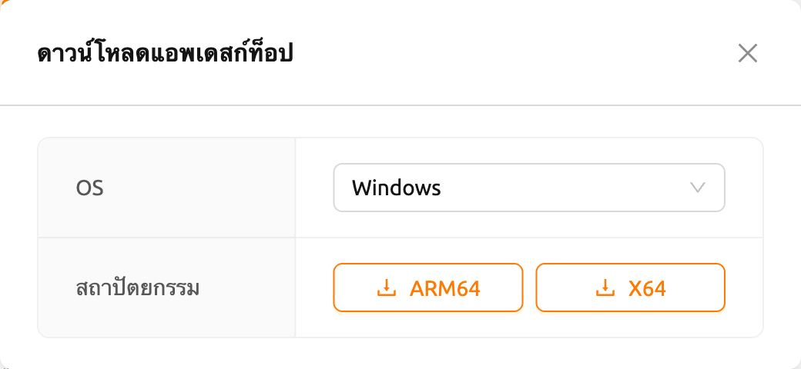
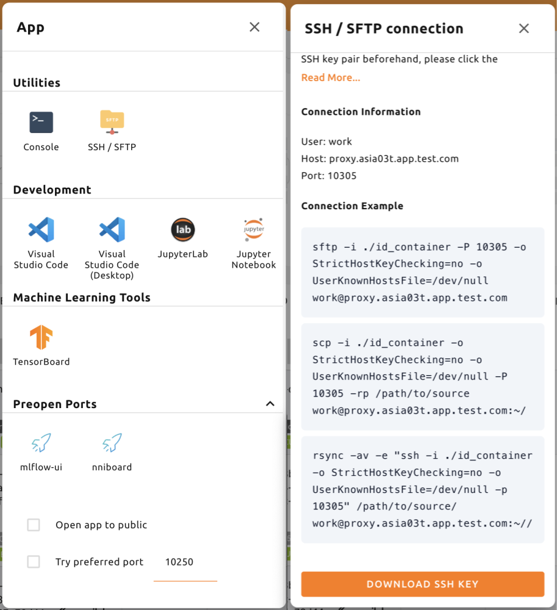
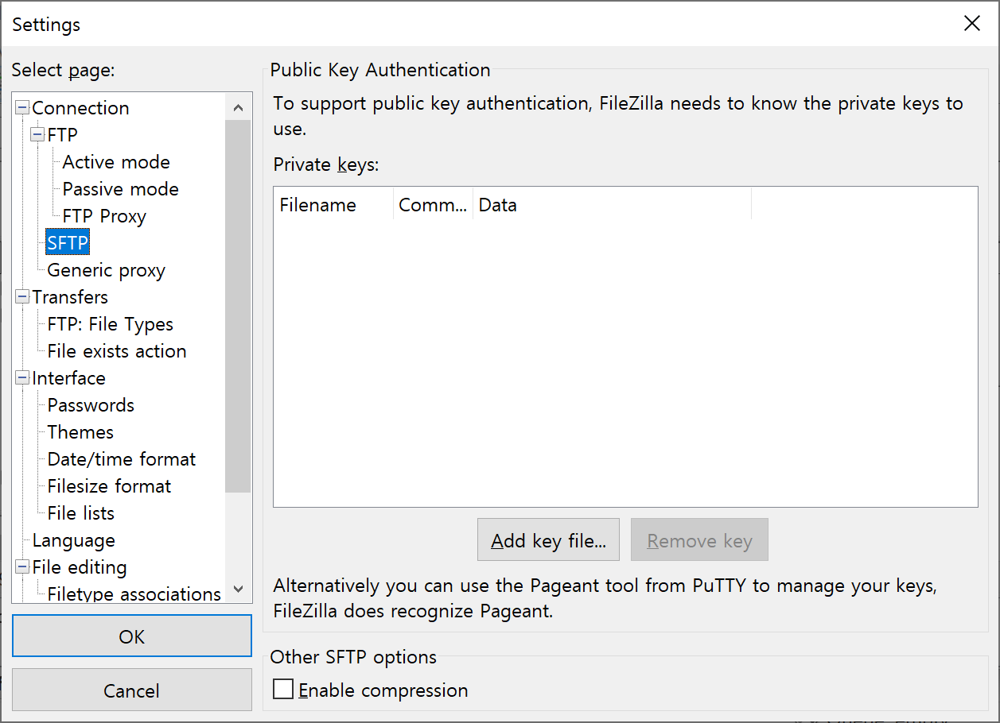
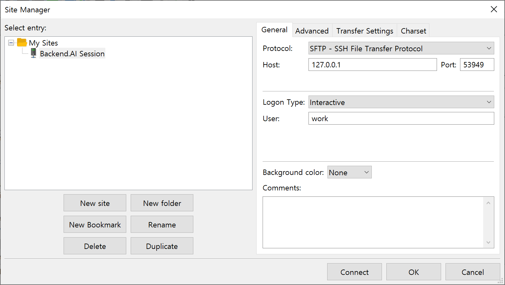
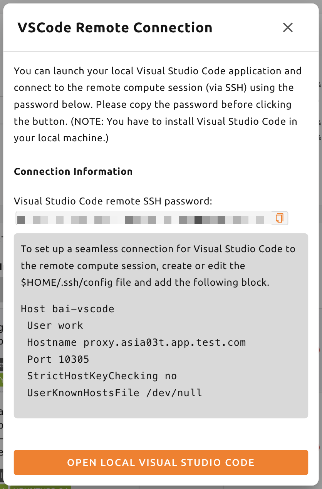
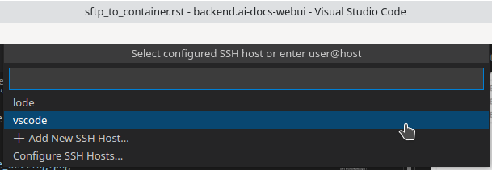
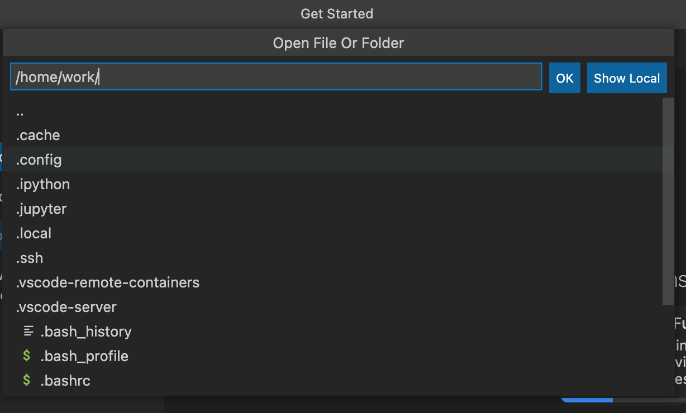

<a id="ssh-sftp-container"></a>

# การเชื่อมต่อ SSH/SFTP ไปยังเซสชันการคำนวณ

Backend.AI สนับสนุนการเชื่อมต่อ SSH/SFTP ไปยังเซสชันการคำนวณที่สร้างขึ้น (คอนเทนเนอร์) ในส่วนนี้เราจะเรียนรู้วิธีทำเช่นนั้น

:::note
ตั้งแต่เวอร์ชัน 24.03 เป็นต้นไป ฟีเจอร์การเชื่อมต่อ SSH/SFTP สามารถใช้งานได้ทั้งในเว็บเบราว์เซอร์และแอปพลิเคชัน WebUI Desktop
เมื่อเวอร์ชันเป็น 23.09 หรือต่ำกว่า คุณจำเป็นต้องใช้แอป WebUI Desktop สามารถดาวน์โหลดแอป Desktop
ได้จากแผงในหน้าสรุป การใช้แผงนี้จะทำให้เวอร์ชันที่เข้ากันได้ถูกดาวน์โหลดโดยอัตโนมัติ



คุณยังสามารถดาวน์โหลดแอปได้จาก
https://github.com/lablup/backend.ai-webui/releases โปรดตรวจสอบให้แน่ใจว่าได้ดาวน์โหลด
เวอร์ชันของ Web-UI ที่เข้ากันได้ในกรณีนี้ คุณสามารถตรวจสอบเวอร์ชัน Web-UI
โดยคลิกที่เมนูย่อย "About Backend.AI" ที่อยู่ใน
เมนูการตั้งค่าที่ด้านขวาบนของ GUI
:::


<a id="for-linux-mac"></a>

## สำหรับ Linux / Mac

ก่อนอื่น สร้างเซสชันการคำนวณ จากนั้นคลิกที่ไอคอนแอป (ปุ่มแรก) ใน Control ตามด้วยไอคอน SSH / SFTP หลังจากนั้นจะมีการเริ่มต้น daemon ที่อนุญาตให้เข้าถึง SSH/SFTP จากภายในคอนเทนเนอร์ และแอป Web-UI จะทำงานร่วมกับ daemon ผ่านบริการพร็อกซีภายในท้องถิ่น


:::note
คุณไม่สามารถสร้างการเชื่อมต่อ SSH/SFTP ไปยังเซสชันจนกว่าคุณจะคลิกที่ไอคอน SSH/SFTP เมื่อคุณปิดแอป Web-UI และเปิดใหม่อีกครั้ง การเชื่อมต่อระหว่างพร็อกซีท้องถิ่นและแอป Web-UI จะถูกสร้างขึ้นใหม่ ดังนั้นจึงต้องคลิกที่ไอคอน SSH/SFTP อีกครั้ง
:::

ถัดไป กล่องโต้ตอบที่มีข้อมูลการเชื่อมต่อ SSH/SFTP จะปรากฏขึ้น
จดจำที่อยู่ (โดยเฉพาะพอร์ตที่ได้รับมอบหมาย) ที่เขียนใน SFTP URL และ
คลิกลิงก์ดาวน์โหลดเพื่อบันทึกไฟล์ `id_container` ลงในเครื่องในพื้นที่
ไฟล์นี้เป็นคีย์ส่วนตัว SSH ที่สร้างขึ้นโดยอัตโนมัติ แทนที่จะใช้
ลิงก์ คุณยังสามารถดาวน์โหลดไฟล์ `id_container` ที่อยู่ภายใต้
`/home/work/` ด้วยเทอร์มินัลเว็บหรือ Jupyter Notebook ของคุณได้ คีย์ SSH
ที่สร้างขึ้นโดยอัตโนมัติอาจเปลี่ยนแปลงเมื่อมีการสร้างเซสชันใหม่ ในกรณีนั้น ต้อง
ดาวน์โหลดใหม่อีกครั้ง



หากต้องการเชื่อมต่อ SSH ไปยังเซสชันการคำนวณด้วยคีย์ส่วนตัว SSH ที่ดาวน์โหลดมา คุณ
เรียกใช้คำสั่งต่อไปนี้ในสภาพแวดล้อมเชลล์ คุณควรเขียน
เส้นทางไปยังไฟล์ `id_container` ที่ดาวน์โหลดมาหลังตัวเลือก `-i` และ
หมายเลขพอร์ตที่ได้รับมอบหมายหลังตัวเลือก `-p` ผู้ใช้ภายในเซสชันการคำนวณ
โดยปกติจะถูกตั้งค่าเป็น `work` แต่หากเซสชันของคุณใช้บัญชีอื่น ส่วน `work`
ใน `work@127.0.0.1` ควรเปลี่ยนเป็นบัญชีเซสชันจริง หาก
คุณเรียกใช้คำสั่งอย่างถูกต้อง คุณจะเห็นว่าการเชื่อมต่อ SSH ถูกสร้างขึ้นไปยัง
เซสชันการคำนวณ และคุณจะได้รับการต้อนรับด้วยสภาพแวดล้อมเชลล์ของคอนเทนเนอร์

```shell
$ ssh \
    -i ~/.ssh/id_container -p 30722 \
    -o StrictHostKeyChecking=no \
    -o UserKnownHostsFile=/dev/null \
    work@127.0.0.1
Warning: Permanently added '[127.0.0.1]:30722' (RSA) to the list of known hosts.
f310e8dbce83:~$
```

การเชื่อมต่อด้วย SFTP ก็เกือบจะเหมือนกัน หลังจากเรียกใช้ไคลเอ็นต์ SFTP และ
ตั้งค่าวิธีการเชื่อมต่อด้วยคีย์สาธารณะ เพียงระบุ `id_container`
เป็นคีย์ส่วนตัว SSH ไคลเอ็นต์ FTP แต่ละตัวอาจใช้วิธีที่แตกต่างกัน ดังนั้นให้ดู
คู่มือของไคลเอ็นต์ FTP แต่ละตัวสำหรับรายละเอียด


:::note
หมายเลขพอร์ตการเชื่อมต่อ SSH/SFTP จะถูกกำหนดแบบสุ่มทุกครั้งที่สร้างเซสชัน
หากคุณต้องการใช้หมายเลขพอร์ต SSH/SFTP เฉพาะ คุณสามารถป้อน
หมายเลขพอร์ตในช่อง "Preferred SSH Port" ในเมนูการตั้งค่าผู้ใช้ได้
เพื่อหลีกเลี่ยงการชนกันที่อาจเกิดขึ้นกับบริการอื่น ๆ ภายในเซสชันการคำนวณ
ขอแนะนำให้ระบุหมายเลขพอร์ตระหว่าง 10000-65000 อย่างไรก็ตาม หาก
มีการเชื่อมต่อ SSH/SFTP โดยเซสชันการคำนวณสองรายการหรือมากกว่าในเวลา
เดียวกัน การเชื่อมต่อ SSH/SFTP ครั้งที่สองจะไม่สามารถใช้พอร์ตที่กำหนดได้ (เนื่องจาก
การเชื่อมต่อ SSH/SFTP ครั้งแรกได้ใช้ไปแล้ว) ดังนั้นหมายเลขพอร์ตแบบสุ่ม
จะถูกกำหนด
:::

:::note
หากคุณต้องการใช้คีย์แพร์ SSH ของคุณเองแทน `id_container` ให้สร้าง
โฟลเดอร์ประเภท user ชื่อ `.ssh` หากคุณสร้างไฟล์ `authorized_keys` ใน
โฟลเดอร์นั้นและเพิ่มเนื้อหาของคีย์สาธารณะ SSH ของคุณ คุณสามารถ
เชื่อมต่อด้วย SSH/SFTP ผ่านคีย์ส่วนตัว SSH ของคุณเองได้โดยไม่ต้อง
ดาวน์โหลด `id_container` หลังจากสร้างเซสชันการคำนวณ
:::

:::note
หากคุณได้รับข้อความเตือนต่อไปนี้ ให้ลองอีกครั้งหลังจากเปลี่ยน
สิทธิ์ของ `id_container` เป็น 600 (`chmod 600 <id_container path>`)


:::


<a id="for-windows-filezilla"></a>

## สำหรับ Windows / FileZilla

แอป Backend.AI Web-UI รองรับการเชื่อมต่อด้วยคีย์สาธารณะแบบ OpenSSH (RSA2048)
หากต้องการเข้าถึงด้วยไคลเอ็นต์เช่น PuTTY บน Windows จะต้องแปลงคีย์ส่วนตัว
เป็นไฟล์ `ppk` ผ่านโปรแกรมเช่น PuTTYgen คุณสามารถดู
ลิงก์ต่อไปนี้สำหรับวิธีการแปลง:
https://wiki.filezilla-project.org/Howto เพื่อให้อธิบายง่ายขึ้น ส่วนนี้
จะอธิบายวิธีการเชื่อมต่อ SFTP ผ่านไคลเอ็นต์ FileZilla บน Windows

ดูที่วิธีการเชื่อมต่อบน Linux/Mac สร้างเซสชันการคำนวณ ตรวจสอบ
พอร์ตการเชื่อมต่อ และดาวน์โหลด `id_container` `id_container` เป็นคีย์
แบบ OpenSSH ดังนั้นหากคุณใช้ไคลเอ็นต์ที่รองรับเฉพาะ Windows หรือคีย์ประเภท ppk
คุณต้องแปลงคีย์ ที่นี่เราจะแปลงผ่านโปรแกรม PuTTYgen
ที่ติดตั้งพร้อมกับ PuTTY หลังจากเรียกใช้ PuTTYgen คลิกที่ import key ในเมนู
Conversions เลือกไฟล์ `id_container` ที่ดาวน์โหลดมาจากกล่องโต้ตอบเปิดไฟล์
คลิกปุ่ม Save private key ของ PuTTYGen และบันทึกไฟล์ด้วย
ชื่อ `id_container.ppk`


หลังจากเรียกใช้ไคลเอ็นต์ FileZilla แล้ว ให้ไปที่ Settings-Connection-SFTP
และลงทะเบียนไฟล์คีย์ `id_container.ppk` (`id_container` สำหรับไคลเอ็นต์
ที่รองรับ OpenSSH)



เปิด Site Manager สร้างไซต์ใหม่ และป้อนข้อมูลการเชื่อมต่อตาม
ด้านล่าง



เมื่อเชื่อมต่อกับคอนเทนเนอร์เป็นครั้งแรก อาจมีป๊อปอัปยืนยัน
ต่อไปนี้ปรากฏขึ้น คลิกปุ่ม OK เพื่อบันทึกคีย์โฮสต์


หลังจากครู่หนึ่ง คุณจะเห็นว่าการเชื่อมต่อถูกสร้างขึ้นดังต่อไปนี้
ตอนนี้คุณสามารถถ่ายโอนไฟล์ขนาดใหญ่ไปยัง `/home/work/` หรือโฟลเดอร์จัดเก็บที่เมานต์อื่น
ผ่านการเชื่อมต่อ SFTP นี้ได้


<a id="for-visual-studio-code"></a>

## สำหรับ Visual Studio Code

Backend.AI รองรับการพัฒนาด้วย Visual Studio Code ในเครื่องผ่านการเชื่อมต่อ SSH/SFTP
ไปยังเซสชันการคำนวณ เมื่อเชื่อมต่อแล้ว คุณสามารถโต้ตอบกับไฟล์และ
โฟลเดอร์ที่ใดก็ได้บนเซสชันการคำนวณ ในส่วนนี้ เราจะเรียนรู้วิธี
ทำสิ่งนี้

ก่อนอื่น คุณควรติดตั้ง Visual Studio Code และแพ็กเกจส่วนขยาย Remote Development

ลิงก์: https://aka.ms/vscode-remote/download/extension


หลังจากติดตั้งส่วนขยายแล้ว คุณควรกำหนดค่าการเชื่อมต่อ SSH สำหรับ
เซสชันการคำนวณ ในกล่องโต้ตอบ VSCode Remote Connection คลิกปุ่มไอคอนคัดลอก
เพื่อคัดลอกรหัสผ่าน SSH ระยะไกลของ Visual Studio Code นอกจากนี้ ให้จดจำหมายเลขพอร์ต



จากนั้น ตั้งค่าไฟล์ SSH config แก้ไขไฟล์ `~/.ssh/config` (สำหรับ Linux/Mac)
หรือ `C:\Users\[ชื่อผู้ใช้]\.ssh\config` (สำหรับ Windows) และเพิ่มบล็อกต่อไปนี้
เพื่อความสะดวก เราตั้งค่าชื่อโฮสต์เป็น `bai-vscode` สามารถเปลี่ยนเป็นนามแฝงอื่นได้

```
Host bai-vscode
User work
Hostname 127.0.0.1
# ป้อนหมายเลขพอร์ตที่จำไว้
Port 49335
StrictHostKeyChecking no
UserKnownHostsFile /dev/null
```

ตอนนี้ใน Visual Studio Code ให้เลือก `Command Palette...` จากเมนู `View`


Visual Studio Code สามารถตรวจจับประเภทของโฮสต์ที่คุณกำลังเชื่อมต่อได้
โดยอัตโนมัติ เลือก `Remote-SSH: Connect to Host...`


คุณจะเห็นรายการโฮสต์ใน `.ssh/config` โปรดเลือกโฮสต์ที่จะ
เชื่อมต่อ ในกรณีนี้ คือ `vscode`



การเลือกชื่อโฮสต์จะนำคุณไปสู่การเข้าถึงเซสชันการคำนวณระยะไกล
หลังจากเชื่อมต่อแล้ว คุณจะเห็นหน้าต่างว่าง คุณสามารถดูแถบสถานะได้เสมอ
เพื่อดูว่าคุณเชื่อมต่อกับโฮสต์ใดอยู่


จากนั้นคุณสามารถเปิดโฟลเดอร์หรือพื้นที่ทำงานใด ๆ บนโฮสต์ระยะไกลได้โดยการเข้าถึงเมนู `File >
Open...` หรือ `File > Open Workspace...` เหมือนที่คุณทำตามปกติ!




<a id="establish-ssh-connection-with-backendai-client-package"></a>

## ตั้งค่าการเชื่อมต่อ SSH ด้วยแพ็กเกจ Backend.AI Client

เอกสารนี้อธิบายวิธีการสร้างการเชื่อมต่อ SSH ไปยังเซสชันการคำนวณ
ในสภาพแวดล้อมที่ไม่สามารถใช้ส่วนติดต่อผู้ใช้แบบกราฟิก (GUI) ได้

โดยทั่วไป โหนด GPU ที่เรียกใช้เซสชันการคำนวณ (คอนเทนเนอร์) ไม่สามารถเข้าถึงได้
โดยตรงจากภายนอก ดังนั้น เพื่อสร้างการเชื่อมต่อ SSH หรือ sFTP
ไปยังเซสชันการคำนวณ จำเป็นต้องเริ่มต้นพร็อกซีในพื้นที่ที่สร้างอุโมงค์
เพื่อถ่ายทอดการเชื่อมต่อระหว่างผู้ใช้และเซสชัน การใช้
แพ็กเกจ Backend.AI Client กระบวนการนี้ค่อนข้างง่ายในการกำหนดค่า

<a id="prepare-backendai-client-package"></a>

### เตรียมแพ็กเกจ Backend.AI Client

<a id="prepare-with-docker-image"></a>

#### เตรียมด้วยอิมเมจ Docker

แพ็กเกจ Backend.AI Client มีให้ใช้งานเป็นอิมเมจ Docker คุณสามารถดึง
อิมเมจจาก Docker Hub ได้ด้วยคำสั่งต่อไปนี้:

```bash
$ docker pull lablup/backend.ai-client
$
$ # If you want to use the specific version, you can pull the image with the following command:
$ docker pull lablup/backend.ai-client:<version>
```

เวอร์ชันของเซิร์ฟเวอร์ Backend.AI สามารถพบได้ในเมนู "About Backend.AI" ที่
ปรากฏขึ้นเมื่อคุณคลิกที่ไอคอนรูปคนที่มุมขวาบนของ Web UI


เรียกใช้อิมเมจ Docker ด้วยคำสั่งต่อไปนี้:

```bash
$ docker run --rm -it lablup/backend.ai-client bash
```

ตรวจสอบว่าคำสั่ง `backend.ai` พร้อมใช้งานในคอนเทนเนอร์หรือไม่ หาก
พร้อมใช้งาน ข้อความช่วยเหลือจะแสดงขึ้น

```bash
$ backend.ai
```

<a id="prepare-directly-from-host-with-a-python-virtual-environment"></a>

#### เตรียมโดยตรงจากโฮสต์ด้วยสภาพแวดล้อมเสมือน Python

หากคุณไม่สามารถหรือไม่ต้องการใช้ Docker คุณสามารถติดตั้งแพ็กเกจ Backend.AI Client
โดยตรงบนเครื่องโฮสต์ของคุณได้ ข้อกำหนดเบื้องต้นคือ:

- เวอร์ชัน Python ที่จำเป็นอาจแตกต่างกันไปขึ้นอยู่กับเวอร์ชันของ Backend.AI Client
  คุณสามารถตรวจสอบตารางความเข้ากันได้ที่
  https://github.com/lablup/backend.ai#python-version-compatibility
- อาจจำเป็นต้องใช้คอมไพเลอร์ `clang`
- อาจจำเป็นต้องใช้แพ็กเกจ `zstd` หากคุณใช้ Python binary ของ `indygreg`

ขอแนะนำให้ใช้สภาพแวดล้อมเสมือน Python ในการติดตั้งแพ็กเกจ
วิธีหนึ่งคือใช้ Python binary ที่สร้างแบบคงที่จาก
คลัง `indygreg` ดาวน์โหลด binary ที่ตรงกับสถาปัตยกรรมเครื่องในพื้นที่ของคุณ
จากหน้าต่อไปนี้และแตกไฟล์

- https://github.com/indygreg/python-build-standalone/releases
- หากคุณใช้สภาพแวดล้อม Ubuntu แบบ x86 ที่ได้รับความนิยม คุณสามารถดาวน์โหลดและ
  แตกไฟล์ได้ดังต่อไปนี้:

  ```bash
  $ wget https://github.com/indygreg/python-build-standalone/releases/download/20240224/cpython-3.11.8+20240224-x86_64-unknown-linux-gnu-pgo-full.tar.zst
  $ tar -I unzstd -xvf *.tar.zst
  ```

หลังจากแตกไฟล์ binary แล้ว จะมีการสร้างไดเรกทอรี `python` ภายใต้
ไดเรกทอรีปัจจุบัน คุณสามารถตรวจสอบเวอร์ชันของ Python ที่ดาวน์โหลดได้โดยเรียกใช้
คำสั่งต่อไปนี้

```bash
$ ./python/install/bin/python3 -V
Python 3.11.8
```

เพื่อหลีกเลี่ยงไม่ให้ส่งผลกระทบต่อสภาพแวดล้อม Python อื่น ๆ บนระบบ ขอแนะนำให้
สร้างสภาพแวดล้อมเสมือน Python แยกต่างหาก เมื่อคุณเรียกใช้
คำสั่งต่อไปนี้ จะมีการสร้างสภาพแวดล้อมเสมือน Python ภายใต้ไดเรกทอรี
`.venv.`

```bash
$ ./python/install/bin/python3 -m venv .venv
```

เปิดใช้งานสภาพแวดล้อมเสมือน เนื่องจากมีการเปิดใช้งานสภาพแวดล้อมเสมือนใหม่แล้ว
จะมีเพียงแพ็กเกจ `pip` และ `setuptools` เท่านั้นที่ติดตั้งไว้เมื่อ
คุณเรียกใช้คำสั่ง `pip list`

```bash
$ source .venv/bin/activate
(.venv) $ pip list
Package    Version
---------- -------
pip        24.0
setuptools 65.5.0
```

ตอนนี้ ติดตั้งแพ็กเกจ Backend.AI Client ติดตั้งแพ็กเกจไคลเอ็นต์ตาม
เวอร์ชันของเซิร์ฟเวอร์ ที่นี่เราสมมติว่าเวอร์ชันคือ 23.09 หาก
มีข้อผิดพลาดที่เกี่ยวข้องกับการติดตั้งเกิดขึ้นกับแพ็กเกจ `netifaces` คุณอาจต้อง
ลดเวอร์ชันของ `pip` และ `setuptools` ตรวจสอบว่าคำสั่ง `backend.ai`
พร้อมใช้งานหรือไม่

```bash
(.venv) $ pip install -U pip==24.0 && pip install -U setuptools==65.5.0
(.venv) $ pip install -U backend.ai-client~=23.09
(.venv) $ backend.ai
```

<a id="setting-up-server-connection-for-cli"></a>

### การตั้งค่าการเชื่อมต่อเซิร์ฟเวอร์สำหรับ CLI

สร้างไฟล์ `.env` และเพิ่มเนื้อหาต่อไปนี้ ใช้ที่อยู่เดียวกันสำหรับ
`webserver-url` ที่คุณใช้เชื่อมต่อกับบริการ Web UI จาก
เบราว์เซอร์ของคุณ

```bash
BACKEND_ENDPOINT_TYPE=session
BACKEND_ENDPOINT=<webserver-url>
```

เรียกใช้คำสั่ง CLI ต่อไปนี้เพื่อเชื่อมต่อกับเซิร์ฟเวอร์ ป้อนอีเมลและ
รหัสผ่านที่คุณใช้เข้าสู่ระบบจากเบราว์เซอร์ของคุณ หากทุกอย่างเป็นไปด้วยดี คุณ
จะเห็นข้อความ `Login succeeded`

```bash
$ backend.ai login
User ID: myuser@test.com
Password:
✓ Login succeeded.
```

<a id="sshscp-connection-to-computation-session"></a>

### การเชื่อมต่อ SSH/SCP ไปยังเซสชันการคำนวณ

สร้างเซสชันการคำนวณจากเบราว์เซอร์โดยการเมานต์โฟลเดอร์ที่คุณต้องการ
คัดลอกข้อมูลไป คุณสามารถสร้างเซสชันโดยใช้ CLI ก็ได้ แต่เพื่อ
ความสะดวก ให้เราสมมติว่าคุณได้สร้างจากเบราว์เซอร์แล้ว จดจำ
ชื่อของเซสชันการคำนวณที่สร้างขึ้น ที่นี่เราสมมติว่าคือ
`ibnFmWim-session`

หากคุณเพียงต้องการ SSH ให้ดำเนินการคำสั่งต่อไปนี้:

```bash
$ backend.ai ssh ibnFmWim-session
∙ running a temporary sshd proxy at localhost:9922 ...
work@main1[ibnFmWim-session]:~$
```

หากคุณต้องการดาวน์โหลดไฟล์คีย์ SSH และเรียกใช้คำสั่ง ssh อย่างชัดเจน คุณ
จำเป็นต้องเรียกใช้คำสั่งต่อไปนี้ก่อนเพื่อเริ่มต้นบริการพร็อกซีในพื้นที่ที่
ถ่ายทอดการเชื่อมต่อจากเครื่องในพื้นที่ไปยังเซสชันการคำนวณ คุณสามารถ
ระบุพอร์ต (9922) ที่จะใช้บนเครื่องในพื้นที่ได้ด้วยตัวเลือก b

```bash
$ backend.ai app ibnFmWim-session sshd -b 9922
∙ A local proxy to the application "sshd" provided by the session "ibnFmWim-session" is available at:
tcp://127.0.0.1:9922
```

เปิดหน้าต่างเทอร์มินัลใหม่บนเครื่องในพื้นที่ของคุณ ย้ายไปยังไดเรกทอรี
การทำงานที่มีไฟล์ `.env` อยู่ และดาวน์โหลดคีย์ SSH
ที่สร้างขึ้นโดยอัตโนมัติในเซสชันการคำนวณ

```bash
$ source .venv/bin/activate  # เปิดใช้งานสภาพแวดล้อมเสมือน Python อีกครั้ง เนื่องจากเป็นเทอร์มินัลคนละอัน
$ backend.ai session download ibnFmWim-session id_container
Downloading files: 3.58kbytes [00:00, 352kbytes/s]
✓ Downloaded to /*/client.
```

คุณสามารถใช้คีย์ที่ดาวน์โหลดมาเพื่อ SSH ดังต่อไปนี้ เนื่องจากคุณเริ่มต้นพร็อกซี
ในพื้นที่บนพอร์ต 9922 ที่อยู่การเชื่อมต่อควรเป็น 127.0.0.1 และพอร์ต
ควรเป็น 9922 ใช้บัญชีผู้ใช้ `work` สำหรับการเชื่อมต่อ

```bash
$ ssh \
-o StrictHostKeyChecking=no \
-o UserKnownHostsFile=/dev/null \
-i ./id_container \
-p 9922 \
work@127.0.0.1
Warning: Permanently added '[127.0.0.1]:9922' (RSA) to the list of known hosts.
work@
```

ในทำนองเดียวกัน คุณสามารถใช้คำสั่ง `scp` เพื่อคัดลอกไฟล์ได้ ในกรณีนี้ คุณ
ควรคัดลอกไฟล์ไปยังโฟลเดอร์ที่เมานต์ภายในเซสชันการคำนวณ เพื่อ
รักษาไฟล์ไว้แม้หลังจากที่เซสชันสิ้นสุดลงแล้ว

```bash
$ scp \
-o StrictHostKeyChecking=no \
-o UserKnownHostsFile=/dev/null \
-i ./id_container \
-P 9922 \
test_file.xlsx work@127.0.0.1:/home/work/myfolder/
Warning: Permanently added '[127.0.0.1]:9922' (RSA) to the list of known hosts.
test_file.xlsx
```

เมื่องานทั้งหมดเสร็จสิ้นแล้ว กด `Ctrl-C` บนเทอร์มินัลแรกเพื่อ
ยกเลิกบริการพร็อกซีในพื้นที่