# การแชร์โฟลเดอร์จัดเก็บข้อมูลและการควบคุมการเข้าถึง

คุณอาจต้องการแชร์เนื้อหาของโฟลเดอร์เก็บข้อมูลกับผู้ใช้หรือสมาชิกในโครงการคนอื่นเพื่อการทำงานร่วมกัน สำหรับวัตถุประสงค์นี้ Backend.AI จึงมีฟีเจอร์การแชร์โฟลเดอร์ที่ยืดหยุ่น

## แชร์โฟลเดอร์สตอเรจกับผู้ใช้อื่น

Let's learn how to share your personal Storage folder with other ผู้ใช้s. First,
log in to User A's account and go to the Data page. There are several
folders, and we want to share a folder named `tests` to User B.

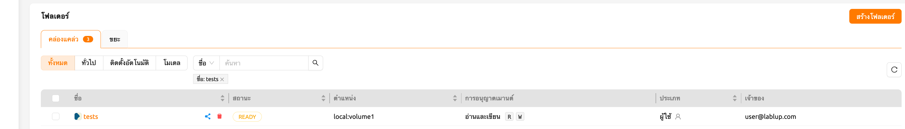

Inside the `tests` folder you can see files and directories like `hello.txt`
and `myfolder`.

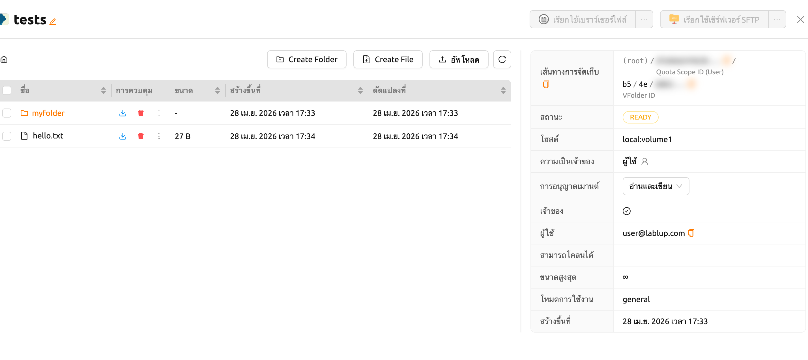

Confirm that the `tests` folder is not listed when logging in with User B's
account.

   If a folder named `tests` already exists in User B's account, User A's
   `tests` folder cannot be shared with User B.

Back to User A's account,click the 'share' button in the Control column on the
'tests' folder in the list.

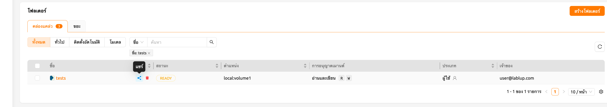

In the 'Invite User' section of the modal, enter User B's email address and
select the desired permission level. If you choose 'Read Only', User B will be
able to only view the folder but not modify it. If you select 'Read & Write',
User B will be able to both view and modify the folder.

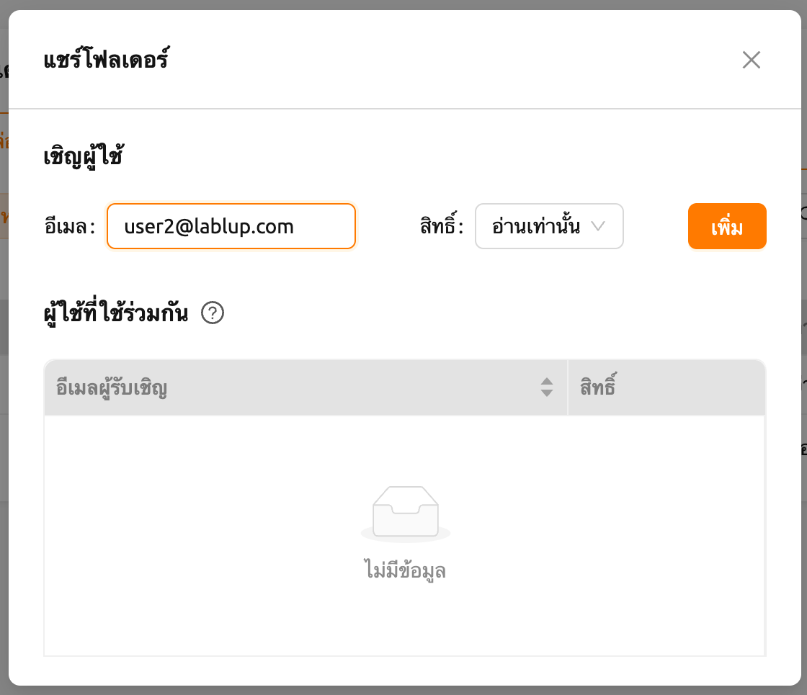

Switch back to User B's account and navigate to the Data page.
The number of invited folders can be checked in the Storage Status panel.

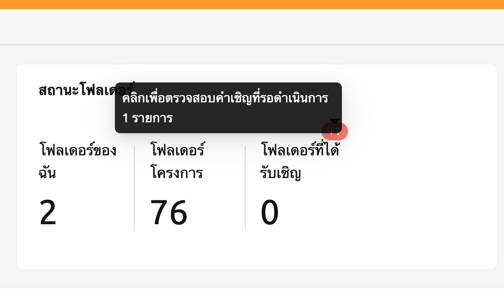

Clicking the badge opens an invitation list modal, where pending folder invitations
can be accepted or declined.

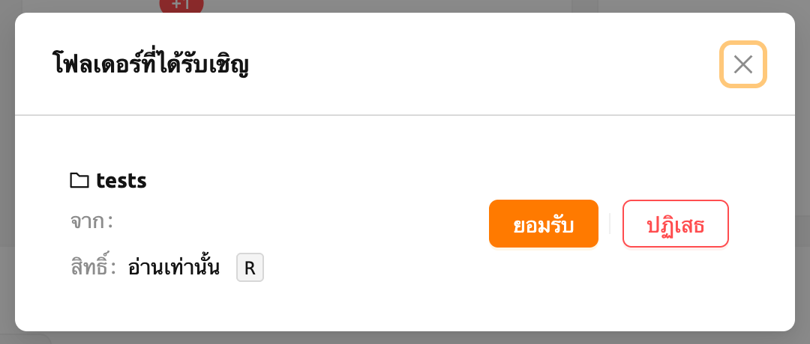

Go to the Data page and check that the `tests` folder is displayed in
the list. If you don't see it on the list, try refreshing your browser page.
Since you have accepted the invitation, you can now view the contents of User
A's `tests` folder in User B account. Unlike folders created by User B,
shared folders appear without the check icon in the Owner column. You
can also see the 'Read only' mark displayed in the Mount Permission column.

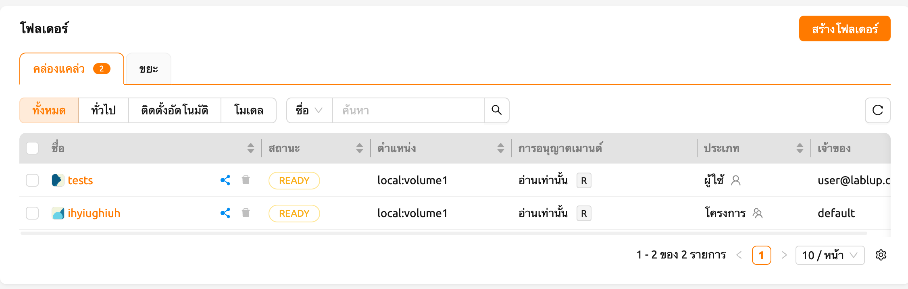

Let's navigate inside the `tests` folder by clicking the folder icon in the
Control panel of `tests`. You can check the `hello.txt` and `myfolder`
that you checked in the User A's account again.

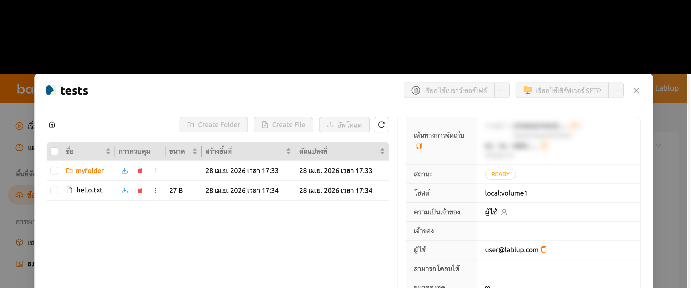

Let's create a compute session
by mounting this storge folder with the User B's account.

   From version 24.09, Backend.AI offers an improved version of the session launcher (NEO)
   as default. If you want to use the previous session launcher, please refer [User Settings<general-settings>](#User Settings<general-settings>)
   section. For instructions on how to use it, please refer to the following [link](https://webui.docs.backend.ai/en/23.09_a/sessions_all/sessions_all.html).
   If you want to know more about the NEO session launcher, please refer [Create Session<create_session>](#Create Session<create_session>)

After creating a session, open the web terminal and check that the `tests`
folder is mounted in the home folder. The contents of the `tests` folder are
displayed, but attempts to create or delete files are not allowed. This is
because User A shared it as read-only. User B can create a file in the `tests`
folder if it has been shared including write access.

วิธีนี้ คุณสามารถแบ่งปันโฟลเดอร์พื้นที่เก็บข้อมูลส่วนตัวของคุณกับผู้ใช้อื่นได้ตามบัญชีอีเมลของ Backend.AI ของคุณ

   Backend.AI also provides sharing project folder to project members.
   To See the detail, go to [sharing a project storage folder with project members <sharing-a-group-storage>](#sharing a project storage folder with project members <sharing-a-group-storage>).

## ปรับแต่งสิทธิ์สำหรับโฟลเดอร์ที่แชร์

You can modify the permissions of a shared ผู้ใช้ from the folder sharing modal.
Click Select permission to set the sharing permission.

- ดู: ผู้ใช้ที่ได้รับเชิญมีสิทธิ์เข้าถึงโฟลเดอร์แบบอ่านอย่างเดียว
- แก้ไข: ผู้ใช้ที่ได้รับเชิญมีสิทธิ์ในการอ่านและเขียนเข้าถึงโฟลเดอร์ ผู้ใช้ไม่สามารถลบโฟลเดอร์หรือไฟล์ได้

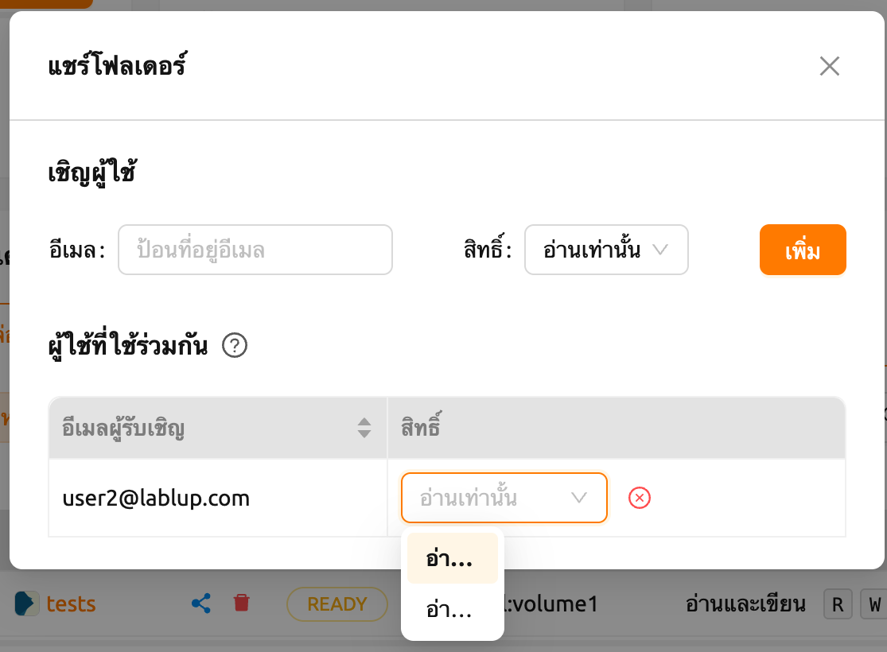

   Renaming folder itself is available only for the owner, even if the ผู้ใช้ has granted
   Edit permission. Please note that Edit permission does not provide
   renaming folder.

## Stop sharing a folder

To stop sharing a folder as the inviter, open the file list and click the 'Share' button in the
control column for the folder. In the permission settings modal, click the 'Stop sharing' button
next to the permission selector.

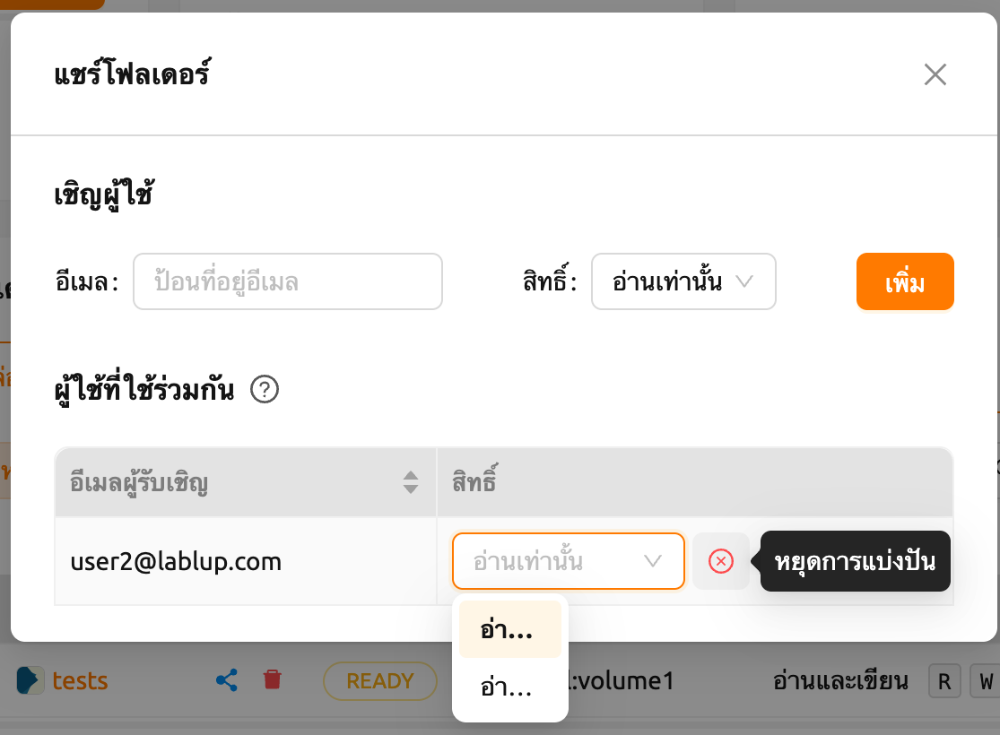

If access to a shared folder is no longer needed as an invitee, select the 'Share' button next to
the folder in the folder list, then click 'Leave the shared folder' to remove access.

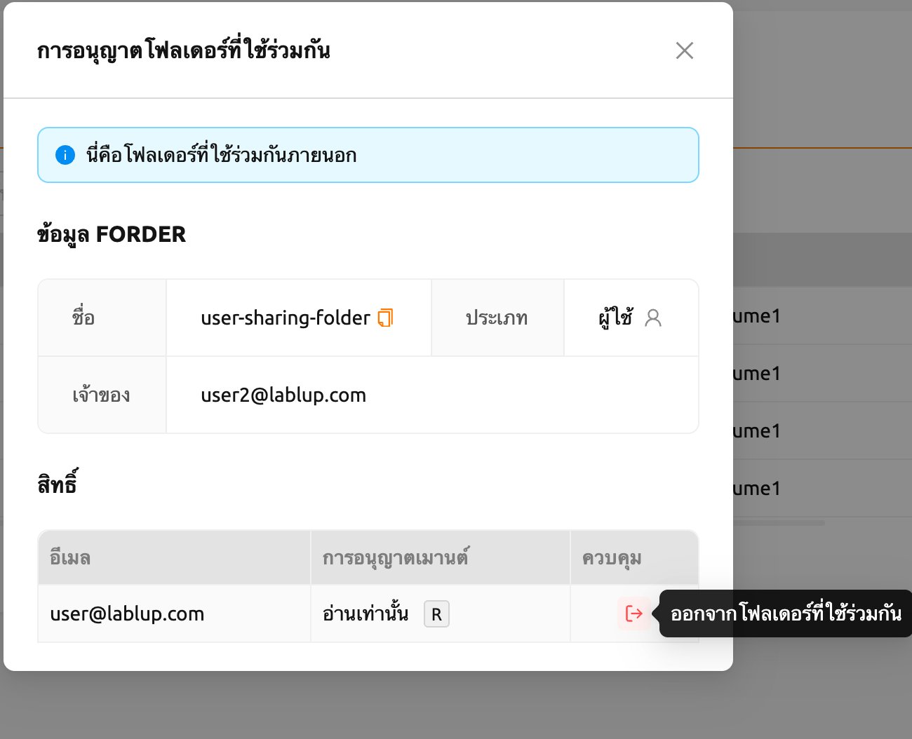