# การแชร์โฟลเดอร์จัดเก็บข้อมูลและการควบคุมการเข้าถึง

คุณอาจต้องการแชร์เนื้อหาของโฟลเดอร์เก็บข้อมูลกับผู้ใช้หรือสมาชิกในโครงการคนอื่นเพื่อการทำงานร่วมกัน สำหรับวัตถุประสงค์นี้ Backend.AI จึงมีฟีเจอร์การแชร์โฟลเดอร์ที่ยืดหยุ่น

## แชร์โฟลเดอร์จัดเก็บกับผู้ใช้อื่น

มาเรียนรู้วิธีแชร์โฟลเดอร์จัดเก็บส่วนตัวกับผู้ใช้อื่น ขั้นแรก ให้เข้าสู่ระบบด้วยบัญชีของผู้ใช้ A แล้วไปที่หน้า Data จะพบโฟลเดอร์หลายรายการ และเราต้องการแชร์โฟลเดอร์ชื่อ `tests` ให้กับผู้ใช้ B

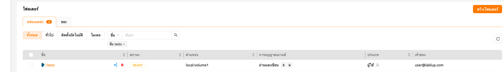

ภายในโฟลเดอร์ `tests` จะเห็นไฟล์และไดเรกทอรี เช่น `hello.txt` และ `myfolder`

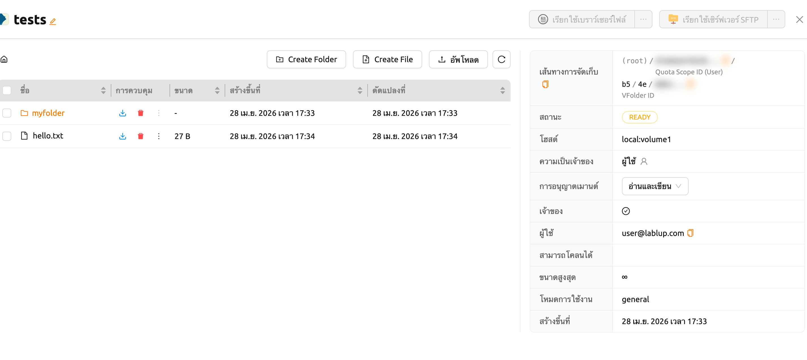

ยืนยันว่าโฟลเดอร์ `tests` ไม่ปรากฏในรายการเมื่อเข้าสู่ระบบด้วยบัญชีผู้ใช้ B

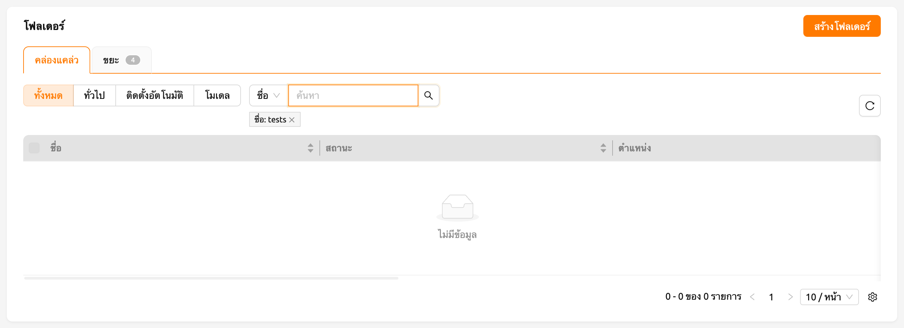

:::note
หากมีโฟลเดอร์ชื่อ `tests` อยู่แล้วในบัญชีของผู้ใช้ B จะไม่สามารถแชร์โฟลเดอร์ `tests` ของผู้ใช้ A ให้กับผู้ใช้ B ได้
:::

กลับไปที่บัญชีผู้ใช้ A คลิกปุ่ม 'แชร์' ในคอลัมน์ควบคุมของโฟลเดอร์ `tests` ในรายการ

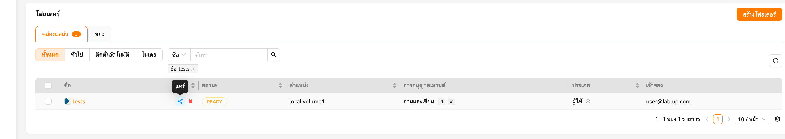

ในส่วน 'เชิญผู้ใช้' ของโมดัล ให้ป้อนที่อยู่อีเมลของผู้ใช้ B และเลือกระดับสิทธิ์ที่ต้องการ หากเลือก 'อ่านเท่านั้น' ผู้ใช้ B จะสามารถดูโฟลเดอร์ได้เท่านั้นแต่ไม่สามารถแก้ไขได้ หากเลือก 'อ่านและเขียน' ผู้ใช้ B จะสามารถดูและแก้ไขโฟลเดอร์ได้

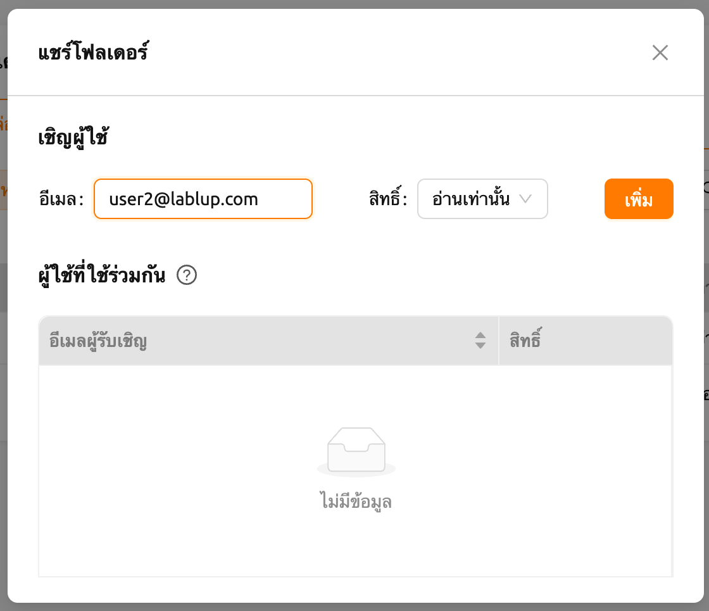

สลับกลับไปที่บัญชีผู้ใช้ B แล้วไปที่หน้า Data จำนวนโฟลเดอร์ที่ได้รับเชิญสามารถตรวจสอบได้ในแผงสถานะพื้นที่จัดเก็บ

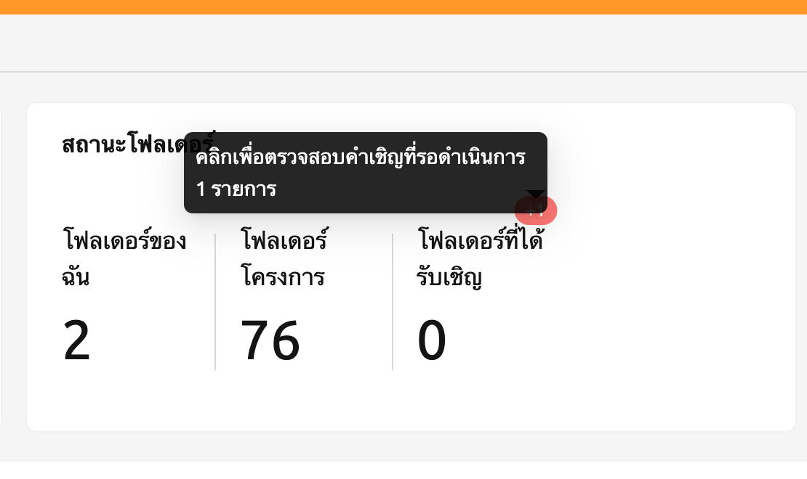

การคลิกที่ป้ายจะเปิดโมดัลรายการเชิญ ซึ่งสามารถยอมรับหรือปฏิเสธคำเชิญโฟลเดอร์ที่รอดำเนินการได้

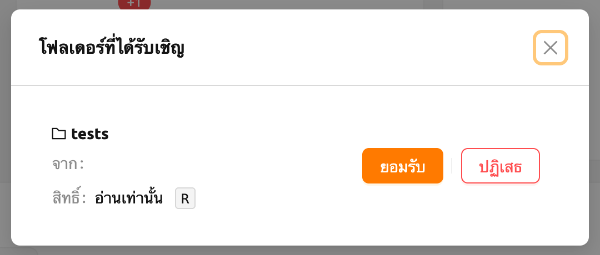

ไปที่หน้า Data และตรวจสอบว่าโฟลเดอร์ `tests` แสดงในรายการ หากไม่เห็นในรายการ ให้ลองรีเฟรชหน้าเบราว์เซอร์ เนื่องจากคุณได้ยอมรับคำเชิญแล้ว จึงสามารถดูเนื้อหาของโฟลเดอร์ `tests` ของผู้ใช้ A ในบัญชีผู้ใช้ B ได้ ต่างจากโฟลเดอร์ที่ผู้ใช้ B สร้างเอง โฟลเดอร์ที่แชร์จะไม่มีไอคอนเครื่องหมายถูกในคอลัมน์เจ้าของ นอกจากนี้ยังจะเห็นเครื่องหมาย 'อ่านเท่านั้น' ที่แสดงในคอลัมน์สิทธิ์การเมาท์

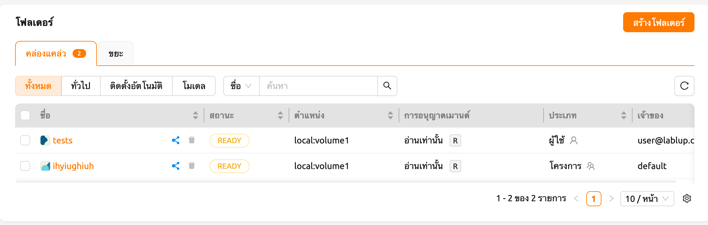

คลิกไอคอนโฟลเดอร์ในแผงควบคุมของ `tests` เพื่อไปยังภายในโฟลเดอร์ `tests` คุณจะเห็น `hello.txt` และ `myfolder` ที่ตรวจสอบไว้ในบัญชีผู้ใช้ A อีกครั้ง

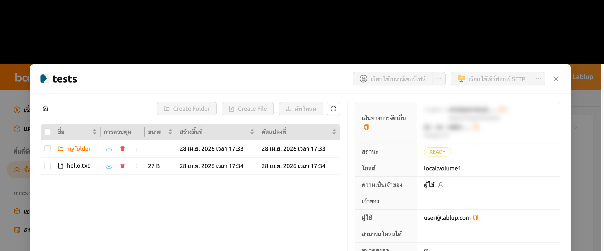

มาสร้างเซสชันการคำนวณโดยเมาท์โฟลเดอร์จัดเก็บนี้ด้วยบัญชีผู้ใช้ B

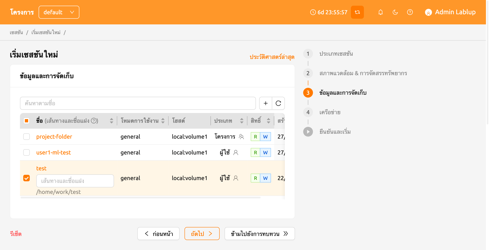

:::note
ตั้งแต่เวอร์ชัน 24.09 Backend.AI มีตัวเปิดเซสชันเวอร์ชันปรับปรุง (NEO) เป็นค่าเริ่มต้น หากต้องการใช้ตัวเปิดเซสชันแบบเดิม โปรดดู[การตั้งค่าผู้ใช้](#general-tab) สำหรับคำแนะนำการใช้งาน โปรดดู[ลิงก์](https://webui.docs.backend.ai/en/23.09_a/sessions_all/sessions_all.html)ต่อไปนี้ หากต้องการทราบข้อมูลเพิ่มเติมเกี่ยวกับตัวเปิดเซสชัน NEO โปรดดู[สร้างเซสชัน](#start-a-new-session)
:::

หลังจากสร้างเซสชัน ให้เปิดเว็บเทอร์มินัลและตรวจสอบว่าโฟลเดอร์ `tests` ถูกเมาท์ในโฟลเดอร์โฮม เนื้อหาของโฟลเดอร์ `tests` จะถูกแสดง แต่การพยายามสร้างหรือลบไฟล์จะไม่ได้รับอนุญาต เนื่องจากผู้ใช้ A แชร์เป็นแบบอ่านเท่านั้น หากแชร์โดยรวมสิทธิ์การเขียน ผู้ใช้ B จะสามารถสร้างไฟล์ในโฟลเดอร์ `tests` ได้

วิธีนี้ คุณสามารถแชร์โฟลเดอร์จัดเก็บส่วนตัวกับผู้ใช้อื่นได้ตามบัญชีอีเมลของ Backend.AI ของคุณ

:::note
Backend.AI ยังมีฟีเจอร์แชร์โฟลเดอร์โปรเจกต์ให้กับสมาชิกในโปรเจกต์อีกด้วย สำหรับรายละเอียด โปรดดู[การแชร์โฟลเดอร์จัดเก็บโปรเจกต์กับสมาชิกในโปรเจกต์](#share-project-storage-folders-with-project-members)
:::

## ปรับแต่งสิทธิ์สำหรับโฟลเดอร์ที่แชร์

คุณสามารถแก้ไขสิทธิ์ของผู้ใช้ที่แชร์ได้จากโมดัลการแชร์โฟลเดอร์ คลิกเลือกสิทธิ์เพื่อตั้งค่าสิทธิ์การแชร์

- อ่านเท่านั้น: ผู้ใช้ที่ได้รับเชิญมีสิทธิ์เข้าถึงโฟลเดอร์แบบอ่านอย่างเดียว
- อ่านและเขียน: ผู้ใช้ที่ได้รับเชิญมีสิทธิ์ในการอ่านและเขียนเข้าถึงโฟลเดอร์ ผู้ใช้ไม่สามารถลบโฟลเดอร์หรือไฟล์ได้

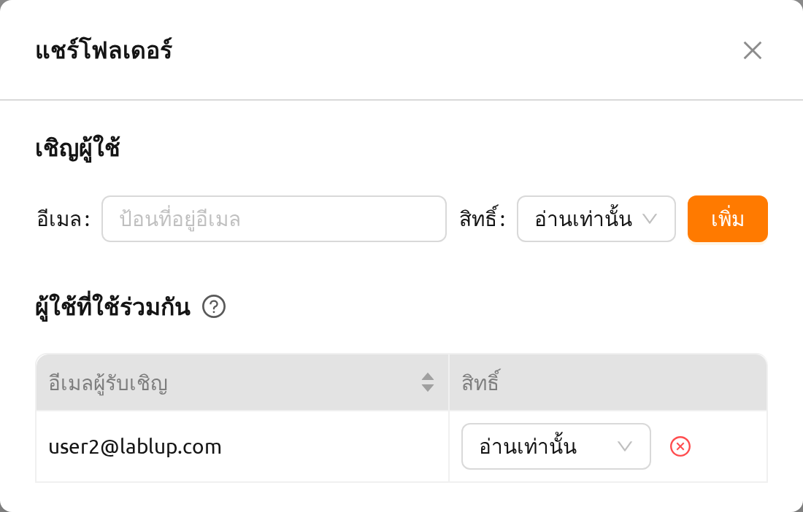

:::note
แม้ว่าผู้ใช้จะได้รับสิทธิ์อ่านและเขียน การเปลี่ยนชื่อโฟลเดอร์สามารถทำได้เฉพาะเจ้าของเท่านั้น โปรดทราบว่าสิทธิ์อ่านและเขียนไม่รวมถึงการเปลี่ยนชื่อโฟลเดอร์
:::

## หยุดการแชร์โฟลเดอร์

หากต้องการหยุดแชร์โฟลเดอร์ในฐานะผู้เชิญ ให้เปิดรายการไฟล์แล้วคลิกปุ่ม 'แชร์' ในคอลัมน์ควบคุมของโฟลเดอร์นั้น ในโมดัลการตั้งค่าสิทธิ์ ให้คลิกปุ่ม 'หยุดแชร์' ข้างตัวเลือกสิทธิ์

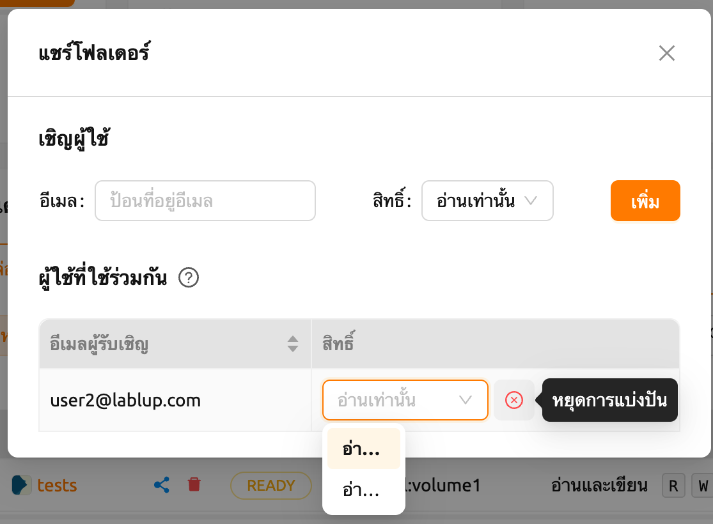

หากผู้ได้รับเชิญไม่ต้องการเข้าถึงโฟลเดอร์ที่แชร์อีกต่อไป ให้เลือกปุ่ม 'แชร์' ข้างโฟลเดอร์ในรายการโฟลเดอร์ แล้วคลิก 'ออกจากโฟลเดอร์ที่แชร์' เพื่อยกเลิกการเข้าถึง

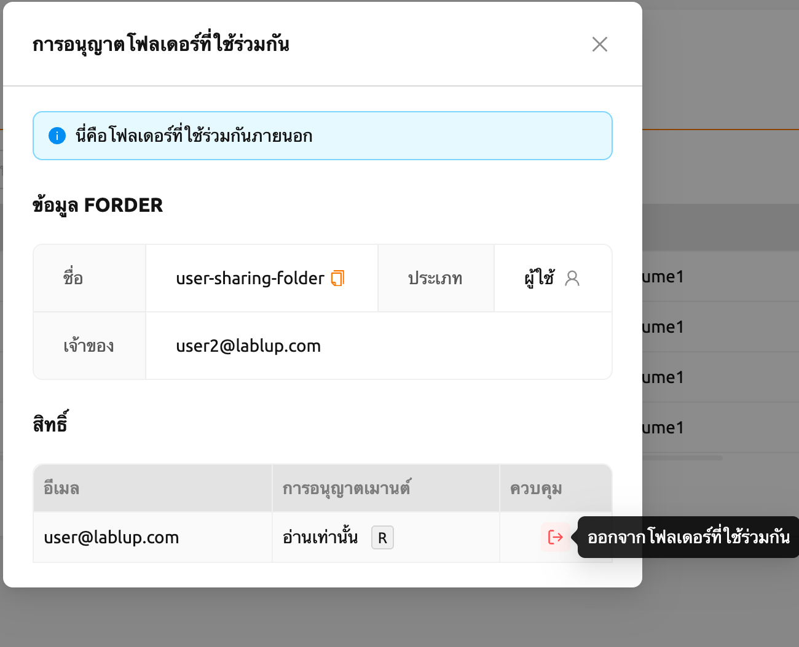
