# การแชร์โฟลเดอร์จัดเก็บข้อมูลและการควบคุมการเข้าถึง

คุณอาจต้องการแชร์เนื้อหาของโฟลเดอร์จัดเก็บกับผู้ใช้หรือสมาชิกในโปรเจกต์คนอื่นเพื่อการทำงานร่วมกัน สำหรับวัตถุประสงค์นี้ Backend.AI จึงมีฟีเจอร์การแชร์โฟลเดอร์ที่ยืดหยุ่น

## แชร์โฟลเดอร์จัดเก็บกับผู้ใช้อื่น

มาเรียนรู้วิธีแชร์โฟลเดอร์จัดเก็บส่วนตัวกับผู้ใช้อื่น ขั้นแรก ให้เข้าสู่ระบบด้วยบัญชีของผู้ใช้ A แล้วไปที่หน้า Data จะพบโฟลเดอร์หลายรายการ และเราต้องการแชร์โฟลเดอร์ชื่อ `tests` ให้กับผู้ใช้ B

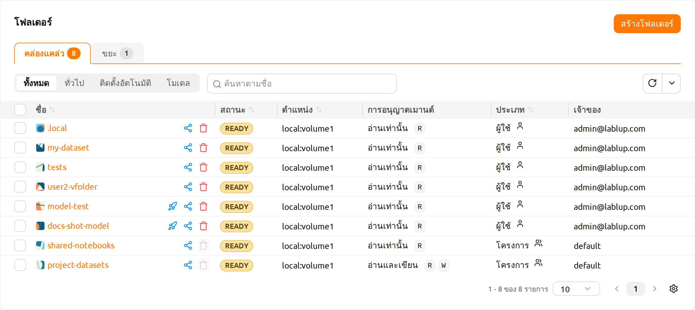

ภายในโฟลเดอร์ `tests` จะเห็นไฟล์และไดเรกทอรี เช่น `hello.txt` และ `myfolder`

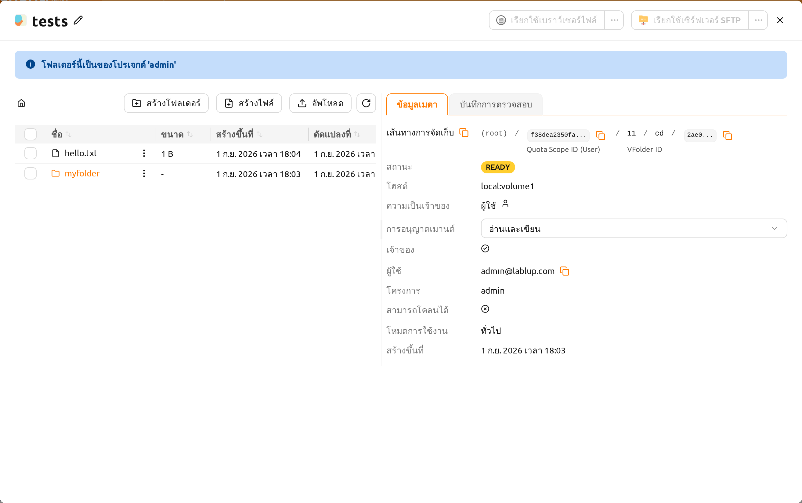

ยืนยันว่าโฟลเดอร์ `tests` ไม่ปรากฏในรายการเมื่อเข้าสู่ระบบด้วยบัญชีผู้ใช้ B

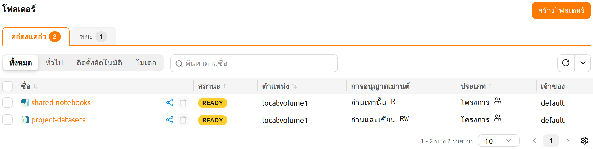

:::note
หากมีโฟลเดอร์ชื่อ `tests` อยู่แล้วในบัญชีของผู้ใช้ B จะไม่สามารถแชร์โฟลเดอร์ `tests` ของผู้ใช้ A ให้กับผู้ใช้ B ได้
:::

กลับไปที่บัญชีผู้ใช้ A คลิกปุ่มแชร์ที่อยู่ข้างชื่อโฟลเดอร์ `tests` ในรายการ

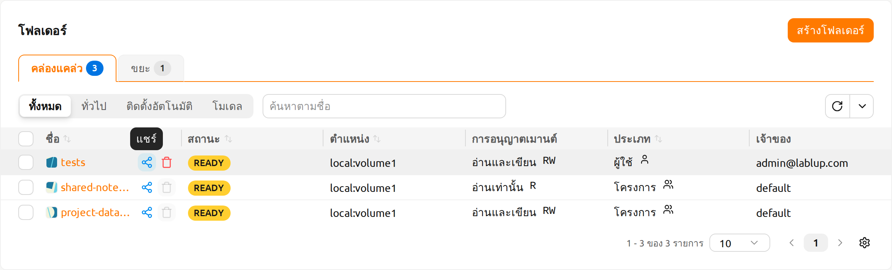

โมดัลแชร์โฟลเดอร์จะเปิดขึ้น ในส่วน **เชิญผู้ใช้** ให้ป้อนที่อยู่อีเมลของผู้ใช้ B และเลือกระดับสิทธิ์ที่ต้องการจากดรอปดาวน์**สิทธิ์** หากเลือก `อ่านเท่านั้น` ผู้ใช้ B จะสามารถดูโฟลเดอร์ได้เท่านั้นแต่ไม่สามารถแก้ไขได้ หากเลือก `อ่านและเขียน` ผู้ใช้ B จะสามารถดูและแก้ไขโฟลเดอร์ได้ คลิกปุ่ม `เพิ่ม` เพื่อส่งคำเชิญ

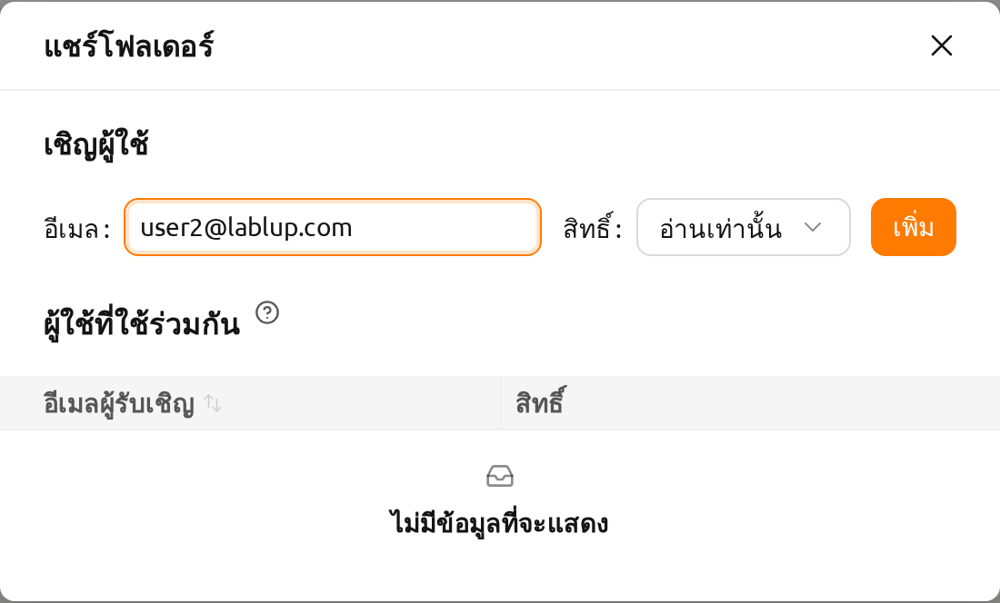

สลับกลับไปที่บัญชีผู้ใช้ B แล้วไปที่หน้า Data หากมีคำเชิญที่รอการตอบกลับ ลิงก์ **คำเชิญที่รอดำเนินการ** จะปรากฏที่ด้านขวาบนของรายการโฟลเดอร์ และแสดงจำนวนคำเชิญที่รอดำเนินการ

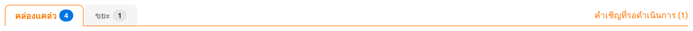

การคลิกที่ลิงก์จะเปิดโมดัล **โฟลเดอร์ที่ได้รับเชิญ** ซึ่งสามารถยอมรับหรือปฏิเสธคำเชิญโฟลเดอร์ที่รอดำเนินการได้

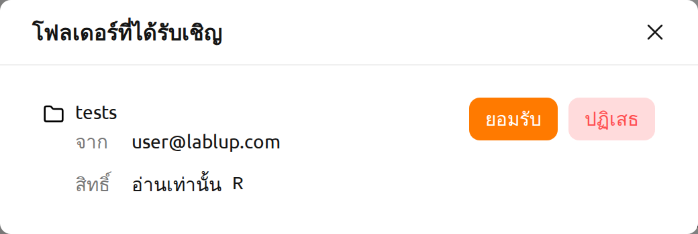

ไปที่หน้า Data และตรวจสอบว่าโฟลเดอร์ `tests` แสดงในรายการ หากไม่เห็นในรายการ ให้ลองรีเฟรชหน้าเบราว์เซอร์ เนื่องจากคุณได้ยอมรับคำเชิญแล้ว จึงสามารถดูเนื้อหาของโฟลเดอร์ `tests` ของผู้ใช้ A ในบัญชีผู้ใช้ B ได้ ต่างจากโฟลเดอร์ที่ผู้ใช้ B สร้างเอง โฟลเดอร์ที่แชร์จะไม่มีไอคอนเครื่องหมายถูกในคอลัมน์เจ้าของ นอกจากนี้ยังจะเห็นเครื่องหมาย `อ่านเท่านั้น` ที่แสดงในคอลัมน์สิทธิ์การเมาท์

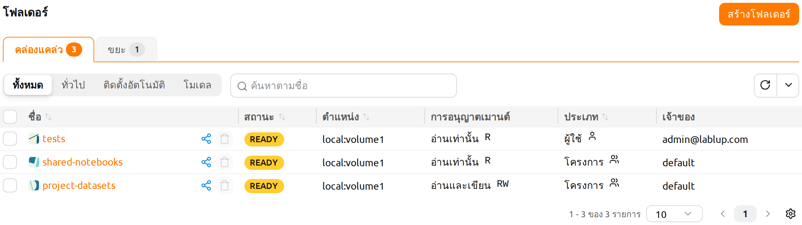

คลิกชื่อโฟลเดอร์ `tests` ในรายการ เพื่อไปยังภายในโฟลเดอร์ `tests` คุณจะเห็น `hello.txt` และ `myfolder` ที่ตรวจสอบไว้ในบัญชีผู้ใช้ A อีกครั้ง เนื่องจากผู้ใช้ A แชร์โฟลเดอร์นี้แบบ `อ่านเท่านั้น` การดำเนินการที่ต้องใช้สิทธิ์เขียนในโฟลเดอร์เอ็กซ์พลอเรอร์จะถูกปิดใช้งาน ได้แก่ ปุ่ม **อัพโหลด** **สร้างโฟลเดอร์** **ลบ** และปุ่ม **Rename** ที่อยู่ข้างแต่ละรายการ ผู้ใช้ B จึงทำได้เพียงเรียกดูและดาวน์โหลดเนื้อหาของโฟลเดอร์เท่านั้น

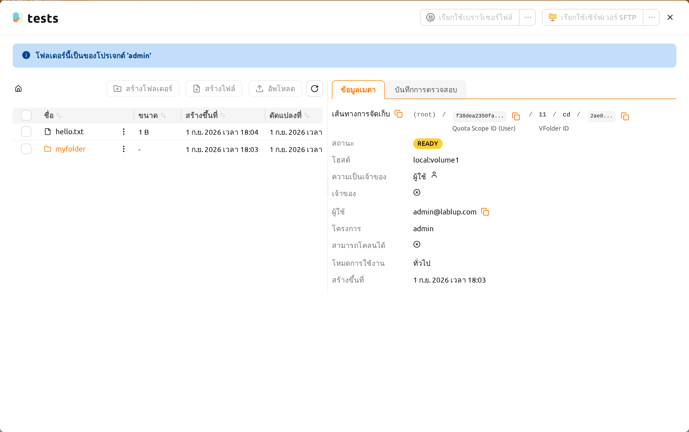
<!-- TODO(screenshot): /data on the invitee account (User B) -> open the
     read-only shared `tests` folder and show Upload, Create Folder, Delete
     and Rename disabled. Not recaptured tonight: the invitee account has no
     vfolder permission on the capture backend (manager returns 403). -->

มาสร้างเซสชันการคำนวณโดยเมาท์โฟลเดอร์จัดเก็บนี้ด้วยบัญชีผู้ใช้ B

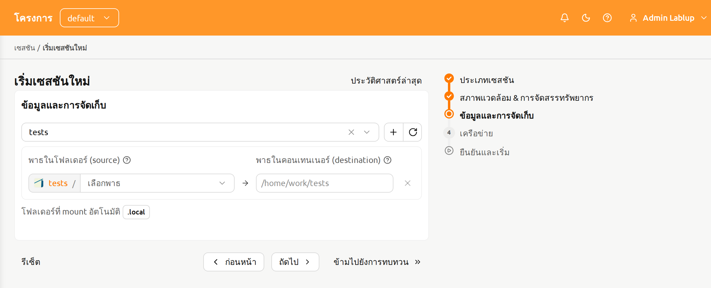

หลังจากสร้างเซสชัน ให้เปิดเว็บเทอร์มินัลและตรวจสอบว่าโฟลเดอร์ `tests` ถูกเมาท์ในโฟลเดอร์โฮม เนื้อหาของโฟลเดอร์ `tests` จะถูกแสดง แต่การพยายามสร้างหรือลบไฟล์จะไม่ได้รับอนุญาต เนื่องจากผู้ใช้ A แชร์เป็นแบบอ่านเท่านั้น หากแชร์โดยรวมสิทธิ์การเขียน ผู้ใช้ B จะสามารถสร้างไฟล์ในโฟลเดอร์ `tests` ได้

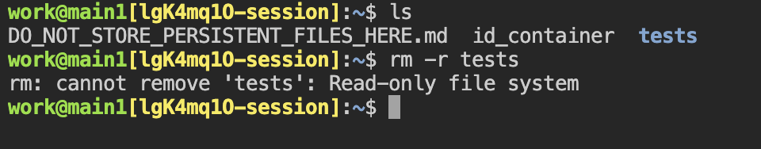

วิธีนี้ คุณสามารถแชร์โฟลเดอร์จัดเก็บส่วนตัวกับผู้ใช้อื่นได้ตามบัญชีอีเมลของ Backend.AI ของคุณ

:::note
Backend.AI ยังมีฟีเจอร์แชร์โฟลเดอร์โปรเจกต์ให้กับสมาชิกในโปรเจกต์อีกด้วย สำหรับรายละเอียด โปรดดู[การแชร์โฟลเดอร์จัดเก็บโปรเจกต์กับสมาชิกในโปรเจกต์](#share-project-storage-folders-with-project-members)
:::

## ปรับแต่งสิทธิ์สำหรับโฟลเดอร์ที่แชร์

คุณสามารถแก้ไขสิทธิ์ของผู้ใช้ที่แชร์ได้จากโมดัลแชร์โฟลเดอร์ ส่วน **ผู้ใช้ที่ใช้ร่วมกัน** จะแสดงตารางรายชื่อผู้ใช้ทั้งหมดที่ยอมรับคำเชิญแล้ว แต่ละแถวจะแสดงที่อยู่อีเมลของผู้รับเชิญและดรอปดาวน์สิทธิ์ คลิกดรอปดาวน์สิทธิ์ในแถวของผู้ใช้เพื่อเปลี่ยนระดับการเข้าถึง

- **อ่านเท่านั้น**: ผู้ใช้ที่ได้รับเชิญมีสิทธิ์เข้าถึงโฟลเดอร์แบบอ่านอย่างเดียว
- **อ่านและเขียน**: ผู้ใช้ที่ได้รับเชิญมีสิทธิ์อ่านและเขียนในโฟลเดอร์ รวมถึงการสร้าง แก้ไข และลบไฟล์และโฟลเดอร์ภายในโฟลเดอร์

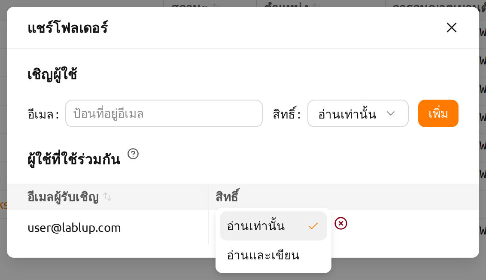

:::note
แม้ว่าผู้ใช้จะได้รับสิทธิ์อ่านและเขียน การเปลี่ยนชื่อโฟลเดอร์สามารถทำได้เฉพาะเจ้าของเท่านั้น โปรดทราบว่าสิทธิ์อ่านและเขียนไม่รวมถึงการเปลี่ยนชื่อโฟลเดอร์
:::

## หยุดการแชร์โฟลเดอร์

หากต้องการหยุดแชร์โฟลเดอร์ในฐานะผู้เชิญ ให้คลิกปุ่มแชร์ที่อยู่ข้างชื่อโฟลเดอร์ในรายการโฟลเดอร์เพื่อเปิดโมดัลแชร์โฟลเดอร์ ในตาราง **ผู้ใช้ที่ใช้ร่วมกัน** ให้คลิกไอคอนหยุดแชร์ (วงกลมปิดสีแดง) ข้างดรอปดาวน์สิทธิ์ในแถวของผู้ใช้ที่ต้องการลบออก กล่องโต้ตอบยืนยันจะปรากฏขึ้นเพื่อขอการยืนยัน คลิก `ยืนยัน` เพื่อเพิกถอนสิทธิ์การเข้าถึงของผู้ใช้

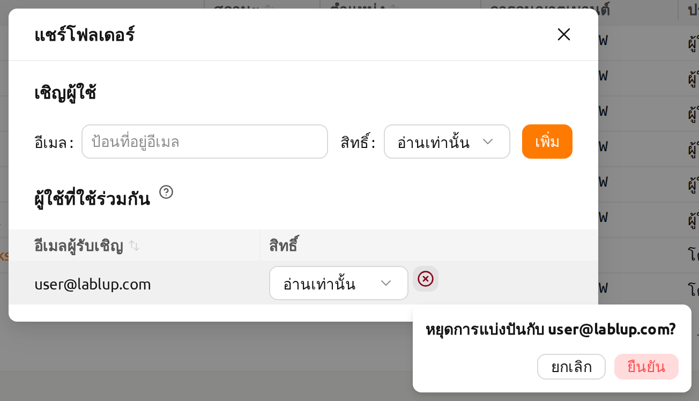

หากผู้ได้รับเชิญไม่ต้องการเข้าถึงโฟลเดอร์ที่แชร์อีกต่อไป ให้คลิกปุ่มแชร์ข้างโฟลเดอร์ในรายการโฟลเดอร์เพื่อเปิดโมดัลสิทธิ์โฟลเดอร์ที่แชร์ ในตารางสิทธิ์ ให้คลิกไอคอนออกในคอลัมน์**ควบคุม**เพื่อออกจากโฟลเดอร์ที่แชร์ กล่องโต้ตอบยืนยันจะปรากฏก่อนดำเนินการ

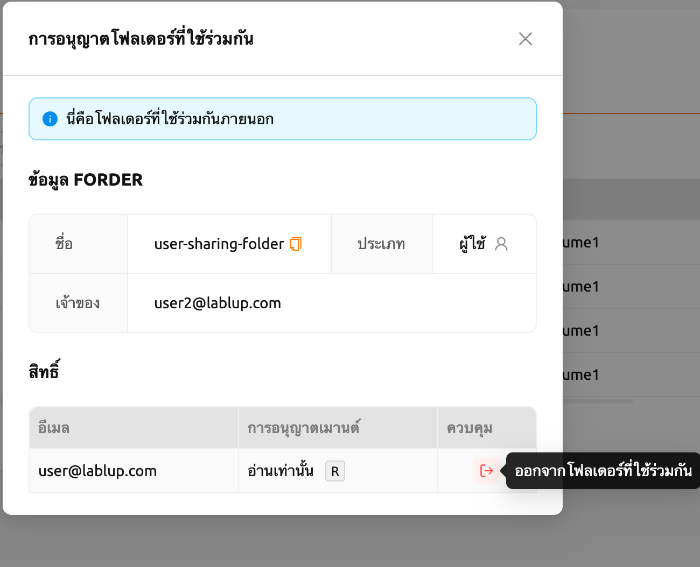
