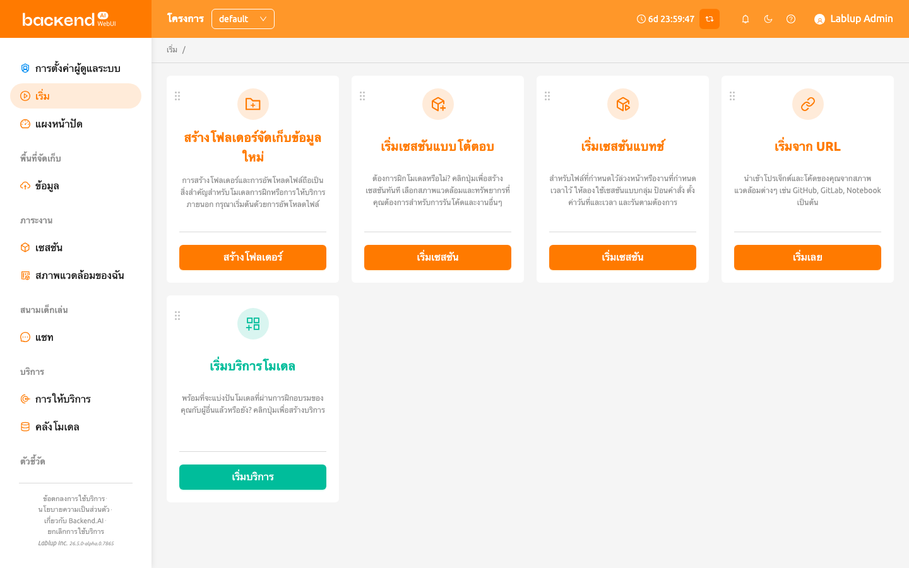

# หน้าเริ่มต้น

หน้าเริ่มต้นช่วยให้คุณเข้าถึงฟีเจอร์ที่ใช้บ่อยของ WebUI ได้อย่างรวดเร็ว
ผ่านการ์ดการดำเนินการ แต่ละการ์ดแสดงถึงขั้นตอนการทำงานหลัก เช่น
การสร้างโฟลเดอร์จัดเก็บ การเปิดเซสชัน การเริ่มบริการโมเดล หรือการนำเข้า
โปรเจกต์จาก URL ภายนอก

## แบนเนอร์ประกาศ

หากผู้ดูแลระบบได้เผยแพร่ประกาศ จะมีแบนเนอร์แสดงที่ด้านบนของหน้าเริ่มต้น
คุณสามารถปิดแบนเนอร์ได้โดยคลิกไอคอนปิด ประกาศรองรับรูปแบบ Markdown
และอาจมีการแจ้งเตือนที่สำคัญเกี่ยวกับการบำรุงรักษาระบบ การอัปเดต หรือ
แนวทางการใช้งาน

## การ์ดการดำเนินการ

หน้าเริ่มต้นแสดงการ์ดการดำเนินการต่อไปนี้ตามค่าเริ่มต้น:

- **สร้างโฟลเดอร์จัดเก็บใหม่**: สร้างโฟลเดอร์จัดเก็บและอัปโหลดไฟล์
  นี่เป็นขั้นตอนแรกที่จำเป็นสำหรับการฝึกโมเดลหรือการให้บริการภายนอก
  การคลิกปุ่มจะเปิดกล่องโต้ตอบการสร้างโฟลเดอร์
- **เริ่มเซสชันแบบโต้ตอบ**: สร้างเซสชันแบบโต้ตอบเพื่อฝึกโมเดล เลือก
  สภาพแวดล้อมและทรัพยากรที่ต้องการสำหรับการรันโค้ด
- **เริ่มเซสชันแบทช์**: สร้างเซสชันแบทช์สำหรับไฟล์ที่กำหนดไว้ล่วงหน้า
  หรืองานที่กำหนดเวลาไว้ ป้อนคำสั่ง ตั้งค่าวันที่และเวลา และรันตามต้องการ
- **เริ่มบริการโมเดล**: สร้าง endpoint บริการโมเดลเพื่อแชร์โมเดลที่ผ่าน
  การฝึกอบรมกับผู้อื่น
- **เริ่มจาก URL**: นำเข้าโปรเจกต์และโค้ดจากสภาพแวดล้อมต่างๆ เช่น GitHub,
  GitLab หรือ Jupyter Notebook ผ่าน URL

:::note
ขึ้นอยู่กับการตั้งค่าเซิร์ฟเวอร์ การ์ดบางส่วน เช่น การ์ดบริการโมเดล อาจไม่
สามารถใช้งานได้ หากคุณต้องการใช้ฟีเจอร์เหล่านี้ กรุณาติดต่อผู้ดูแลระบบ
:::

## เริ่มจาก URL

การ์ด **เริ่มจาก URL** ช่วยให้คุณนำเข้าและรันโปรเจกต์จากแหล่งภายนอก
ได้โดยตรง การคลิกการ์ดจะเปิดกล่องโต้ตอบที่มีสามแท็บ

### นำเข้าโน้ตบุ๊ก

1. ป้อน URL ของ Jupyter Notebook (ต้องลงท้ายด้วย `.ipynb`) ในฟิลด์
   **URL โน้ตบุ๊ก**
2. คลิก **นำเข้าและรัน** เพื่อสร้างเซสชันอัตโนมัติและเปิดโน้ตบุ๊กใน Jupyter

   คุณยังสามารถคลิกลูกศรดรอปดาวน์ข้างปุ่มและเลือก **เริ่มด้วยตัวเลือก**
   เพื่อปรับแต่งสภาพแวดล้อมเซสชันก่อนเริ่มต้น

ที่ด้านล่างของแท็บ คุณสามารถสร้างโค้ดป้าย "Run on Backend.AI" ได้ คัดลอก
โค้ดป้าย HTML หรือ Markdown เพื่อฝังลิงก์เปิดใช้งานโดยตรงในเอกสารโปรเจกต์

### นำเข้าพื้นที่เก็บข้อมูล GitHub

1. ป้อน URL พื้นที่เก็บข้อมูล GitHub ที่ถูกต้องในฟิลด์ **URL GitHub**
2. เลือก **โฮสต์ที่เก็บข้อมูล** ที่จะบันทึกพื้นที่เก็บข้อมูล
3. ตั้งค่า **โหมดการใช้งานโฟลเดอร์** (ทั่วไปหรือโมเดล) ตามต้องการ
4. คลิก **นำเข้าไปยังโฟลเดอร์** เพื่อโคลนพื้นที่เก็บข้อมูลไปยังโฟลเดอร์
   จัดเก็บใหม่

พื้นที่เก็บข้อมูลที่นำเข้าจะถูกแปลงเป็นโฟลเดอร์จัดเก็บและสามารถเมาท์ได้
เมื่อเริ่มเซสชัน

### นำเข้าพื้นที่เก็บข้อมูล GitLab

1. ป้อน URL พื้นที่เก็บข้อมูล GitLab ที่ถูกต้องในฟิลด์ **URL GitLab**
2. ระบุ **ชื่อ Branch GitLab** ตามต้องการ (ค่าเริ่มต้น: `master`)
3. เลือก **โฮสต์ที่เก็บข้อมูล** ที่จะบันทึกพื้นที่เก็บข้อมูล
4. ตั้งค่า **โหมดการใช้งานโฟลเดอร์** (ทั่วไปหรือโมเดล) ตามต้องการ
5. คลิก **นำเข้าไปยังโฟลเดอร์** เพื่อโคลนพื้นที่เก็บข้อมูลไปยังโฟลเดอร์
   จัดเก็บใหม่

## การปรับแต่งเลย์เอาท์การ์ด

คุณสามารถจัดเรียงการ์ดการดำเนินการบนหน้าเริ่มต้นได้โดยการลากและวาง
แต่ละการ์ดมีที่จับลากที่มุมซ้ายบนซึ่งคุณสามารถจับเพื่อย้ายการ์ดไปยัง
ตำแหน่งอื่นได้

การจัดเรียงการ์ดที่ปรับแต่งแล้วจะถูกบันทึกอัตโนมัติและคงอยู่ระหว่าง
เซสชันของเบราว์เซอร์ เลย์เอาท์จะถูกจัดเก็บตามผู้ใช้ ดังนั้นผู้ใช้แต่ละคน
สามารถมีการจัดเรียงที่ต้องการของตนเองได้
