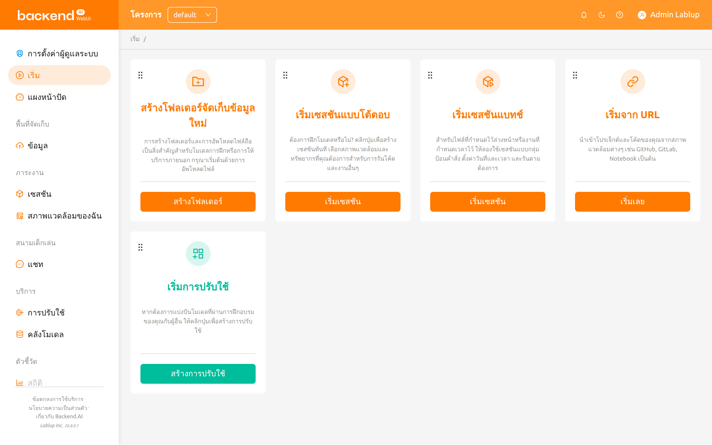
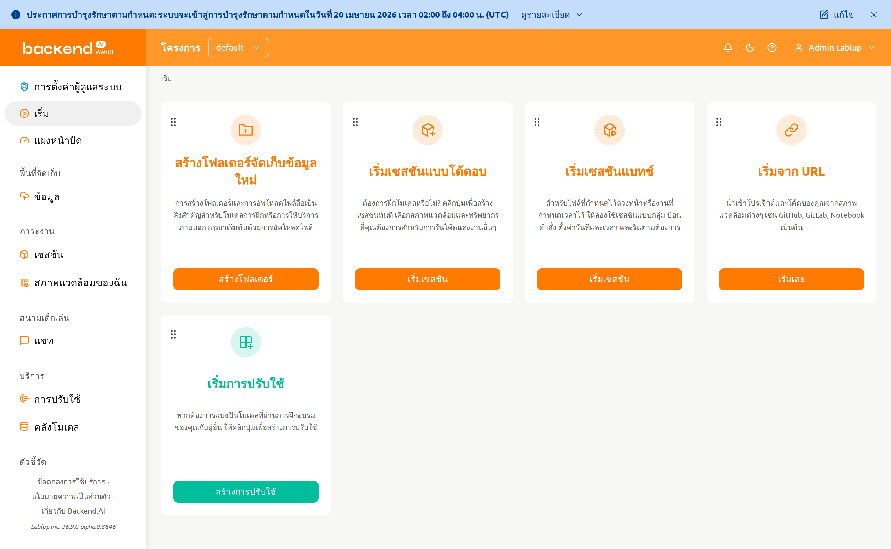
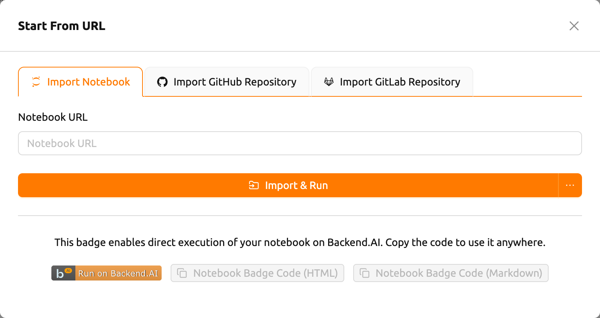
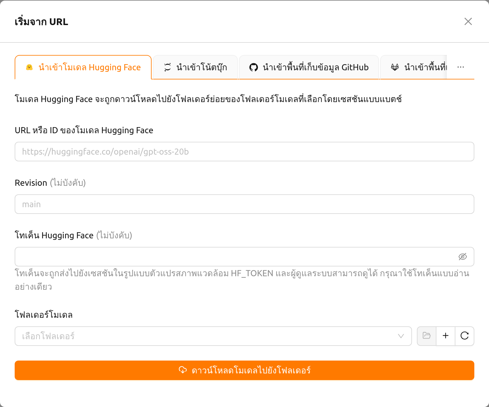

# หน้าเริ่มต้น

หน้าเริ่มต้นช่วยให้คุณเข้าถึงฟีเจอร์ที่ใช้บ่อยของ WebUI ได้อย่างรวดเร็ว
ผ่านการ์ดการดำเนินการ แต่ละการ์ดแสดงถึงขั้นตอนการทำงานหลัก เช่น
การสร้างโฟลเดอร์จัดเก็บ การเปิดเซสชัน การปรับใช้โมเดล หรือการนำเข้า
โปรเจกต์จาก URL ภายนอก

## แบนเนอร์ประกาศ

หากผู้ดูแลระบบได้เผยแพร่ประกาศ จะมีแบนเนอร์แสดงที่ด้านบนของหน้าเริ่มต้น
ประกาศรองรับรูปแบบ Markdown และอาจมีการแจ้งเตือนที่สำคัญเกี่ยวกับ
การบำรุงรักษาระบบ การอัปเดต หรือแนวทางการใช้งาน คุณสามารถปิดแบนเนอร์ได้
โดยคลิกไอคอนปิด

## การ์ดการดำเนินการ

หน้าเริ่มต้นแสดงการ์ดการดำเนินการต่อไปนี้ตามค่าเริ่มต้น:

- **สร้างโฟลเดอร์จัดเก็บข้อมูลใหม่**: สร้างโฟลเดอร์จัดเก็บและอัปโหลดไฟล์
  นี่เป็นขั้นตอนแรกที่จำเป็นสำหรับการฝึกโมเดลหรือการให้บริการภายนอก
  การคลิกปุ่มจะเปิดกล่องโต้ตอบการสร้างโฟลเดอร์
- **เริ่มเซสชันแบบโต้ตอบ**: สร้างเซสชันเพื่อฝึกโมเดล เลือกสภาพแวดล้อมและ
  ทรัพยากรที่ต้องการสำหรับการรันโค้ด
- **เริ่มเซสชันแบทช์**: สร้างเซสชันแบทช์สำหรับไฟล์ที่กำหนดไว้ล่วงหน้า
  หรืองานที่กำหนดเวลาไว้ ป้อนคำสั่ง ตั้งค่าวันที่และเวลา และรันตามต้องการ
- **เริ่มการปรับใช้**: สร้างการปรับใช้เพื่อแชร์โมเดลที่ผ่านการฝึกอบรม
  กับผู้อื่น
- **เริ่มจาก URL**: นำเข้าโปรเจกต์และโค้ดจากสภาพแวดล้อมต่างๆ เช่น GitHub,
  GitLab หรือ Jupyter Notebook ผ่าน URL

:::note
ขึ้นอยู่กับการตั้งค่าเซิร์ฟเวอร์ การ์ดบางส่วน เช่น การ์ดการปรับใช้ อาจไม่
สามารถใช้งานได้ หากคุณต้องการใช้ฟีเจอร์เหล่านี้ กรุณาติดต่อผู้ดูแลระบบ
:::

## เริ่มจาก URL

การ์ด **เริ่มจาก URL** ช่วยให้คุณนำเข้าและรันโปรเจกต์จากแหล่งภายนอก
ได้โดยตรง การคลิกการ์ดจะเปิดกล่องโต้ตอบที่มีแท็บสำหรับแต่ละแหล่งนำเข้า ได้แก่
**นำเข้าโน้ตบุ๊ก**, **นำเข้าพื้นที่เก็บข้อมูล GitHub** และ
**นำเข้าพื้นที่เก็บข้อมูล GitLab** เมื่อเปิดใช้งานการนำเข้าจาก Hugging Face
ซึ่งเป็นฟีเจอร์ทดลอง จะมีแท็บ **นำเข้าโมเดล Hugging Face** เพิ่มขึ้นมา

### นำเข้าโน้ตบุ๊ก

1. ป้อน URL ของ Jupyter Notebook (ต้องลงท้ายด้วย `.ipynb`) ในฟิลด์
   **URL โน้ตบุ๊ก**
2. คลิก **นำเข้าและรัน** เพื่อสร้างเซสชันอัตโนมัติและเปิดโน้ตบุ๊กใน Jupyter

   คุณยังสามารถคลิกลูกศรดรอปดาวน์ข้างปุ่มและเลือก **เริ่มด้วยตัวเลือก**
   เพื่อปรับแต่งสภาพแวดล้อมเซสชันก่อนเริ่มต้น

:::note
โน้ตบุ๊กจะถูกดาวน์โหลดจากภายในเซสชันการคำนวณ (สคริปต์บูตสแตรปจะรันคำสั่ง
`curl -O <url>`) ดังนั้น URL ที่ป้อนต้องเข้าถึงได้จากเซสชันการคำนวณ ที่อยู่ภายในเครื่อง
เช่น `localhost` หรือ `127.0.0.1` จะชี้ไปยังคอนเทนเนอร์ของเซสชันเอง ไม่ใช่เครื่องของคุณ
จึงใช้งานไม่ได้ กรุณาป้อน URL ที่เข้าถึงได้จากเซสชันการคำนวณ
:::

:::note
ปิดตัวบล็อกป๊อปอัพของเบราว์เซอร์เพื่อให้หน้าต่างโน้ตบุ๊กที่กำลังทำงานเปิดขึ้น
โดยอัตโนมัติ หากไม่มีทรัพยากรเพียงพอในการเริ่มเซสชัน โน้ตบุ๊กที่นำเข้าจะไม่ทำงาน
:::

ที่ด้านล่างของแท็บ คุณสามารถสร้างโค้ดป้าย "Run on Backend.AI" ได้ คัดลอก
โค้ดป้าย HTML หรือ Markdown เพื่อฝังลิงก์เปิดใช้งานโดยตรงในเอกสารโปรเจกต์

:::note
คุณต้องเข้าสู่ระบบก่อนสร้างโค้ดป้าย มิฉะนั้น กรุณาเข้าสู่ระบบก่อนแล้วลองอีกครั้ง
:::

### นำเข้าพื้นที่เก็บข้อมูล GitHub

1. ป้อน URL พื้นที่เก็บข้อมูล GitHub ที่ถูกต้องในฟิลด์ **URL GitHub**
2. เลือก **โฮสต์ที่เก็บข้อมูล** ที่จะบันทึกพื้นที่เก็บข้อมูล
3. ตั้งค่า **โหมดการใช้งานโฟลเดอร์** (ทั่วไปหรือโมเดล) ตามต้องการ
4. คลิก **นำเข้าไปยังโฟลเดอร์** เพื่อโคลนพื้นที่เก็บข้อมูลไปยังโฟลเดอร์
   จัดเก็บใหม่

พื้นที่เก็บข้อมูลที่นำเข้าจะถูกแปลงเป็นโฟลเดอร์จัดเก็บและสามารถเมาท์ได้
เมื่อเริ่มเซสชัน

### นำเข้าพื้นที่เก็บข้อมูล GitLab

1. ป้อน URL พื้นที่เก็บข้อมูล GitLab ที่ถูกต้องในฟิลด์ **URL GitLab**
2. ระบุ **ชื่อ Branch GitLab** ตามต้องการ (ค่าเริ่มต้น: `master`)
3. เลือก **โฮสต์ที่เก็บข้อมูล** ที่จะบันทึกพื้นที่เก็บข้อมูล
4. ตั้งค่า **โหมดการใช้งานโฟลเดอร์** (ทั่วไปหรือโมเดล) ตามต้องการ
5. คลิก **นำเข้าไปยังโฟลเดอร์** เพื่อโคลนพื้นที่เก็บข้อมูลไปยังโฟลเดอร์
   จัดเก็บใหม่

### นำเข้าโมเดล Hugging Face

แท็บ **นำเข้าโมเดล Hugging Face** ใช้ดาวน์โหลดโมเดลจาก Hugging Face
ไปยังโฟลเดอร์โมเดลของคุณ เพื่อให้คุณสามารถเมาท์โมเดลนั้นในเซสชันการคำนวณ
หรือให้บริการเป็นการปรับใช้ในภายหลัง

:::warning[ฟีเจอร์ทดลอง]
แท็บนี้จะถูกซ่อนไว้จนกว่าคุณจะเปิดใช้งาน **นำเข้าจาก Hugging Face**
ในส่วน **คุณสมบัติการทดลอง** ของหน้า [การตั้งค่าผู้ใช้](#user-settings)
ฟีเจอร์ทดลองอาจเปลี่ยนแปลงหรือถูกลบออกในการอัปเดตในอนาคต
:::

1. ป้อนโมเดลในฟิลด์ **URL หรือ ID ของโมเดล Hugging Face** ระบบรองรับทั้ง URL
   ของหน้าโมเดล เช่น `https://huggingface.co/openai/gpt-oss-20b` และ ID
   ของโมเดล เช่น `openai/gpt-oss-20b` ที่อยู่ซึ่งชี้ไปยังชุดข้อมูล สเปซ
   หรือหน้าอื่นที่ไม่ใช่โมเดลจะไม่ได้รับการยอมรับ
2. ป้อน **Revision** ตามต้องการ ซึ่งคือ branch, tag หรือ commit
   ของพื้นที่เก็บข้อมูลโมเดลที่จะดาวน์โหลด หากเว้นว่างไว้
   ระบบจะดาวน์โหลด revision เริ่มต้น และหากที่อยู่ที่ป้อนมี revision
   อยู่แล้ว ระบบจะใช้ revision นั้น
3. ป้อน **โทเค็น Hugging Face** ตามต้องการ โมเดลที่จำกัดการเข้าถึง
   หรือเป็นแบบส่วนตัวจำเป็นต้องใช้โทเค็น
4. เลือก **โฟลเดอร์โมเดล** ที่จะดาวน์โหลดไปยัง ปุ่มข้างตัวเลือก
   ใช้สำหรับเปิดโฟลเดอร์ที่เลือก สร้างโฟลเดอร์โมเดลใหม่ และรีเฟรชรายการ
5. คลิก **ดาวน์โหลดโมเดลไปยังโฟลเดอร์**

กล่องโต้ตอบจะปิดลงและ Backend.AI จะเริ่มเซสชันแบทช์เพื่อทำการดาวน์โหลด
เนื่องจากการดาวน์โหลดทำงานอยู่ภายในเซสชันนั้น คุณจึงติดตามความคืบหน้าได้
ที่หน้าเซสชัน และโมเดลจะพร้อมใช้งานเมื่อเซสชันสิ้นสุดลงสำเร็จ หากเซสชันล้มเหลว
การดาวน์โหลดจะไม่เสร็จสมบูรณ์และโมเดลจะไม่พร้อมใช้งาน

โมเดลจะถูกจัดเก็บในโฟลเดอร์ย่อยที่ตั้งชื่อตามโมเดลภายในโฟลเดอร์ที่คุณเลือก
ตัวอย่างเช่น `openai/gpt-oss-20b` จะถูกดาวน์โหลดไปยัง `gpt-oss-20b/`
ดังนั้นโฟลเดอร์โมเดลเดียวจึงเก็บได้หลายโมเดล

:::warning
โทเค็นจะถูกส่งไปยังเซสชันดาวน์โหลดในรูปแบบตัวแปรสภาพแวดล้อม `HF_TOKEN`
และผู้ดูแลระบบสามารถดูได้ กรุณาใช้โทเค็นแบบอ่านอย่างเดียว
:::

:::note
แท็บนี้ดาวน์โหลดไปยังโฟลเดอร์โมเดล จึงใช้งานได้เฉพาะเมื่อบัญชีของคุณ
เปิดใช้งานฟีเจอร์การปรับใช้เท่านั้น โมเดลขนาดใหญ่ใช้เวลาดาวน์โหลดนาน
และใช้พื้นที่จัดเก็บของโฟลเดอร์ปลายทาง
:::

## การปรับแต่งเลย์เอาท์การ์ด

คุณสามารถจัดเรียงการ์ดการดำเนินการบนหน้าเริ่มต้นได้โดยการลากและวาง
แต่ละการ์ดมีที่จับลากที่มุมซ้ายบนซึ่งคุณสามารถจับเพื่อย้ายการ์ดไปยัง
ตำแหน่งอื่นได้

การจัดเรียงการ์ดที่ปรับแต่งแล้วจะถูกบันทึกอัตโนมัติและคงอยู่ระหว่าง
เซสชันของเบราว์เซอร์ เลย์เอาท์จะถูกจัดเก็บตามผู้ใช้ ดังนั้นผู้ใช้แต่ละคน
สามารถมีการจัดเรียงที่ต้องการของตนเองได้
