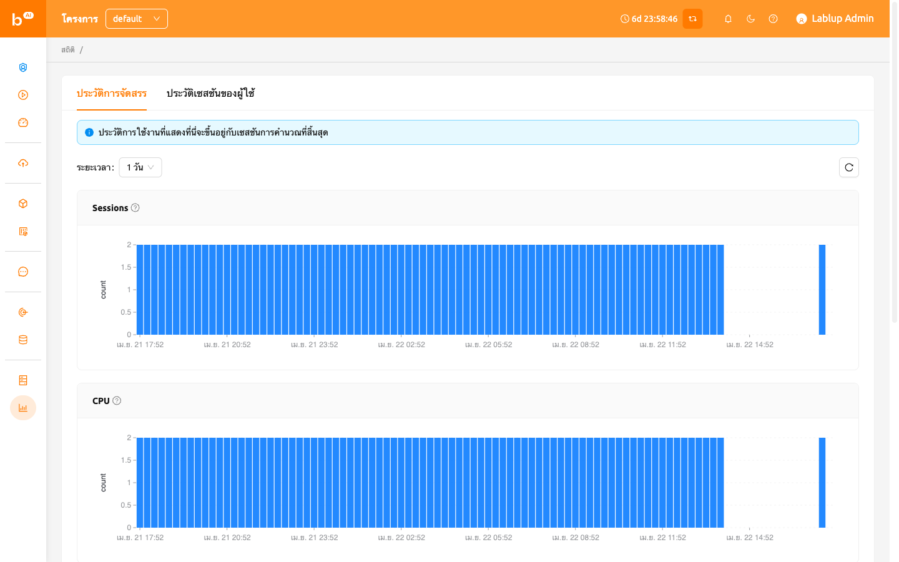

# หน้าสถิติ

## Allocation history

On the สถิติ page, under the Allocation History tab, you can check simple statistics related to the use of
compute sessions via a graph. You can check the statistics for a day or a week by selecting the usage period
from the select period menu on the upper left. Displayed items are as follows.

- เซสชัน: จำนวนเซสชันการประมวลผลที่สร้างขึ้น。
- CPU: จำนวนของคอร์ CPU ที่จัดสรรให้กับเซสชันการคำนวณ
- หน่วยความจำ: ปริมาณหน่วยความจำที่จัดสรรให้กับเซสชันการประมวลผล。
- GPU: จำนวนหน่วย GPU ที่จัดสรรให้กับเซสชันการประมวลผล หากคุณสมบัติ GPU แบบเศษเสี้ยวถูกเปิดใช้งาน อาจไม่ตรงกับ GPU ทางฟิสิกส์
- IO-อ่าน: ปริมาณข้อมูลที่อ่านจากที่เก็บข้อมูล
- IO-Write: ปริมาณข้อมูลที่เขียนลงในพื้นที่เก็บข้อมูล.

โปรดทราบว่าสถิติที่แสดงที่นี่มีพื้นฐานมาจากเซสชันการคอมพิวเตอร์ที่สิ้นสุดแล้ว นอกจากนี้ สถิติหนึ่งสัปดาห์อาจไม่แสดงสำหรับผู้ใช้ที่บัญชีของพวกเขาถูกสร้างขึ้นไม่เกินหนึ่งสัปดาห์

## User session history

In the User Session History tab of the สถิติ page, ผู้ใช้s can view statistics on various resources used by sessions through graphs.
Users can check the statistics for a selected period using the Select Period menu at the upper left. The displayed items are as follows.

- CPU Util: The amount of CPU time used by the sessions.
- Memory: The amount of memory used by the sessions.
- Net Rx: The rate at which the container is receiving network data.
- Net Tx: The rate at which the container is sending network data.
- IO Read: The amount of data read from the storage by the sessions.
- IO Write: The amount of data written to the storage by the sessions.

In addition, depending on the available resources, additional items such as CUDA-capable GPU Util and CUDA-capable GPU Mem may be displayed.

ข้อมูลสถิติที่ละเอียดกว่านั้นจะแสดงในแผงควบคุมที่เฉพาะสำหรับผู้ดูแลระบบเท่านั้น

