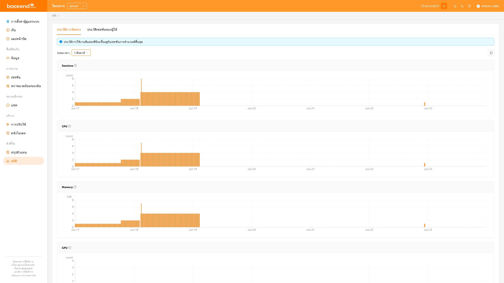
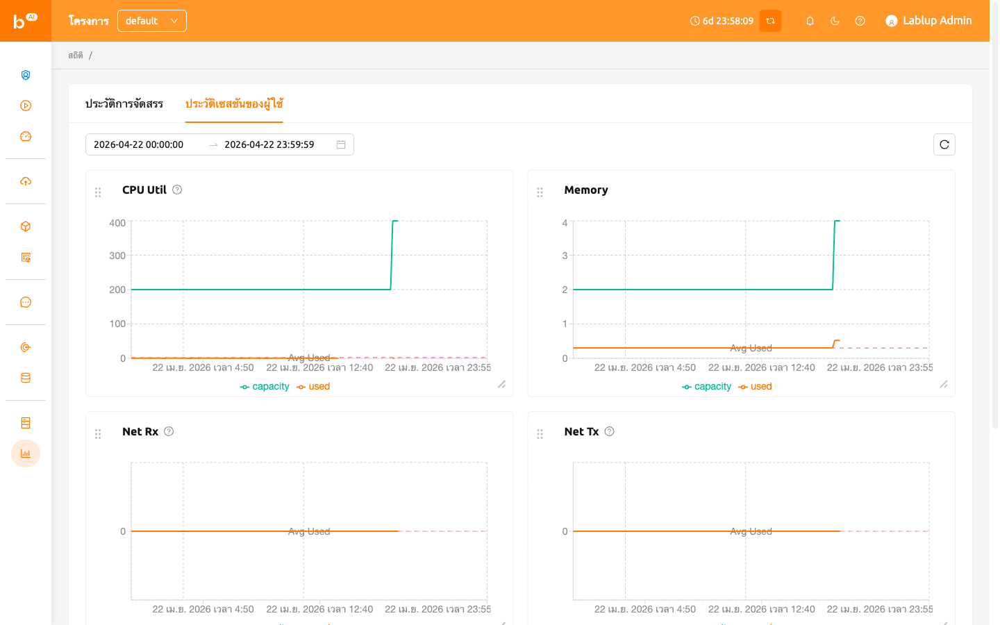

# หน้าสถิติ

## ประวัติการจัดสรร

ในหน้าสถิติ ภายใต้แท็บประวัติการจัดสรร คุณสามารถตรวจสอบสถิติง่าย ๆ ที่เกี่ยวข้องกับการใช้เซสชันการคำนวณผ่านกราฟได้ คุณสามารถตรวจสอบสถิติสำหรับหนึ่งวันหรือหนึ่งสัปดาห์โดยเลือกช่วงเวลาการใช้งานจากเมนูเลือกช่วงเวลาที่มุมซ้ายบน รายการที่แสดงมีดังนี้

- เซสชัน: จำนวนเซสชันการคำนวณที่สร้างขึ้น
- CPU: จำนวนคอร์ CPU ที่จัดสรรให้กับเซสชันการคำนวณ
- หน่วยความจำ: ปริมาณหน่วยความจำที่จัดสรรให้กับเซสชันการคำนวณ
- GPU: จำนวนหน่วย GPU ที่จัดสรรให้กับเซสชันการคำนวณ หากคุณสมบัติ GPU แบบเศษส่วนถูกเปิดใช้งาน อาจไม่ตรงกับ GPU ทางกายภาพ
- IO-Read: ปริมาณข้อมูลที่อ่านจากที่เก็บข้อมูล
- IO-Write: ปริมาณข้อมูลที่เขียนลงในที่เก็บข้อมูล

โปรดทราบว่าสถิติที่แสดงที่นี่อ้างอิงจากเซสชันการคำนวณที่สิ้นสุดแล้ว นอกจากนี้ สถิติหนึ่งสัปดาห์อาจไม่แสดงสำหรับผู้ใช้ที่บัญชีถูกสร้างขึ้นไม่เกินหนึ่งสัปดาห์

## ประวัติเซสชันของผู้ใช้

ในแท็บประวัติเซสชันของผู้ใช้ของหน้าสถิติ ผู้ใช้สามารถดูสถิติเกี่ยวกับทรัพยากรต่าง ๆ ที่ใช้โดยเซสชันผ่านกราฟได้ ผู้ใช้สามารถตรวจสอบสถิติสำหรับช่วงเวลาที่เลือกโดยใช้ตัวเลือกช่วงวันที่ที่มุมซ้ายบน รายการที่แสดงมีดังนี้

- CPU Util: ปริมาณเวลา CPU ที่ใช้โดยเซสชัน
- Memory: ปริมาณหน่วยความจำที่ใช้โดยเซสชัน
- Net Rx: อัตราที่คอนเทนเนอร์รับข้อมูลเครือข่าย
- Net Tx: อัตราที่คอนเทนเนอร์ส่งข้อมูลเครือข่าย
- IO Read: ปริมาณข้อมูลที่อ่านจากที่เก็บข้อมูลโดยเซสชัน
- IO Write: ปริมาณข้อมูลที่เขียนลงในที่เก็บข้อมูลโดยเซสชัน

นอกจากนี้ ขึ้นอยู่กับทรัพยากรที่มี อาจมีรายการเพิ่มเติม เช่น CUDA-capable GPU Util และ CUDA-capable GPU Mem แสดงขึ้นด้วย

สถิติที่ละเอียดกว่านี้จะแสดงในแผงควบคุมที่เฉพาะสำหรับผู้ดูแลระบบเท่านั้น

