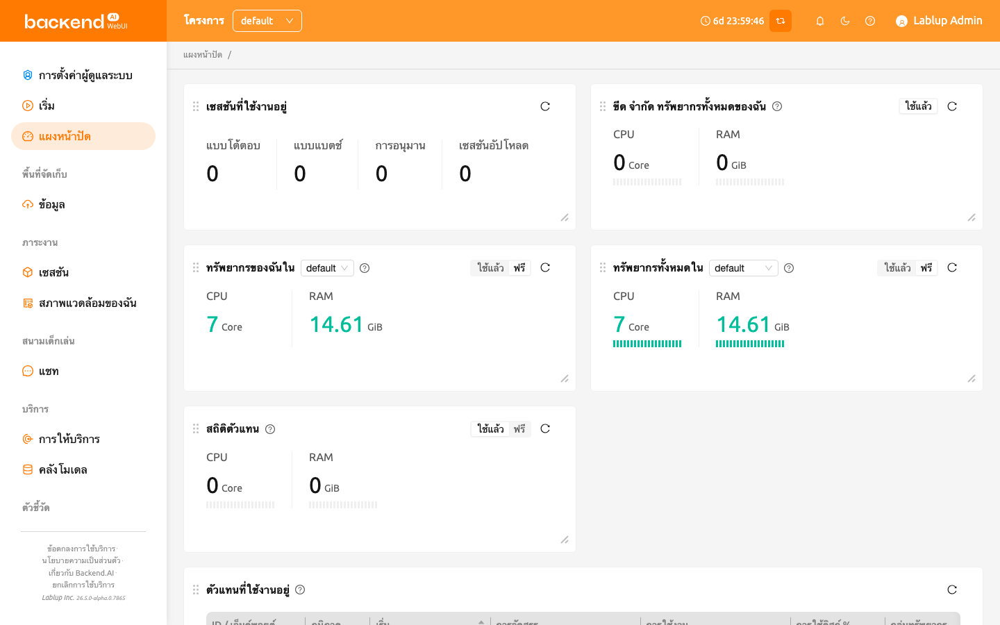

:::warning
คุณสมบัตินี้ถูกยกเลิกการใช้งานแล้ว ดังนั้นโปรดใช้หน้า[แดชบอร์ด](../dashboard/dashboard.md)แทนต่อจากนี้ นอกจากนี้ การสนับสนุนทางเทคนิคและการแก้ไขข้อบกพร่องสำหรับคุณสมบัตินี้จะไม่ให้บริการอีกต่อไป โปรดเข้าใจว่าปัญหาต่าง ๆ อาจไม่ได้รับการแก้ไข
:::

# หน้าสรุป

ที่หน้าสรุป ผู้ใช้สามารถตรวจสอบสถานะทรัพยากรและการใช้งานเซสชันได้

### สถิติทรัพยากร

จะแสดงจำนวนรวมของทรัพยากรที่ผู้ใช้สามารถจัดสรรได้และจำนวนทรัพยากรที่ถูกจัดสรรอยู่ในขณะนี้ คุณสามารถตรวจสอบการใช้ทรัพยากร CPU, หน่วยความจำ และ GPU ของผู้ใช้และโควต้าได้ตามลำดับ นอกจากนี้ในสไลเดอร์ เซสชัน คุณยังสามารถดูจำนวนเซสชันการคำนวณสูงสุดที่คุณสามารถสร้างพร้อมกันและจำนวนเซสชันการคำนวณที่กำลังทำงานอยู่ในขณะนี้

คุณสามารถเปลี่ยนกลุ่มทรัพยากรได้โดยการคลิกที่ฟิลด์กลุ่มทรัพยากรด้านบน กลุ่มทรัพยากรเป็นแนวคิดในการรวมหน่วยงาน Agent หลาย ๆ ตัวเป็นหน่วยทรัพยากรเดียว หากคุณมีหน่วยงาน Agent หลายตัว คุณสามารถตั้งค่าต่าง ๆ เช่น การกำหนดพวกเขาให้กับโครงการเฉพาะสำหรับแต่ละกลุ่มทรัพยากร เมื่อมีหน่วยงาน Agent เพียงตัวเดียว จะเป็นเรื่องปกติที่จะเห็นเพียงกลุ่มทรัพยากรเดียว หากคุณเปลี่ยนกลุ่มทรัพยากร ปริมาณทรัพยากรอาจเปลี่ยนแปลงไปตามจำนวนทรัพยากรที่กลุ่มทรัพยากรนั้นถืออยู่ (หน่วยงานที่เป็นของมัน)

### ทรัพยากรระบบ

จะแสดงจำนวนโหนดของ Agent worker ที่เชื่อมต่อกับระบบ Backend.AI และจำนวนเซสชันการคำนวณทั้งหมดที่สร้างขึ้นในปัจจุบัน คุณยังสามารถตรวจสอบการใช้ CPU, หน่วยความจำ และ GPU ของโหนดตัวแทนได้ หากคุณล็อกอินเป็นผู้ใช้ทั่วไป จะมีการแสดงผลเฉพาะจำนวนเซสชันการคำนวณที่คุณสร้างขึ้นเท่านั้น

### คำเชิญ

หากผู้ใช้คนอื่นได้แชร์โฟลเดอร์ที่เก็บข้อมูลของพวกเขาให้คุณ มันจะแสดงที่นี่ หากคุณยอมรับคำขอการแชร์ คุณสามารถดูและเข้าถึงโฟลเดอร์ที่แชร์ในโฟลเดอร์ข้อมูลและที่จัดเก็บ ข้อสิทธิ์การเข้าถึงจะถูกกำหนดโดยผู้ที่ส่งคำขอการแชร์ แน่นอนว่าคุณสามารถปฏิเสธคำขอการแชร์ได้

### ดาวน์โหลดแอป Backend.AI Web UI

Backend.AI WebUI รองรับแอปพลิเคชันเดสก์ท็อป
เมื่อใช้แอปเดสก์ท็อป คุณจะสามารถใช้คุณสมบัติเฉพาะของแอปเดสก์ท็อปได้ เช่น [การเชื่อมต่อ SSH/SFTP ไปยังเซสชันการคำนวณ](../sftp_to_container/sftp_to_container.md#ssh-sftp-container)
ในขณะนี้ Backend.AI WebUI ให้บริการแอปพลิเคชันเดสก์ท็อปบนระบบปฏิบัติการต่อไปนี้:

- Windows
- Linux
- Mac

:::note
เมื่อคุณคลิกปุ่มที่ตรงกับสภาพแวดล้อมท้องถิ่นของคุณ (เช่น ระบบปฏิบัติการ สถาปัตยกรรม) ระบบจะดาวน์โหลดเวอร์ชันเดียวกันกับเวอร์ชัน WebUI ปัจจุบันโดยอัตโนมัติ
หากคุณต้องการดาวน์โหลด WebUI เวอร์ชันใหม่กว่าหรือเก่ากว่าเป็นแอปเดสก์ท็อป โปรดเข้าชม[ที่นี่](https://github.com/lablup/backend.ai-webui/releases?page=1)และดาวน์โหลดเวอร์ชันที่ต้องการ
:::