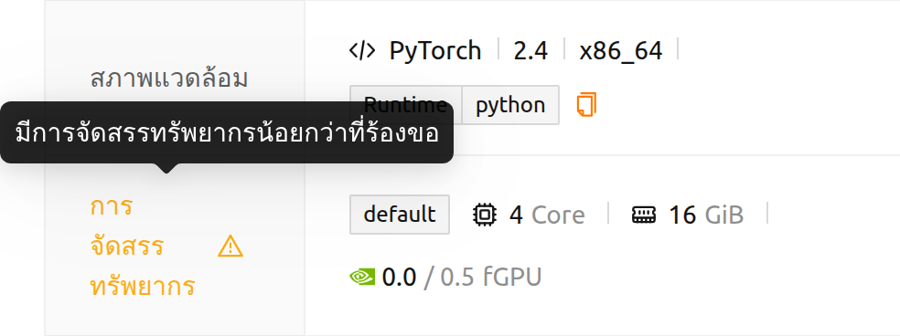

# คำถามที่พบบ่อย & การแก้ปัญหา

## คู่มือการแก้ปัญหาสำหรับผู้ใช้

### รายการเซสชันแสดงไม่ถูกต้อง

เนื่องจากปัญหาเครือข่ายที่เกิดขึ้นเป็นระยะเวลาและ/หรือเหตุผลต่างๆ รายชื่อเซสชันอาจไม่แสดงอย่างถูกต้อง ในส่วนใหญ่ของเวลา ปัญหานี้จะหายไปเพียงแค่การรีเฟรชเบราว์เซอร์

- Web-based WebUI: รีเฟรชหน้าเบราว์เซอร์ (ใช้ทางลัดที่เบราว์เซอร์จัดให้ เช่น Ctrl-R) เนื่องจากแคชของเบราว์เซอร์อาจทำให้เกิดปัญหาในบางครั้ง แนะนำให้รีเฟรชหน้าด้วยการข้ามแคช (เช่น Shift-Ctrl-R แต่คีย์อาจแตกต่างกันในแต่ละเบราว์เซอร์)
- WebUI แอป: กดแป้น Ctrl-R เพื่อรีเฟรชแอป

### ทันใดนั้น ฉันไม่สามารถเข้าสู่ระบบด้วยบัญชีของฉันได้

หากมีปัญหาในการรับรู้คุกกี้การพิสูจน์ตัวตน ผู้ใช้อาจไม่สามารถเข้าสู่ระบบได้ชั่วคราว ลองเข้าสู่ระบบด้วยหน้าต่างเบราว์เซอร์ส่วนตัว หากเข้าสู่ระบบได้ กรุณาล้างแคชของเบราว์เซอร์และ/หรือข้อมูลแอปพลิเคชัน

<a id="offline-banner"></a>

### WebUI แจ้งว่าฉันออฟไลน์อยู่

แถบสีแดง **ออฟไลน์: ไม่ได้เชื่อมต่อกับเครือข่ายใดๆ** ที่ด้านบนของหน้า หมายความว่าไม่สามารถเข้าถึงเซิร์ฟเวอร์ Backend.AI ได้ WebUI ไม่ได้อาศัยเพียงการคาดเดาสถานะเครือข่ายของเบราว์เซอร์เท่านั้น เมื่อเบราว์เซอร์รายงานว่าไม่มีการเชื่อมต่อ WebUI จะตรวจสอบก่อนว่าเซิร์ฟเวอร์ยังตอบสนองอยู่หรือไม่ และจะแสดงแถบนี้ก็ต่อเมื่อการตรวจสอบดังกล่าวล้มเหลวด้วย ดังนั้น VPN, captive portal หรืออะแดปเตอร์เครือข่ายเสมือนที่ทำงานเป็นปกติจะไม่ทำให้เกิดการแจ้งเตือนที่ผิดพลาดอีกต่อไป

โปรดตรวจสอบการเชื่อมต่อเครือข่ายของคุณ และสอบถามผู้ดูแลระบบว่าเซิร์ฟเวอร์ Backend.AI ทำงานอยู่หรือไม่ WebUI จะตรวจสอบซ้ำอย่างต่อเนื่องขณะที่แถบนี้แสดงอยู่ ดังนั้นแถบจะหายไปเองภายในไม่กี่วินาทีเมื่อเข้าถึงเซิร์ฟเวอร์ได้อีกครั้ง

แถบสีเหลือง **เซิร์ฟเวอร์ใช้เวลาตอบสนองนานขึ้น กรุณารอสักครู่** เป็นข้อความคนละแบบ หมายความว่าเซิร์ฟเวอร์ยังเข้าถึงได้แต่ตอบสนองช้า คุณสามารถปิดแถบนี้และทำงานต่อได้

<a id="route-error-pages"></a>

### ลิงก์พาฉันไปยังหน้าข้อผิดพลาดแทนหน้าที่ฉันต้องการ

เมื่อไม่สามารถเปิดที่อยู่ใดได้ WebUI จะไม่ทิ้งหน้าเปล่าไว้ แต่จะอธิบายเหตุผลภายในแอปพลิเคชัน หน้าข้อผิดพลาดจะแสดงที่อยู่ที่คุณพยายามเปิด พร้อมปุ่มที่พาคุณไปยังหน้าแรกที่คุณสามารถใช้งานได้ (**กลับไปยังหน้า ...**) ข้อความจะบอกว่าเกิดกรณีใดต่อไปนี้

- **โอ๊ะ! ไม่พบหน้าที่คุณต้องการ...** — ที่อยู่ไม่ตรงกับหน้าใดใน WebUI โดยทั่วไปเกิดจากการพิมพ์ที่อยู่ผิด ลิงก์ที่ล้าสมัย หรือบุ๊กมาร์กที่บันทึกไว้ก่อนที่หน้านั้นจะถูกเปลี่ยนชื่อ
- **ไม่พบโปรเจกต์ '...' หรือคุณไม่มีสิทธิ์เข้าถึง** — ที่อยู่ระบุโปรเจกต์ที่ไม่มีอยู่จริง หรือคุณไม่ได้เป็นสมาชิกของโปรเจกต์นั้น ที่อยู่จะแสดงพร้อมทำเครื่องหมายในส่วนที่เป็นโปรเจกต์ คุณจึงเห็นได้ทันทีว่าชื่อใดผิด เลือกโปรเจกต์ที่คุณใช้งานได้จากตัวเลือกโปรเจกต์ที่ด้านบนของหน้า แล้วฟีเจอร์เดียวกันจะเปิดขึ้นในโปรเจกต์นั้น
- **ไม่มีโปรเจกต์ที่สามารถเข้าถึงได้** — บัญชีของคุณยังไม่ได้อยู่ในโปรเจกต์ใดเลย โปรดติดต่อผู้ดูแลระบบเพื่อขอสิทธิ์เข้าถึงโปรเจกต์ตามที่ข้อความแนะนำ
- **การเข้าถึงที่ไม่ได้รับอนุญาต** — ที่อยู่นั้นถูกต้อง แต่บทบาทของคุณไม่อนุญาตให้เปิด ดูที่ [หน้าที่คุณไม่สามารถเปิดได้](#pages-you-cannot-open) ในบทการเข้าสู่ระบบ


<a id="installing_apt_pkg"></a>

### วิธีการติดตั้งแพ็กเกจ apt?

ภายในเซสชันการคำนวณ ผู้ใช้ไม่สามารถเข้าถึงบัญชี `root` และทำการ
ดำเนินการที่ต้องใช้สิทธิ์ `sudo` ได้ด้วยเหตุผลด้านความปลอดภัย ดังนั้น
จึงไม่อนุญาตให้ติดตั้งแพ็กเกจด้วย `apt` หรือ `yum` เนื่องจากต้องใช้
`sudo` หากจำเป็นจริง ๆ คุณสามารถร้องขอให้ผู้ดูแลระบบอนุญาตสิทธิ์ `sudo` ได้

หรืออีกทางหนึ่ง ผู้ใช้อาจใช้ Homebrew เพื่อติดตั้งแพ็กเกจ OS ได้ โปรดดู
[คู่มือการใช้ Homebrew กับโฟลเดอร์เมาท์อัตโนมัติ](#using-linuxbrew-with-automountfolder)


<a id="install_pip_pkg"></a>

### วิธีติดตั้งแพ็คเกจด้วย pip คืออะไร?

โดยค่าเริ่มต้น เมื่อคุณติดตั้งแพ็กเกจ pip จะถูกติดตั้งภายใต้
`~/.local` ดังนั้น หากคุณสร้างโฟลเดอร์จัดเก็บแบบเมาท์อัตโนมัติชื่อ `.local` คุณ
สามารถเก็บแพ็กเกจที่ติดตั้งไว้ได้แม้หลังจากที่เซสชันการคำนวณถูกทำลาย และนำมา
ใช้ใหม่ในเซสชันการคำนวณครั้งต่อไปได้ เพียงติดตั้งแพ็กเกจด้วย pip ดังนี้:

```bash
pip install aiohttp
```
สำหรับข้อมูลเพิ่มเติม โปรดดู[คู่มือการติดตั้งแพ็กเกจ Python
ด้วยโฟลเดอร์เมาท์อัตโนมัติ](#using-pip-with-automountfolder)

### ฉันได้สร้างเซสชันการคำนวณแล้ว แต่ไม่สามารถเปิดใช้งาน Jupyter Notebook ได้

หากคุณได้ติดตั้งแพ็กเกจ Jupyter ด้วย pip ด้วยตนเอง อาจเกิดข้อขัดแย้งกับ
แพ็กเกจ Jupyter ที่เซสชันการคำนวณจัดเตรียมให้โดยค่าเริ่มต้น โดยเฉพาะหากคุณ
ได้สร้างไดเรกทอรี `~/.local` ไว้ แพ็กเกจ Jupyter ที่ติดตั้งด้วยตนเอง
จะคงอยู่ในทุกเซสชันการคำนวณ ในกรณีนี้ โปรดลองลบโฟลเดอร์เมาท์อัตโนมัติ
`.local` ออก แล้วลองเปิดใช้งาน Jupyter Notebook อีกครั้ง

### เลย์เอาต์ของหน้าเสียหาย

Backend.AI WebUI ใช้ฟีเจอร์ JavaScript และ/หรือเบราว์เซอร์สมัยใหม่ล่าสุด กรุณาใช้เวอร์ชันล่าสุดของเบราว์เซอร์สมัยใหม่ (เช่น Chrome)

<a id="sftp-disconnection"></a>

### การตัดการเชื่อมต่อ SFTP

หัวข้อนี้ครอบคลุมกรณีที่การถ่ายโอนหยุดลงหลังจากเชื่อมต่อสำเร็จแล้ว หากกล่องโต้ตอบการเชื่อมต่อไม่เปิดขึ้นเลยและมีการแจ้งเตือนข้อผิดพลาดแทน แสดงว่าไม่สามารถระบุข้อมูลการเชื่อมต่อได้ โปรดดูที่ [ข้อผิดพลาดในการเชื่อมต่อ](#connection-errors) ในบท SFTP ไปยังคอนเทนเนอร์

เมื่อแอป WebUI เริ่มเชื่อมต่อ SFTP จะใช้เซิร์ฟเวอร์พร็อกซี่ท้องถิ่นที่ฝังอยู่ในแอป หากคุณออกจากแอป WebUI ในระหว่างการถ่ายโอนไฟล์ด้วยโปรโตคอล SFTP การถ่ายโอนจะล้มเหลวทันทีเนื่องจากการเชื่อมต่อที่สร้างขึ้นผ่านเซิร์ฟเวอร์พร็อกซี่ท้องถิ่นถูกตัดการเชื่อมต่อ ดังนั้น แม้ว่าคุณจะไม่ได้ใช้เซสชันการคำนวณ คุณไม่ควรออกจากแอป WebUI ขณะใช้ SFTP หากคุณต้องการรีเฟรชหน้า เราขอแนะนำให้ใช้คีย์ลัด Ctrl-R

หากแอป WebUI ถูกปิดและเริ่มต้นใหม่ บริการ SFTP จะไม่ได้ถูกเริ่มต้นอัตโนมัติสำหรับเซสชันการคำนวณที่มีอยู่ คุณต้องเริ่มบริการ SSH/SFTP ในคอนเทนเนอร์ที่ต้องการโดยชัดเจนเพื่อสร้างการเชื่อมต่อ SFTP


## คู่มือการแก้ไขปัญหาสำหรับผู้ดูแลระบบ

### ผู้ใช้ไม่สามารถเริ่มใช้งานแอปพลิเคชันเช่น Jupyter Notebook ได้

อาจมีปัญหาในการเชื่อมต่อบริการ App Proxy โปรดลองหยุดและเริ่มบริการใหม่
โดยอ้างอิงจากคู่มือการเริ่ม/หยุด/เริ่มใหม่ของบริการ App Proxy

หากผู้ใช้แจ้งว่าไม่สามารถเปิด SSH/SFTP ได้ แทนที่จะเป็นแอปแบบเว็บ โปรดสอบถามข้อความที่แสดงในการแจ้งเตือนให้ตรงตามที่ปรากฏ เนื่องจากแต่ละข้อความชี้ไปยังขั้นตอนที่ต่างกันของเส้นทาง App Proxy รายละเอียดอยู่ใน [ข้อผิดพลาดในการเชื่อมต่อ](#connection-errors)

### ทรัพยากรที่ระบุไม่ตรงกับการจัดสรรจริง

หน้ารายละเอียดเซสชันจะรายงานเรื่องนี้ให้เอง จึงควรตรวจสอบก่อนดำเนินการอื่นใด หน้านี้แสดงทรัพยากรที่เซสชัน**ถือครองอยู่จริง** เมื่อการจัดสรรต่างจากที่ร้องขอ ทรัพยากรแต่ละรายการจะแสดงทั้งสองค่าในรูปแบบ *ที่จัดสรร / ที่ร้องขอ* ภายในรายการเดียวกัน (เช่น `0.0 / 0.5 fGPU`) และป้ายกำกับ **การจัดสรรทรัพยากร** จะมีไอคอนคำเตือนซึ่งมีทูลทิปว่า *มีการจัดสรรทรัพยากรน้อยกว่าที่ร้องขอ*



ความแตกต่างที่แสดงตรงนั้นคือการจัดสรรจริง ไม่ใช่ข้อผิดพลาดในการแสดงผล โดยทั่วไปหมายความว่าคำขอถูกปรับเมื่อเซสชันได้รับการจัดสรร เช่น จำนวน GPU แบบเศษส่วนถูกปัดลงให้ตรงกับหน่วยการจัดสรรของกลุ่มทรัพยากร ส่วนเซสชันที่ยังไม่ได้รับการจัดสรรจะแสดงเฉพาะจำนวนที่ร้องขอโดยไม่มีการเปรียบเทียบ

เฉพาะเมื่อค่าที่แสดงในหน้านั้นยังไม่ตรงกับปริมาณที่คอนเทนเนอร์ใช้จริง (ซึ่งอาจเกิดขึ้นหลังจากการเชื่อมต่อเครือข่ายไม่เสถียร หรือปัญหาการจัดการคอนเทนเนอร์ของ Docker daemon) จึงคำนวณการครอบครองทรัพยากรใหม่

1. เข้าสู่ระบบด้วยบัญชีผู้ดูแลระบบ
2. เปิดหน้า **การบำรุงรักษา**
3. คลิกปุ่ม **คำนวณการใช้งานใหม่**

### ภาพไม่แสดงหลังจากที่ถูกนำขึ้นไปยัง docker registry


:::note
ฟีเจอร์นี้มีให้ใช้เฉพาะสำหรับซูเปอร์แอดมินเท่านั้น
:::

หากมีการดันภาพใหม่ไปยังหนึ่งในรีจิสทรี docker ของ Backend.AI เมตาดาทาต้องได้รับการอัปเดตใน Backend.AI เพื่อที่จะใช้ในการสร้างเซสชันการคำนวณ การอัปเดตเมตาดาทาสามารถทำได้โดยการคลิกที่ปุ่ม **สแกนอิมเมจใหม่** บนหน้า **การบำรุงรักษา** ซึ่งจะปรับปรุงเมตาดาทาสำหรับรีจิสทรี docker ทุกตัว หากมีรีจิสทรีหลายตัว

หากคุณต้องการอัปเดตข้อมูลเมตาสำหรับ docker registry ที่เฉพาะเจาะจง ให้เปิดแท็บ **Registries** ในหน้า **สภาพแวดล้อม** แต่ละ registry จะแสดงเป็นแถว (row) พร้อมเมนูการดำเนินการ คลิกการดำเนินการ **สแกนอิมเมจใหม่** ในแถวของ registry ที่ต้องการ เพื่ออัปเดตเมตาดาทาของอิมเมจเฉพาะ registry นั้น

:::warning
ในแถวเดียวกันยังมีการดำเนินการ **ลบ** (ไอคอนถังขยะ) อยู่ด้วย การลบ registry จะเป็นการนำออกจาก Backend.AI อย่างถาวร โปรดอย่าสับสนกับการดำเนินการ **สแกนอิมเมจใหม่**
:::
