

# การตั้งค่าผู้ใช้

หน้าการตั้งค่าผู้ใช้ช่วยให้คุณปรับแต่งประสบการณ์การใช้งาน Backend.AI WebUI
ได้ คุณสามารถเข้าถึงได้โดยคลิกที่ไอคอนคนที่มุมขวาบนและเลือกเมนูการตั้งค่า
จากที่นี่ คุณสามารถกำหนดค่าต่างๆ เช่น โหมดธีม ภาษา การแจ้งเตือนเดสก์ท็อป
การจัดการคู่คีย์ SSH สคริปต์เชลล์ และคุณสมบัติการทดลอง

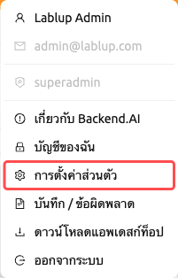

## แท็บทั่วไป

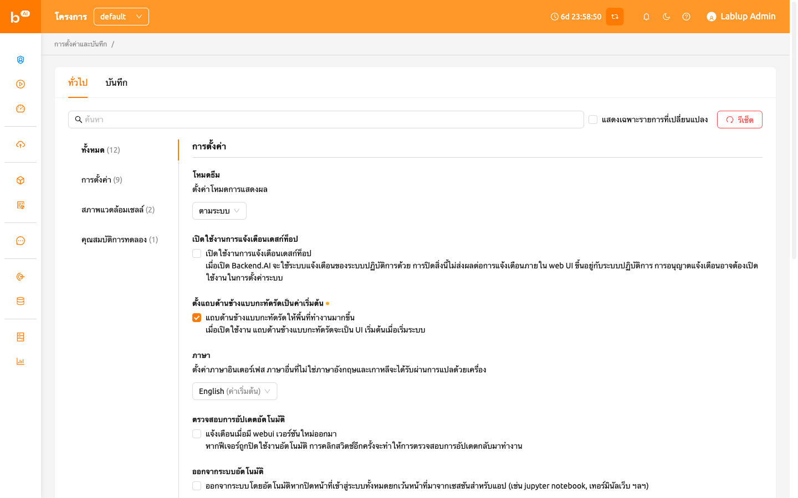

แท็บทั่วไปประกอบด้วยรายการตั้งค่าทั้งหมดที่จัดกลุ่มเป็น **การตั้งค่า**,
**สภาพแวดล้อมเชลล์** และ **คุณสมบัติการทดลอง**

### การค้นหาและกรองการตั้งค่า

ที่ด้านบนของพื้นที่ตั้งค่า คุณสามารถใช้**แถบค้นหา**เพื่อค้นหาการตั้งค่า
เฉพาะตามชื่อได้อย่างรวดเร็ว พิมพ์คำสำคัญ แล้วจะแสดงเฉพาะการตั้งค่าที่
ตรงกันเท่านั้น

คุณยังสามารถเลือกช่อง **แสดงเฉพาะรายการที่เปลี่ยนแปลง** เพื่อกรองรายการ
และแสดงเฉพาะการตั้งค่าที่ถูกแก้ไขจากค่าเริ่มต้น ซึ่งเป็นประโยชน์สำหรับ
การตรวจสอบการปรับแต่งทั้งหมดที่คุณได้ทำไว้

### การรีเซ็ตการตั้งค่าเป็นค่าเริ่มต้น

หากต้องการคืนค่าการตั้งค่าทั้งหมดเป็นค่าเริ่มต้น ให้คลิกปุ่ม
**Reset to Default** ที่ด้านบนของพื้นที่ตั้งค่า กล่องยืนยันจะปรากฏขึ้นก่อน
ทำการรีเซ็ต

การตั้งค่าแต่ละรายการยังมีปุ่มรีเซ็ตของตัวเอง (แสดงเมื่อค่าแตกต่างจาก
ค่าเริ่มต้น) ซึ่งช่วยให้คุณรีเซ็ตการตั้งค่าเดียวโดยไม่กระทบการตั้งค่าอื่น

### โหมดธีม

ตั้งค่าโหมดการแสดงผลสำหรับ WebUI คุณสามารถเลือกจาก:

- **ตามระบบ**: ปรับตามการตั้งค่าโหมดสว่าง/มืดของระบบปฏิบัติการโดยอัตโนมัติ
- **โหมดสว่าง**: ใช้ธีมสว่างเสมอ
- **โหมดมืด**: ใช้ธีมมืดเสมอ

### เปิดใช้งานการแจ้งเตือนเดสก์ท็อป

เปิดหรือปิดใช้งานคุณสมบัติการแจ้งเตือนเดสก์ท็อป เมื่อเปิดใช้งาน
Backend.AI จะใช้ระบบการแจ้งเตือนของระบบปฏิบัติการนอกเหนือจากการแจ้งเตือน
ภายในแอป การปิดใช้งานนี้จะไม่ส่งผลต่อการแจ้งเตือนภายใน WebUI ขึ้นอยู่กับ
ระบบปฏิบัติการ อาจจำเป็นต้องเปิดใช้งานสิทธิ์การแจ้งเตือนในการตั้งค่าระบบ

### ตั้งแถบด้านข้างแบบกะทัดรัดเป็นค่าเริ่มต้น

เมื่อเปิดใช้งานตัวเลือกนี้ แถบด้านซ้ายจะถูกแสดงในรูปแบบกะทัดรัด
(ความกว้างที่แคบกว่า) การเปลี่ยนแปลงของตัวเลือกจะมีผลเมื่อมีการรีเฟรช
เบราว์เซอร์ หากคุณต้องการเปลี่ยนประเภทของแถบด้านข้างทันทีโดยไม่ต้องรีเฟรช
หน้า ให้คลิกที่ไอคอนทางซ้ายสุดที่ด้านบนของหัวเรื่อง

### ภาษา

ตั้งค่าภาษาที่แสดงบน UI ตัวเลือกภาษาเป็นดร็อปดาวน์ที่ค้นหาได้ ประกอบด้วย
20 ภาษา: English, 한국어, brasileiro, 简体中文, 繁體中文, Français, Suomalainen,
Deutsch, Ελληνική, Bahasa Indonesia, Italiano, 日本語, Монгол, Polski,
Português, русский, Español, ภาษาไทย, Türkçe และ Tiếng Việt
คุณสามารถพิมพ์ในดร็อปดาวน์เพื่อกรองและค้นหาภาษาได้อย่างรวดเร็ว

ภาษาที่ตรงกับค่าเริ่มต้นของเบราว์เซอร์จะมีป้าย "(Default)" แสดงอยู่ข้างชื่อ
ภาษาอื่นๆ นอกเหนือจากภาษาอังกฤษและภาษาเกาหลีจะให้บริการผ่านการแปลด้วย
เครื่อง บางรายการใน UI อาจไม่ได้อัปเดตภาษาจนกว่าหน้าจะถูกรีเฟรช

:::note
บางรายการที่แปลแล้วอาจถูกทำเครื่องหมายเป็น `__NOT_TRANSLATED__` ซึ่งบ่งชี้
ว่ารายการนั้นยังไม่ได้รับการแปลสำหรับภาษานั้น เนื่องจาก Backend.AI WebUI
เป็นโอเพ่นซอร์ส ใครก็ตามที่ต้องการช่วยปรับปรุงการแปลสามารถมีส่วนร่วมได้:
https://github.com/lablup/backend.ai-webui.
:::

### เก็บข้อมูลเซสชันเข้าสู่ระบบไว้ระหว่างการออกจากระบบ

:::note
การตั้งค่านี้ใช้ได้เฉพาะในแอป Electron (เดสก์ท็อป) เท่านั้น
:::

เมื่อเปิดใช้งาน แอป WebUI จะเก็บข้อมูลเซสชันเข้าสู่ระบบปัจจุบันไว้
สำหรับการเปิดแอปครั้งถัดไป หากปิดตัวเลือกนี้ ข้อมูลการเข้าสู่ระบบจะถูก
ล้างทุกครั้งที่ออกจากระบบ

### ตรวจสอบการอัปเดตอัตโนมัติ

หน้าต่างแจ้งเตือนจะปรากฏขึ้นเมื่อตรวจพบเวอร์ชัน WebUI ใหม่ ทำงานได้เฉพาะ
ในสภาพแวดล้อมที่มีการเข้าถึงอินเทอร์เน็ตเท่านั้น หากคุณสมบัตินี้ถูก
ปิดใช้งานโดยอัตโนมัติ การคลิกปุ่มสลับอีกครั้งจะกลับมาตรวจสอบการอัปเดต

### ออกจากระบบอัตโนมัติ

ออกจากระบบโดยอัตโนมัติเมื่อหน้า Backend.AI WebUI ทั้งหมดถูกปิด ยกเว้นหน้า
ที่สร้างขึ้นเพื่อเรียกใช้แอปใน session (เช่น Jupyter Notebook, Web Terminal
เป็นต้น)

### ข้อมูลคู่คีย์ของฉัน

ผู้ใช้แต่ละคนมีคีย์คู่อย่างน้อยหนึ่งคู่ คุณสามารถดูคีย์การเข้าถึงและ
คีย์ลับได้โดยคลิกปุ่ม 'กำหนดค่า' จำไว้ว่าคีย์คู่การเข้าถึงหลักมีเพียงหนึ่งคู่
เท่านั้น

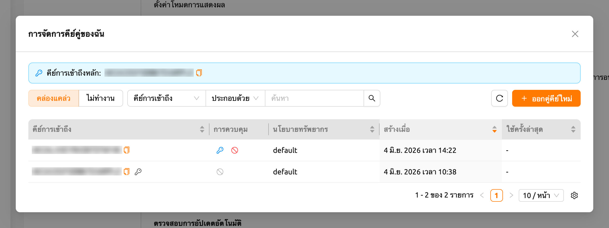

ที่ด้านบนของกล่องโต้ตอบ แบนเนอร์ **คีย์การเข้าถึงหลัก** จะแสดงคีย์การเข้าถึง
หลักปัจจุบันของคุณ คลิกไอคอนคัดลอกที่อยู่ข้างๆ เพื่อคัดลอกคีย์ไปยังคลิปบอร์ด

#### การเรียกดูคู่คีย์ของคุณ

กล่องโต้ตอบจะแสดงรายการคู่คีย์ของคุณในตาราง ใช้ตัวควบคุมเหนือตารางเพื่อ
จำกัดสิ่งที่แสดง:

- **คล่องแคล่ว** / **ไม่ทำงาน** สลับ: สลับระหว่างการดูคู่คีย์ที่ใช้งานอยู่และ
  คู่คีย์ที่ถูกปิดใช้งาน
- **ตัวกรอง**: กรองรายการตาม **คีย์การเข้าถึง** หรือ **นโยบายทรัพยากร**
- **การเรียงลำดับคอลัมน์**: เรียงลำดับตารางตาม **คีย์การเข้าถึง**,
  **นโยบายทรัพยากร**, **สร้างเมื่อ** หรือ **ใช้ครั้งล่าสุด** โดยคลิกที่
  ส่วนหัวคอลัมน์
- **การแบ่งหน้า**: เลื่อนไปมาระหว่างหน้าเมื่อคุณมีคู่คีย์มากกว่าที่จะแสดงได้
  ในหน้าเดียว

ตารางประกอบด้วยคอลัมน์ต่อไปนี้:

- **คีย์การเข้าถึง**: คีย์การเข้าถึงของคู่คีย์ คีย์การเข้าถึงหลักของคุณจะถูก
  ทำเครื่องหมายด้วยไอคอนกุญแจ คลิกไอคอนคัดลอกเพื่อคัดลอกคีย์การเข้าถึง
- **การควบคุม**: การดำเนินการที่ใช้ได้สำหรับแต่ละคู่คีย์ (ดูด้านล่าง)
- **นโยบายทรัพยากร**: นโยบายทรัพยากรที่ใช้กับคู่คีย์
- **สร้างเมื่อ**: เวลาที่สร้างคู่คีย์
- **ใช้ครั้งล่าสุด**: เวลาที่ใช้คู่คีย์ครั้งล่าสุด
- **แก้ไขเมื่อ**: เวลาที่แก้ไขคู่คีย์ครั้งล่าสุด คอลัมน์นี้ถูกซ่อนไว้โดย
  ค่าเริ่มต้น คุณสามารถแสดงได้ผ่านการตั้งค่าคอลัมน์ของตาราง

#### การออกคู่คีย์ใหม่

คลิกปุ่ม **ออกคู่คีย์ใหม่** เพื่อสร้างคู่คีย์ใหม่ หลังจากออกคู่คีย์แล้ว
กล่องโต้ตอบ **ข้อมูลรับรองคู่คีย์** จะปรากฏขึ้น โดยแสดงข้อมูลรับรองใหม่
เพียงครั้งเดียวเท่านั้น

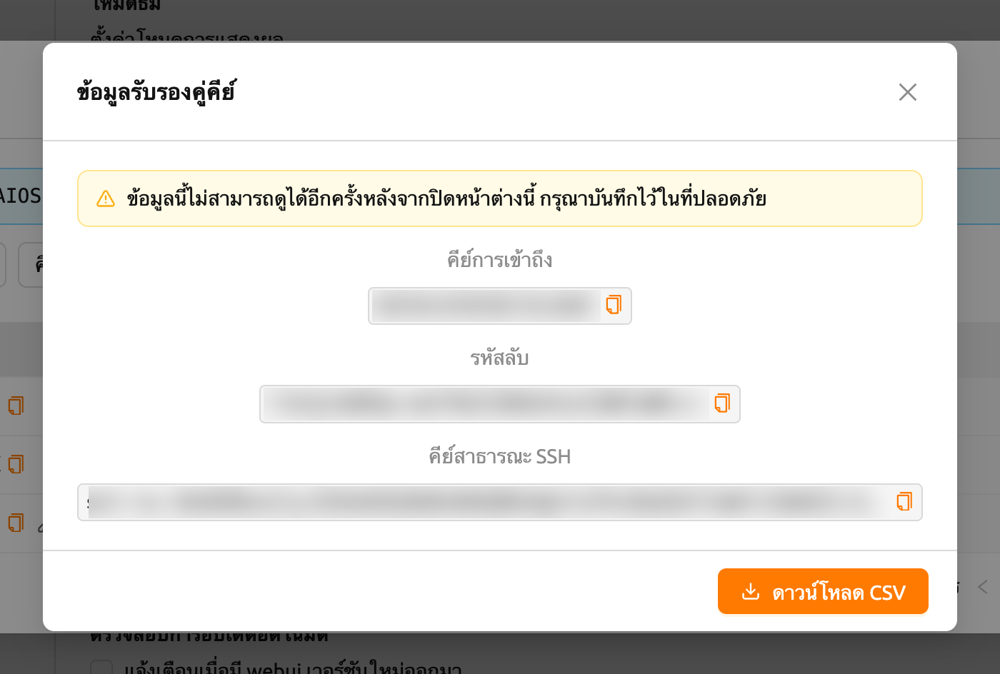

กล่องโต้ตอบจะแสดงค่าต่อไปนี้ พร้อมปุ่มคัดลอกสำหรับแต่ละค่า:

- **คีย์การเข้าถึง**
- **รหัสลับ**
- **คีย์สาธารณะ SSH**

คลิก **ดาวน์โหลด CSV** เพื่อบันทึกข้อมูลรับรองลงในไฟล์

:::warning
*"ข้อมูลนี้ไม่สามารถดูได้อีกครั้งหลังจากปิดหน้าต่างนี้ กรุณาบันทึกไว้ในที่
ปลอดภัย"* รหัสลับจะแสดงเพียงครั้งเดียวเท่านั้น คัดลอกหรือดาวน์โหลด CSV ก่อน
ที่คุณจะปิดกล่องโต้ตอบ เนื่องจากไม่มีวิธีเรียกดูรหัสลับในภายหลัง
:::

#### การจัดการคู่คีย์ที่ใช้งานอยู่

สำหรับคู่คีย์ที่ใช้งานอยู่แต่ละคู่ คอลัมน์ **การควบคุม** มีการดำเนินการ
ต่อไปนี้:

- **ตั้งเป็นหลัก**: กำหนดให้คู่คีย์นี้เป็นคีย์การเข้าถึงหลักของคุณ จะมีกล่อง
  ยืนยันปรากฏขึ้นก่อนที่การเปลี่ยนแปลงจะถูกนำไปใช้ คีย์การเข้าถึงหลักที่ใช้งาน
  อยู่ในปัจจุบันจะไม่แสดงการดำเนินการนี้

  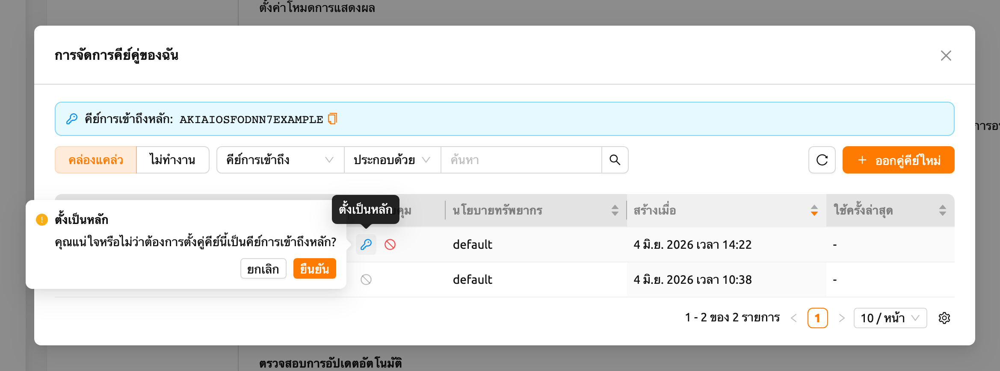

- **ปิดการใช้งาน**: ปิดใช้งานคู่คีย์เพื่อไม่ให้สามารถใช้งานได้อีกต่อไป จะมี
  กล่องยืนยันปรากฏขึ้นก่อนที่คู่คีย์จะถูกปิดใช้งาน คีย์การเข้าถึงหลักไม่สามารถ
  ปิดใช้งานได้ โปรดเปลี่ยนไปใช้คีย์อื่นก่อน (*"ไม่สามารถปิดใช้งานคีย์การเข้าถึง
  หลักได้ โปรดเปลี่ยนไปใช้คีย์อื่นก่อน"*)

:::note[จำเป็นต้องเข้าสู่ระบบใหม่]
เมื่อคีย์การเข้าถึงหลักถูกเปลี่ยน (เช่น หลังจากออกคู่คีย์ใหม่และตั้งให้เป็น
คีย์หลัก) WebUI จะแสดงการแจ้งเตือน **จำเป็นต้องเข้าสู่ระบบใหม่** พร้อมข้อความ
*"คีย์การเข้าถึงหลักได้เปลี่ยนแล้ว โปรดเข้าสู่ระบบอีกครั้งเพื่อใช้การ
เปลี่ยนแปลง"* โปรดออกจากระบบและเข้าสู่ระบบอีกครั้งเพื่อให้คีย์การเข้าถึงหลักใหม่
ถูกนำไปใช้กับเซสชันของคุณ
:::

#### การจัดการคู่คีย์ที่ไม่ได้ใช้งาน

สลับไปที่มุมมอง **ไม่ทำงาน** เพื่อจัดการคู่คีย์ที่ถูกปิดใช้งาน คู่คีย์ที่ไม่ได้
ใช้งานแต่ละคู่มีการดำเนินการต่อไปนี้:

- **คืนค่า**: เปิดใช้งานคู่คีย์อีกครั้งเพื่อให้สามารถใช้งานได้ จะมีกล่องยืนยัน
  ปรากฏขึ้นก่อนที่คู่คีย์จะถูกคืนค่า
- **ลบคู่คีย์**: ลบคู่คีย์อย่างถาวร

:::danger
การลบคู่คีย์ **ไม่สามารถย้อนกลับได้** คู่คีย์ที่ถูกลบแล้วไม่สามารถกู้คืนได้
เพื่อป้องกันการลบโดยไม่ตั้งใจ คุณต้องพิมพ์ **ลบถาวร** ในช่องยืนยันก่อนที่จะ
อนุญาตให้ลบ
:::

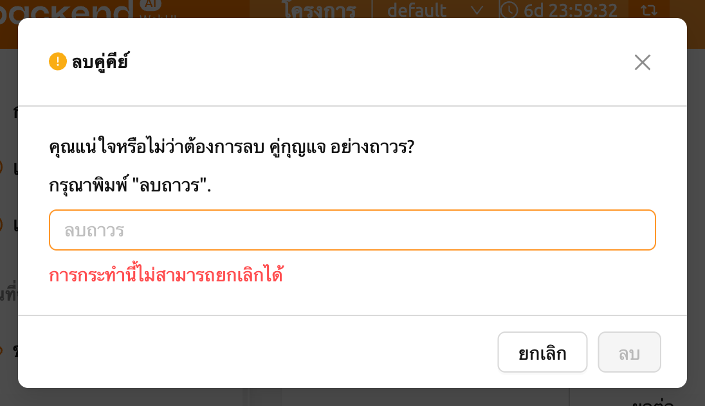

### การจัดการคู่คีย์ SSH

เมื่อใช้แอป WebUI คุณสามารถสร้างการเชื่อมต่อ SSH/SFTP ไปยังเซสชันการ
คำนวณได้โดยตรง เมื่อคุณสมัครใช้งาน Backend.AI คู่คีย์สาธารณะจะถูกจัดเตรียม
ให้ หากคุณคลิกปุ่มทางขวาของส่วนการจัดการคู่คีย์ SSH กล่องโต้ตอบต่อไปนี้จะ
ปรากฏขึ้น คลิกปุ่มคัดลอกทางขวาเพื่อคัดลอกคีย์สาธารณะ SSH ที่มีอยู่
คุณสามารถอัปเดตคู่คีย์ SSH ได้โดยคลิกปุ่ม `GENERATE` ที่ด้านล่างของกล่อง
โต้ตอบ คีย์สาธารณะ/ส่วนตัว SSH จะถูกสร้างแบบสุ่มและจัดเก็บเป็นข้อมูลผู้ใช้
โปรดทราบว่าคีย์ลับจะไม่สามารถตรวจสอบได้อีกหากไม่ได้บันทึกด้วยตนเองทันที
หลังจากการสร้าง

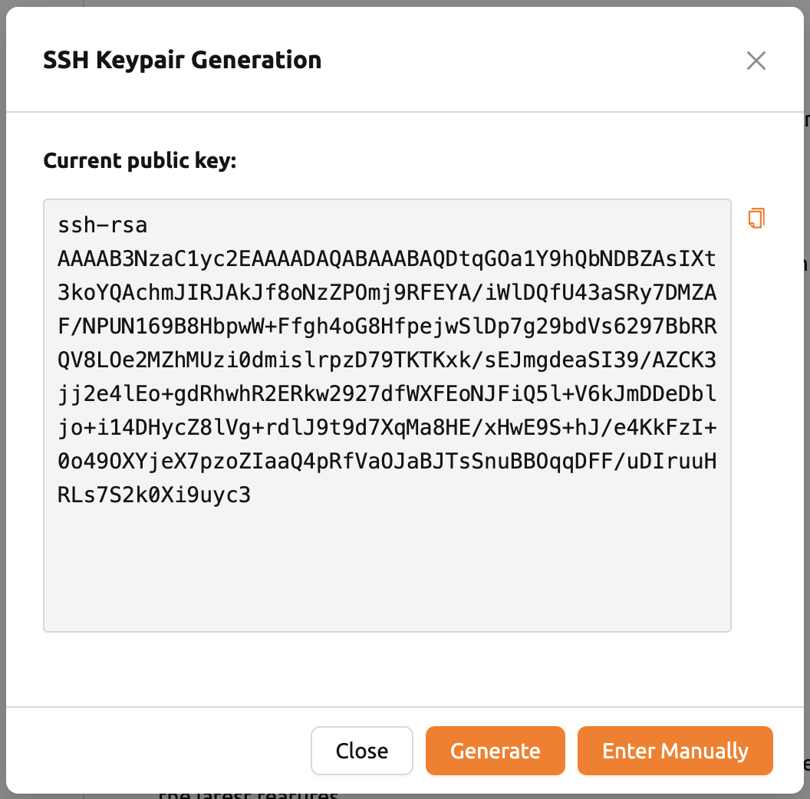

:::note
Backend.AI ใช้คู่คีย์ SSH ที่อิงตาม OpenSSH บน Windows คุณอาจต้องแปลงเป็น
คีย์ PPK
:::

Backend.AI WebUI รองรับการเพิ่มคู่คีย์ SSH ของคุณเองเพื่อให้ความยืดหยุ่น
เช่น การเข้าถึงที่เก็บข้อมูลส่วนตัว หากต้องการเพิ่มคู่คีย์ SSH ของคุณเอง
ให้คลิกปุ่ม `ENTER MANUALLY` จากนั้นคุณจะเห็นพื้นที่
ข้อความสองช่องที่สอดคล้องกับคีย์ "public" และ "private"

กรอกคีย์และคลิกปุ่ม `SAVE` ตอนนี้คุณสามารถเข้าถึง session ของ Backend.AI
โดยใช้คีย์ของคุณเองได้

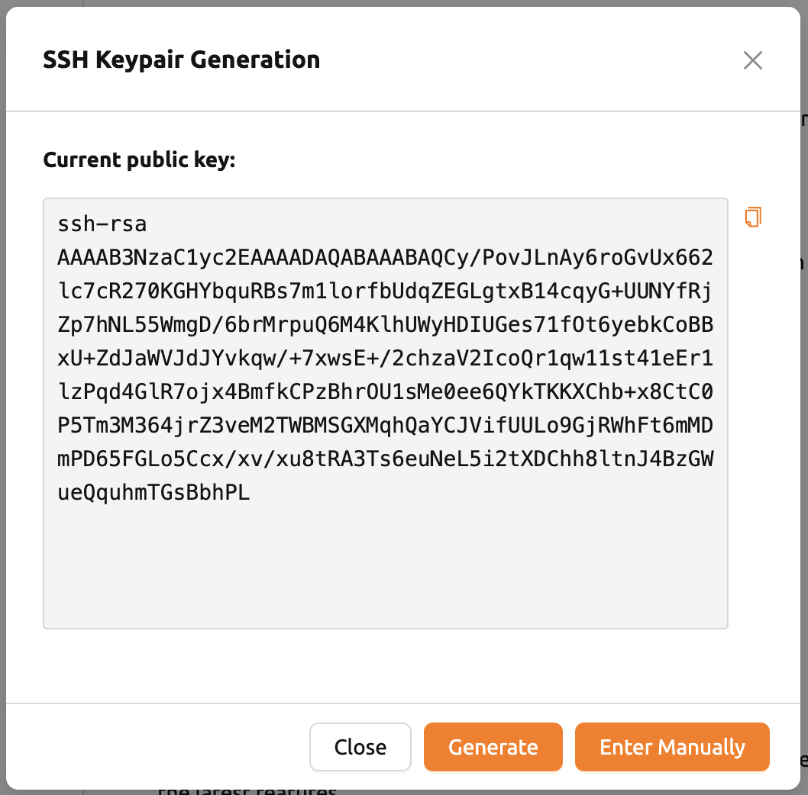

### ขีดจำกัดการอัพโหลดไฟล์สูงสุดพร้อมกัน

จำกัดจำนวนไฟล์ที่สามารถอัพโหลดพร้อมกันผ่าน File Explorer คุณสามารถเลือกค่า
ระหว่าง 2 ถึง 5 ค่าเริ่มต้นคือ 2

### แก้ไขสคริปต์บูตสแตรป

หากคุณต้องการเรียกใช้สคริปต์ครั้งเดียวหลังจากที่เซสชันการคำนวณของคุณ
เริ่มต้นขึ้น ให้เขียนเนื้อหาที่นี่

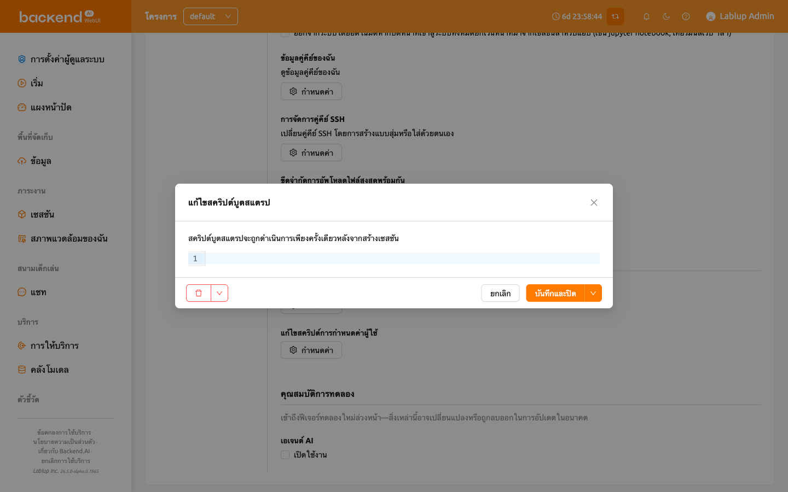

:::note
เซสชันการคำนวณจะอยู่ในสถานะ `PREPARING` จนกว่าสคริปต์บูตสแตรปจะทำงานเสร็จ
เนื่องจากผู้ใช้ไม่สามารถใช้ session ได้จนกว่าจะเป็นสถานะ `RUNNING` หาก
สคริปต์มีงานที่ใช้เวลานาน ควรลบออกจากสคริปต์บูตสแตรปและเรียกใช้ในแอป
เทอร์มินัลแทน
:::

### แก้ไขสคริปต์การกำหนดค่าผู้ใช้

คุณสามารถเขียนสคริปต์การกำหนดค่าเพื่อแทนที่ค่าเริ่มต้นในเซสชันการคำนวณ
ไฟล์เช่น `.bashrc`, `.tmux.conf.local`, `.vimrc` เป็นต้น สามารถปรับแต่งได้
สคริปต์จะถูกบันทึกสำหรับผู้ใช้แต่ละคนและสามารถใช้ได้เมื่อต้องการงาน
อัตโนมัติบางอย่าง ตัวอย่างเช่น คุณสามารถแก้ไขสคริปต์ `.bashrc` เพื่อลงทะเบียน
นามแฝงคำสั่งหรือระบุว่าไฟล์บางไฟล์จะถูกดาวน์โหลดไปยังตำแหน่งที่กำหนดเสมอ

ใช้เมนูแบบเลื่อนลงที่ด้านบนเพื่อเลือกประเภทของสคริปต์ที่คุณต้องการเขียน
แล้วเขียนเนื้อหา คุณสามารถบันทึกสคริปต์โดยคลิกปุ่ม SAVE หรือ
SAVE AND CLOSE คลิกปุ่ม DELETE เพื่อลบสคริปต์

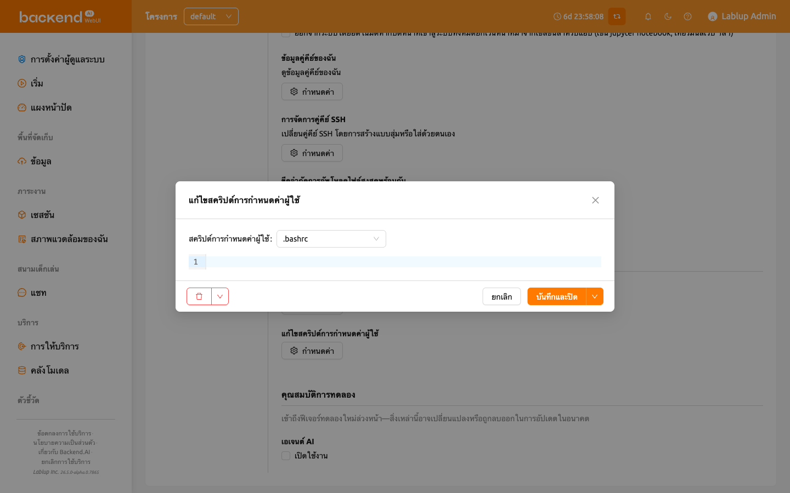

### คุณสมบัติการทดลอง

เข้าถึงฟีเจอร์ทดลองใหม่ล่วงหน้า สิ่งเหล่านี้อาจเปลี่ยนแปลงหรือถูกลบออก
ในการอัปเดตในอนาคต

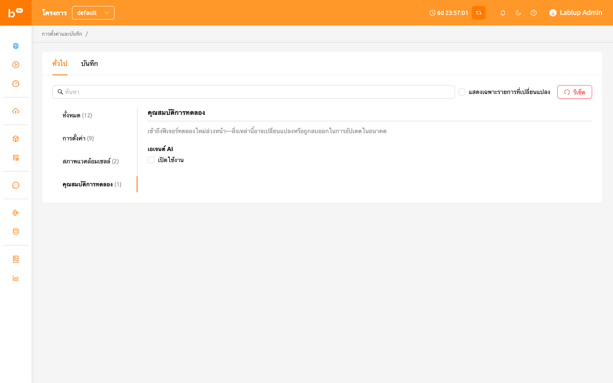

- **เอเจนต์ AI**: เปิดใช้งานฟีเจอร์เอเจนต์ AI ซึ่งให้ความสามารถ AI แบบ
  เอเจนต์ภายใน WebUI เมื่อเปิดใช้งาน ฟังก์ชันเอเจนต์ AI จะพร้อมใช้งาน
  ในเซสชันของคุณ

## แท็บบันทึก

แสดงข้อมูลรายละเอียดของบันทึกต่างๆ ที่บันทึกไว้ในฝั่งไคลเอนต์ คุณสามารถ
ไปที่หน้านี้เพื่อหาข้อมูลเพิ่มเติมเกี่ยวกับข้อผิดพลาดที่เกิดขึ้น
คุณสามารถค้นหาและกรองบันทึกข้อผิดพลาด อัปเดตรายการ และล้างบันทึกทั้งหมด
โดยคลิกปุ่ม Clear Logs ที่มุมขวาบน

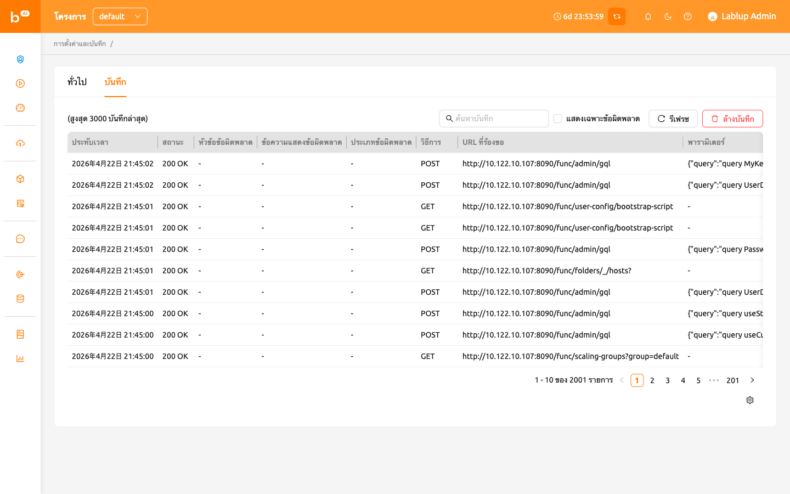

:::note
หากคุณล็อกอินอยู่เพียงหน้าหนึ่ง การคลิกที่ปุ่ม REFRESH อาจไม่แสดงผล
อย่างถูกต้อง หน้าบันทึกเป็นการรวมคำขอไปยังเซิร์ฟเวอร์และการตอบสนอง
จากเซิร์ฟเวอร์ หากหน้าปัจจุบันคือหน้าบันทึก มันจะไม่ส่งคำขอใดๆ ไปยัง
เซิร์ฟเวอร์นอกเหนือจากการรีเฟรชหน้าตามที่ระบุ หากต้องการตรวจสอบว่าบันทึก
กำลังถูกจัดเรียงอย่างถูกต้อง กรุณาเปิดหน้าอื่นและคลิกปุ่ม REFRESH
:::

หากคุณต้องการซ่อนหรือแสดงคอลัมน์บางอย่าง ให้คลิกที่ไอคอนเฟืองที่มุมขวา
ล่างของตาราง จากนั้นกล่องโต้ตอบจะปรากฏขึ้นเพื่อให้คุณเลือกคอลัมน์ที่
ต้องการเห็น

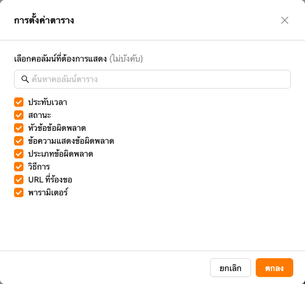
