# Data Page

# การจัดการข้อมูลและโฟลเดอร์เก็บข้อมูล

Backend.AI supports dedicated storage to preserve ผู้ใช้'s files. Since the files
and directories of a compute session are deleted upon session termination, it is
recommended to save them in a storage folder. List of storage folders can be
found by selecting the Data page on the sidebar. You can see the information
such as the folder name and ID, the NFS host name where the folder is located
(Location), and folder access rights (Permission).

โฟลเดอร์จัดเก็บมีสองประเภท: `ผู้ใช้` และ `โปรเจกต์` คุณสามารถแยกความแตกต่างได้ในคอลัมน์ 'ประเภท'

โฟลเดอร์ผู้ใช้ถูกสร้างขึ้นโดยตรงโดยผู้ใช้แต่ละรายเพื่อใช้งานส่วนตัว
โฟลเดอร์โปรเจกต์ถูกสร้างโดยผู้ดูแลระบบโดเมนสำหรับแต่ละโปรเจกต์
ผู้ใช้ทั่วไปไม่สามารถสร้างโฟลเดอร์โปรเจกต์ด้วยตนเองได้ พวกเขาสามารถใช้เฉพาะโฟลเดอร์โปรเจกต์ที่สร้างโดยผู้ดูแลระบบเท่านั้น

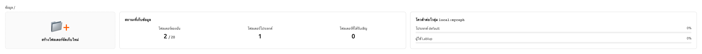

The Storage Status and โควตาต่อปริมาตรการจัดเก็บ show the following information:

- Storage Status
    - Created โฟลเดอร์: The number of folders that the ผู้ใช้ created.

         - ข้อจำกัด: จำนวนโฟลเดอร์สูงสุดที่ผู้ใช้สามารถสร้างได้ภายหลัง ค่าใช้จ่ายนี้ขึ้นอยู่กับนโยบายทรัพยากรที่นำไปใช้กับผู้ใช้และไม่สามารถเปลี่ยนแปลงได้หากไม่เปลี่ยนนโยบายทรัพยากร โฟลเดอร์ที่ไม่ได้สร้างโดยผู้ใช้ (เช่น โฟลเดอร์ที่ถูกเชิญให้แชร์ หรือโฟลเดอร์โปรเจกต์) จะไม่ถูกนับรวม

    * Project โฟลเดอร์: The number of project folders that the ผู้ใช้ created.
    * Invited โฟลเดอร์: The number of folders that the ผู้ใช้ was invited to share.
- โควตาต่อปริมาตรการจัดเก็บ
    * โฮสต์: ชื่อของโฮสต์ที่เก็บข้อมูล。
    * โครงการ: การใช้งานโฟลเดอร์โครงการปัจจุบัน / ขอบเขตการจัดสรรโฟลเดอร์โครงการปัจจุบัน
    * ผู้ใช้: การใช้งานโฟลเดอร์ของผู้ใช้ปัจจุบัน / ขอบเขตของโควต้าของโฟลเดอร์ผู้ใช้ปัจจุบัน

   Please remind that quota is only available in storage that provides quota setting
   (e.g. XFS, CephFS, NetApp, Purestorage, etc.). For the quota setting, please refer
   to the [Quota Setting Panel<quota-setting-panel>](#Quota Setting Panel<quota-setting-panel>) section.

## สร้างโฟลเดอร์จัดเก็บ

To create a new folder, click 'Create Folder' on the Data page. Fill in the fields in
the creation dialog as follows:

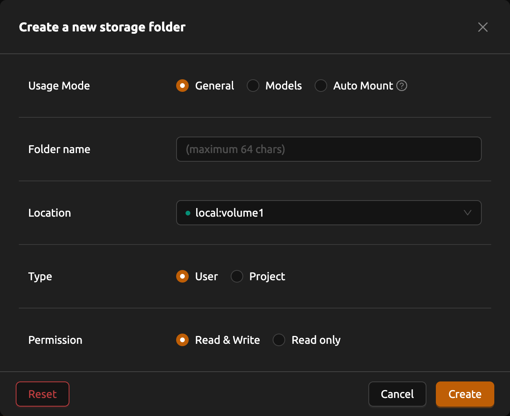

The meaning of each field in the creation dialog is as follows.

- Usage Mode: Set the purpose of the folder.

   * General: Defines a folder for storing various data in a general-purpose manner.
   * โมเดลส์: Defines a folder specialized for model serving and management. If this mode is selected, it is also possible to toggle the folder's copy availability.
   * Auto Mount: โฟลเดอร์ automatically mounted when a session is created. If selected, the folder name must start with a dot ('.').

- Folder name: The name of the folder (up to 64 characters).
- Location: Select the NFS host where the folder will be created. If there are multiple hosts, choose one. An indicator will show if there is enough available space.
- ประเภท: กำหนดประเภทของโฟลเดอร์ที่จะสร้าง สามารถตั้งค่าเป็นผู้ใช้หรือโครงการ โฟลเดอร์ผู้ใช้คือโฟลเดอร์ที่ผู้ใช้สามารถสร้างและใช้งานได้เพียงคนเดียว และโฟลเดอร์โครงการคือโฟลเดอร์ที่สร้างโดยผู้ดูแลระบบและแชร์โดยผู้ใช้ในโครงการ
- Project: Shown only when you select project type. Designates the project to which the folder belongs when creating a new project folder. Project folders must belong to a project. However, it does not play any role when creating a ผู้ใช้ folder.
- สิทธิ์: กำหนดสิทธิ์ของโฟลเดอร์โปรเจกต์สำหรับสมาชิกโปรเจกต์ หากตั้งค่าเป็น "อ่านอย่างเดียว" สมาชิกโปรเจกต์จะไม่สามารถเขียนลงในโฟลเดอร์นี้ภายในเซสชันการคอมพิวเตอร์ของพวกเขาได้
- Cloneable: Shown only when you select usage model to "Model". Select whether the vfolder you are creating should be cloneable.

The folders created here can be [mounted <session-mounts>](#mounted <session-mounts>) when creating a compute session. โฟลเดอร์ are mounted
under the ผู้ใช้'s default working directory, `/home/work/`, and the file stored in the mounted
directory will not be deleted when the compute session is terminated.
(If you delete the folder, the file will also be deleted.)

## สำรวจโฟลเดอร์

Click the folder name to open a file explorer and view the contents of the folder.

คุณสามารถเห็นได้ว่าไดเรกทอรีและไฟล์ภายในโฟลเดอร์จะถูกแสดงรายการ หากมีอยู่ คลิกที่ชื่อไดเรกทอรีในคอลัมน์ชื่อเพื่อย้ายไปยังไดเรกทอรีนั้น คุณสามารถคลิกที่ปุ่มดาวน์โหลดหรือปุ่มลบในคอลัมน์การกระทำเพื่อลงดาวน์โหลดหรือลบออกจากไดเรกทอรีโดยสิ้นเชิง คุณสามารถเปลี่ยนชื่อไฟล์/ไดเรกทอรีได้เช่นกัน สำหรับการดำเนินการไฟล์ที่ละเอียดมากขึ้น คุณสามารถทำการเมานต์โฟลเดอร์นี้เมื่อสร้างเซสชันการคอมพิวเตอร์ จากนั้นใช้บริการเช่น Terminal หรือ Jupyter Notebook ทำการดำเนินการดังกล่าว

You can create a new directory on the current path with the 'Create' button
(in the folder explorer), or upload a local file or folder with the 'Upload' button. All
of these file operations can also be performed using the above-described method
of mounting folders into a compute session.

ความยาวสูงสุดของไฟล์หรือไดเร็กทอรีภายในโฟลเดอร์อาจขึ้นอยู่กับระบบไฟล์ของโฮสต์ แต่โดยปกติจะไม่สามารถเกิน 255 ตัวอักษร

   To ensure smooth performance, the screen limits the maximum number of files that can be displayed when a
   directory contains an excessive number of files. If a folder contains a large number of files, some may
   not be shown on the screen. In such cases, please use the terminal or other applications to view all files
   in the directory.

### แก้ไขไฟล์ข้อความ

คุณสามารถแก้ไขไฟล์ข้อความได้โดยตรงในโฟลเดอร์เอ็กซ์พลอเรอร์ คลิกที่ชื่อโฟลเดอร์เพื่อเปิดไฟล์เอ็กซ์พลอเรอร์ จากนั้นคลิกที่ปุ่ม 'แก้ไขไฟล์' ในคอลัมน์ควบคุมสำหรับไฟล์ข้อความใด ๆ

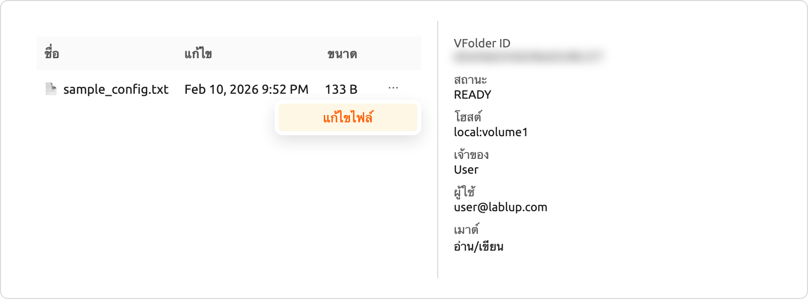

โปรแกรมแก้ไขไฟล์ข้อความจะเปิดขึ้นในโมดัลพร้อมอินเทอร์เฟซตัวแก้ไขโค้ด ตัวแก้ไขจะตรวจจับประเภทไฟล์โดยอัตโนมัติตามนามสกุลไฟล์และใช้การเน้นไวยากรณ์ที่เหมาะสม (เช่น Python, JavaScript, Markdown) หัวเรื่องโมดัลจะแสดงชื่อไฟล์และขนาด

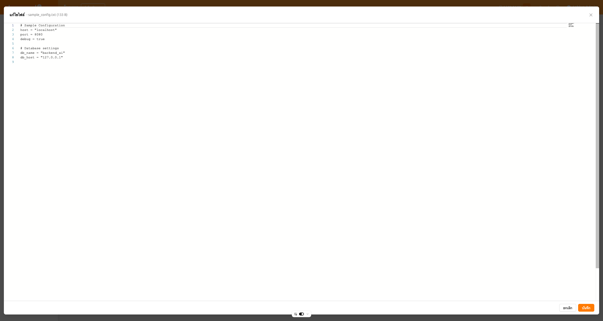

ตัวแก้ไขรองรับทั้งธีมสว่างและธีมมืดที่ตรงกับการตั้งค่า UI ของคุณ คุณสามารถแก้ไขเนื้อหาไฟล์ จากนั้นคลิก 'บันทึก' เพื่ออัปโหลดไฟล์ที่แก้ไข หรือ 'ยกเลิก' เพื่อยกเลิกการเปลี่ยนแปลง

   ปุ่มแก้ไขไฟล์จะใช้งานได้เฉพาะเมื่อคุณมีสิทธิ์ write_content บนโฟลเดอร์จัดเก็บ หากไฟล์โหลดไม่สำเร็จ ข้อความแสดงข้อผิดพลาดจะปรากฏขึ้น

## เปลี่ยนชื่อโฟลเดอร์

หากคุณมีสิทธิ์ในการเปลี่ยนชื่อโฟลเดอร์จัดเก็บ คุณสามารถเปลี่ยนชื่อได้โดยคลิกที่ปุ่มแก้ไข

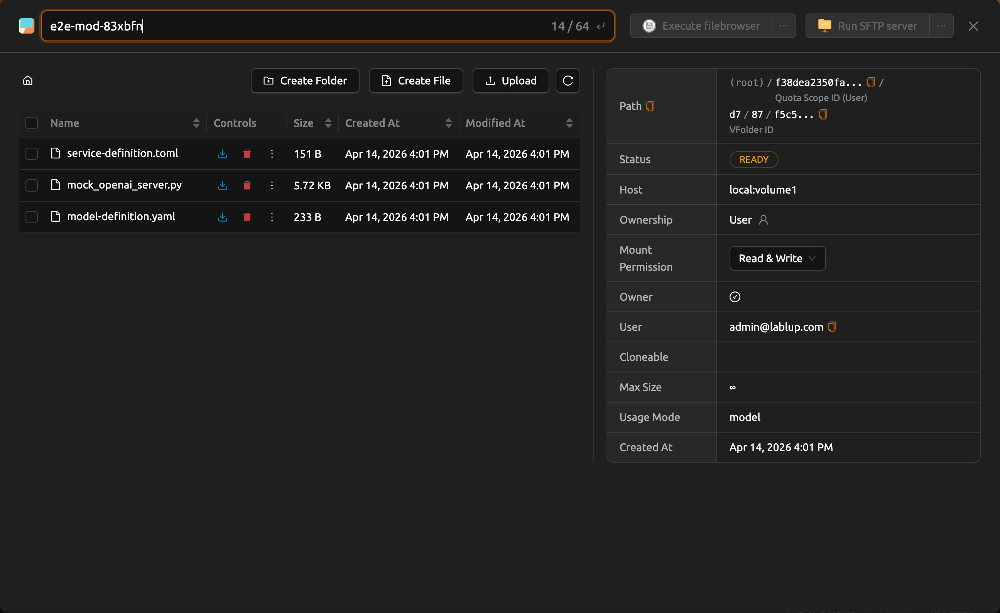

## ลบโฟลเดอร์

หากคุณมีสิทธิ์ในการลบโฟลเดอร์จัดเก็บ คุณสามารถส่งโฟลเดอร์ไปยังแท็บ 'ถังขะยะ' ได้โดยคลิกที่ปุ่ม 'ถังขยะ' เมื่อคุณย้ายโฟลเดอร์ไปยังแท็บถังขยะ โฟลเดอร์จะถูกทำเครื่องหมายเป็นรอการลบ

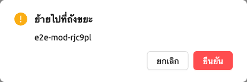

ในสถานะนี้ คุณสามารถกู้คืนโฟลเดอร์โดยคลิกที่ปุ่มกู้คืนในคอลัมน์ควบคุม หากคุณต้องการลบโฟลเดอร์อย่างถาวร กรุณาคลิกที่ปุ่ม 'ถังขยะ' ในคอลัมน์เดียวกัน

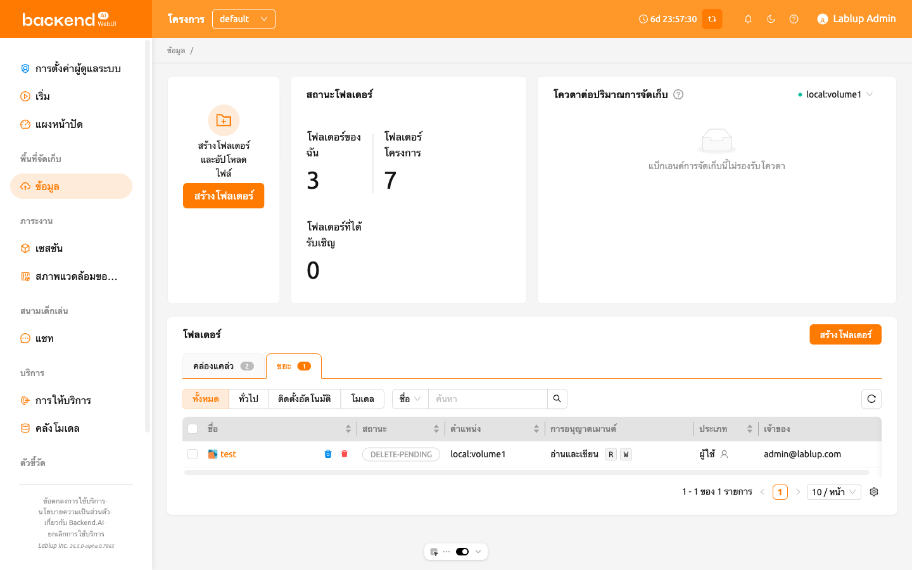

โมดัลยืนยันจะปรากฏขึ้นพร้อมกับช่องป้อนข้อมูลที่ระบุว่า `พิมพ์ชื่อโฟลเดอร์เพื่อลบ` ตรวจสอบให้แน่ใจว่าคุณพิมพ์ชื่อโฟลเดอร์ที่ถูกต้องลงในช่อง จากนั้นคลิกปุ่มสีแดง 'ลบถาวร' เพื่อลบโฟลเดอร์อย่างถาวร

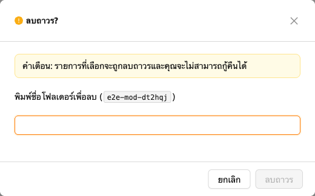

## การใช้ FileBrowser

Backend.AI supports [FileBrowser](https://filebrowser.org) from version
20.09. FileBrowser is a program that helps you manage files on a remote server
through a web browser. This is especially useful when uploading a directory from
the ผู้ใช้'s local machine.

ปัจจุบัน Backend.AI มี FileBrowser เป็นแอปพลิเคชันของเซสชันการคำนวณ ดังนั้น จึงมีเงื่อนไขต่อไปนี้ที่จำเป็นต้องมีเพื่อเรียกใช้มัน

- ผู้ใช้สามารถสร้างเซสชันการคอมพิวเตอร์ได้อย่างน้อยหนึ่งเซสชัน
- ผู้ใช้สามารถกำหนดสรรพคุณอย่างน้อย 1 แกนของ CPU และ 512 MB ของหน่วยความจำ
- ภาพที่สนับสนุน FileBrowser ต้องถูกติดตั้ง

คุณสามารถเข้าถึง FileBrowser ได้สองวิธี

- Execute FileBrowser from file explorer dialog of a data folder.
- เริ่มเซสชันการคอมพิวเตอร์โดยตรงจากภาพ FileBrowser ในหน้าเซสชัน

### Execute FileBrowser from folder explorer dialog

Go to the Data page and open the file explorer dialog of target
data folder. Click the folder name to open the file explorer.

Click 'Execute filebrowser' button in the upper-right corner of the explorer.

คุณสามารถเห็นว่า FileBrowser ถูกเปิดในหน้าต่างใหม่ คุณยังสามารถเห็นว่าหมายเหตุข้อมูลที่คุณเปิดหน้าต่างสำรวจกลายเป็นโฟลเดอร์หลัก จากหน้าต่าง FileBrowser คุณสามารถอัปโหลด แก้ไข และลบโฟลเดอร์และไฟล์ใด ๆ ได้อย่างอิสระ

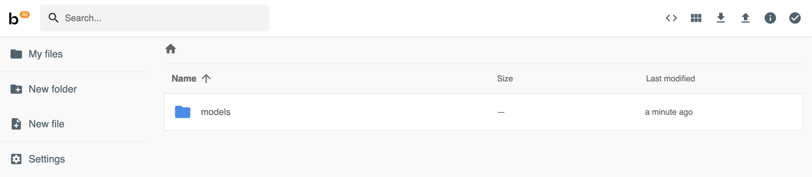

เมื่อผู้ใช้คลิกปุ่ม 'EXECUTE FILEBROWSER' ระบบ Backend.AI จะสร้างเซสชันการคำนวณเฉพาะสำหรับแอปโดยอัตโนมัติ ดังนั้นในหน้าเซสชัน คุณควรเห็นเซสชันการคำนวณ FileBrowser เป็นความรับผิดชอบของผู้ใช้ในการลบเซสชันการคำนวณนี้

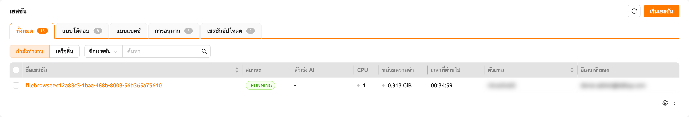

   หากคุณปิดหน้าต่าง FileBrowser โดย accident และต้องการเปิดใหม่เพียงแค่ไปที่หน้า เซสชัน และคลิกปุ่มแอปพลิเคชัน FileBrowser ของเซสชันการคอมพิวเตอร์ FileBrowser

   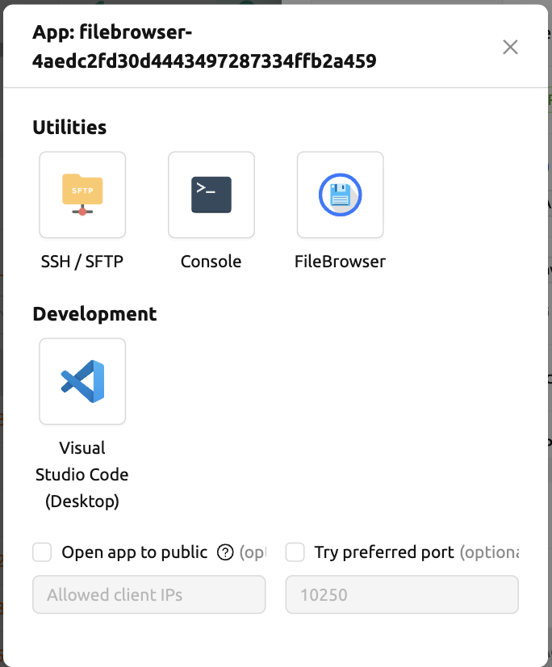

   |
   | เมื่อคุณคลิกที่ปุ่ม 'EXECUTE FILEBROWSER' อีกครั้งในตัวสำรวจโฟลเดอร์ข้อมูล จะมีการสร้างเซสชันการคำนวณใหม่และจะมีการแสดงเซสชัน FileBrowser ทั้งหมดสองรายการ

### สร้างเซสชันการคำนวณด้วยภาพ FileBrowser

คุณสามารถสร้างเซสชันคอมพิวเตอร์ได้โดยตรงด้วยภาพที่รองรับโดย FileBrowser คุณจำเป็นต้องติดตั้งโฟลเดอร์ข้อมูลอย่างน้อยหนึ่งโฟลเดอร์เพื่อเข้าถึงพวกเขา คุณสามารถใช้ FileBrowser ได้โดยไม่มีปัญหาแม้ว่าคุณจะไม่ติดตั้งโฟลเดอร์ข้อมูลใด ๆ แต่ไฟล์ที่อัปโหลด/อัปเดตทุกไฟล์จะหายไปหลังจากเซสชันสิ้นสุด

   The root directory of FileBrowser will be `/home/work`. Therefore, you
   can access any mounted data folders for the compute session.

### ตัวอย่างการใช้งานพื้นฐานของ FileBrowser

Here, we present some basic usage examples of FileBrowser in Backend.AI. Most
of the FileBrowser operations are intuitive, but if you need more detailed
guide, please refer to the
[FileBrowser documentation](https://filebrowser.org).

**อัปโหลดไดเรกทอรีท้องถิ่นโดยใช้ FileBrowser**

FileBrowser รองรับการอัปโหลดไดเรกทอรีท้องถิ่นหนึ่งหรือหลายไดเรกทอรีในขณะที่รักษาโครงสร้างต้นไม้ไว้ คลิกปุ่มอัปโหลดที่มุมขวาบนของหน้าต่าง จากนั้นคลิกปุ่มโฟลเดอร์ จะมีการแสดงกล่องโต้ตอบสำรวจไฟล์ท้องถิ่นขึ้นมา และคุณสามารถเลือกไดเรกทอรีใดก็ได้ที่คุณต้องการอัปโหลด

   หากคุณพยายามอัปโหลดไฟล์ไปยังโฟลเดอร์ที่มีสถานะเป็นอ่านอย่างเดียว FileBrowser จะเกิดข้อผิดพลาดของเซิร์ฟเวอร์

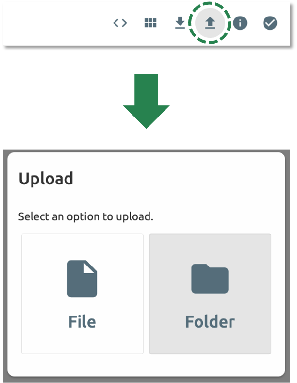

ให้เราอัปโหลดไดเรกทอรีที่มีโครงสร้างดังต่อไปนี้

``shell
foo
+-- test
|   +-- test2.txt
+-- test.txt
``
After selecting `foo` directory, you can see the directory just uploaded
successfully.

You can also upload local files and directories by drag and drop.

**Move files or directories to another directory**

Moving files or directories in data folder is also possible from FileBrowser.
You can move files or directories by following steps below.

1. Select directories or files from FileBrowser.

2. Click the 'arrow' button in the upper right corner of FileBrowser

3. Select the destination

4. Click 'MOVE' button

You will see that moving operation is successfully finished.

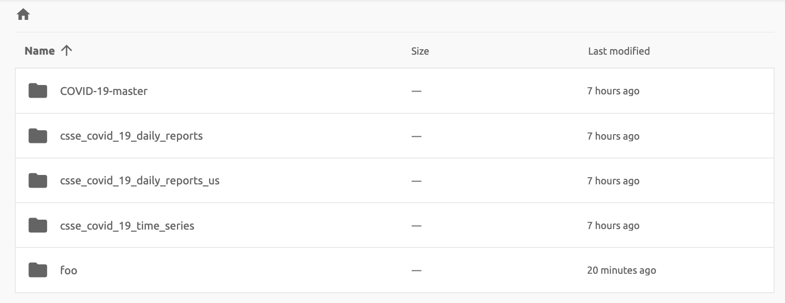

   FileBrowser is provided via application inside a compute session currently.
   We are planning to update FileBrowser so that it can run independently
   without creating a session.

## Using SFTP Server

From 22.09, Backend.AI supports SSH / SFTP file upload from both desktop app and
web-based WebUI. The SFTP server allows you to upload files quickly through reliable
data streams.

   Depending on the system settings, running SFTP server from the file dialog may not
   be allowed.

### Execute SFTP server from folder explorer dialog in Data page

Go to the Data page and open the file explorer dialog of target data folder.
Click the folder button or the folder name to open the file explorer.

Click 'Run SFTP server' button in the upper-right corner of the explorer.

You can see the SSH / SFTP connection dialog. And a new SFTP session will be created
automatically. (This session will not affect resource occupancy.)

For the connection, click 'Download SSH Key' button to download the SSH private key
(`id_container`). Also, remember the host and port number. Then, you can copy your
files to the session using the Connection Example code written in the dialog, or
referring to the following guide: [link<sftp_connection_for_linux_and_mac>](#link<sftp_connection_for_linux_and_mac>).
To preserve the files, you need to transfer the files to the data folder. Also,
the session will be terminated when there is no transfer for some time.

   If you upload your SSH keypair, the `id_container` will be set with your
   own SSH private key. So, you don't need to download it every time you
   want to connect via SSH to your container. Please refer to
   [managing user's SSH keypair<user-ssh-keypair-management>](#managing user's SSH keypair<user-ssh-keypair-management>).

# Folder Categories

## Pipeline folders

This tab shows the list of folders that are automatically created when executing a
pipeline in FastTrack. When a pipeline is created, a new folder is created and mounted
under `/pipeline` for each instance of work (computing session).

## Automount folders

Data page has an Automount Folders tab. Click this tab to see a
list of folders whose names prefixed with a dot (`.`). When you create a folder,
if you specify a name that starts with a dot (`.`), it is added to the Automount
Folders tab, not the Folders tab. Automount Folders are special folders that are
automatically mounted in your home directory even if you do not mount them
manually when creating a compute session. By using this feature, creating and
using Storage folders such as `.local`, `.linuxbrew`, `.pyenv`, etc.,
you can configure a certain ผู้ใช้ packages or environments that do not change
with different kinds of compute session.

For more detailed information on the usage of การติดตั้งโฟลเดอร์อัตโนมัติ, refer to
[examples of using automount folders<using-automount-folder>](#examples of using automount folders<using-automount-folder>).

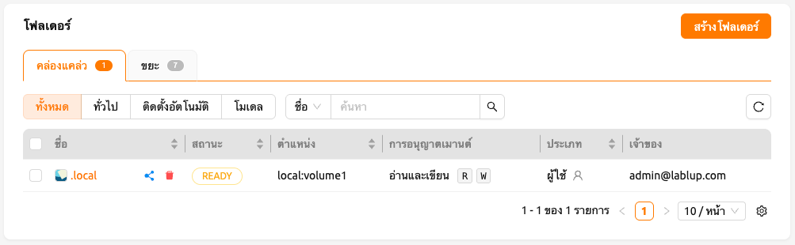

## โมเดลส์

'โมเดลส์'
The โมเดลส์ tab facilitates straightforward model serving.
You can store the necessary data, including input data for [model serving <model-serving>](#model serving <model-serving>) and training data, in the model folder.

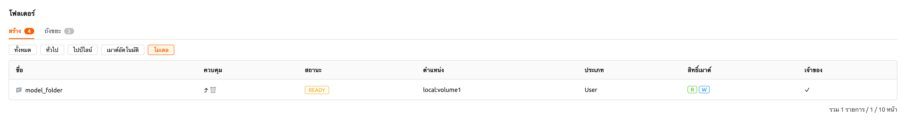