# การจัดการข้อมูลและโฟลเดอร์เก็บข้อมูล


Backend.AI มีพื้นที่จัดเก็บเฉพาะเพื่อเก็บไฟล์ของผู้ใช้ให้คงอยู่ เนื่องจากไฟล์และไดเรกทอรีของเซสชันการคำนวณจะถูกลบเมื่อเซสชันสิ้นสุดลง จึงแนะนำให้บันทึกไว้ในโฟลเดอร์จัดเก็บ คุณสามารถดูรายการโฟลเดอร์จัดเก็บได้โดยเลือกหน้าข้อมูล (Data) ที่แถบด้านข้าง หน้านี้จะแสดงข้อมูลสำคัญ เช่น ชื่อและ ID ของโฟลเดอร์ ชื่อโฮสต์ NFS ที่โฟลเดอร์ตั้งอยู่ (Location) และสิทธิ์การเข้าถึงโฟลเดอร์ (Permission)


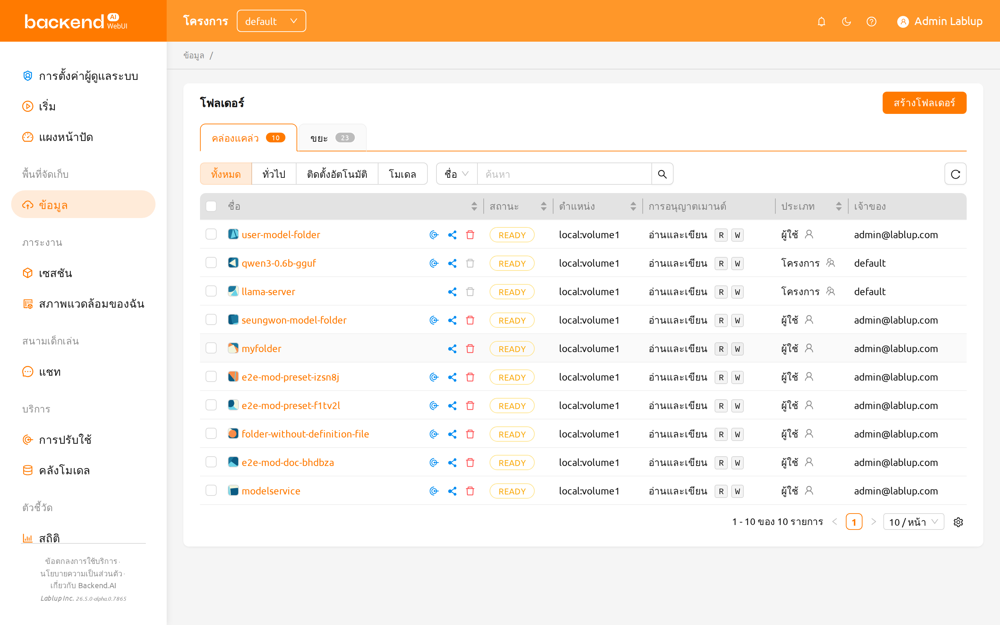

โฟลเดอร์จัดเก็บมีสองประเภท: `ผู้ใช้` และ `โปรเจกต์` คุณสามารถแยกความแตกต่างได้ในคอลัมน์ 'ประเภท'

### ป้ายคำเชิญและจุดเข้าใช้งาน

เมื่อมีผู้ใช้รายอื่นเชิญคุณให้ใช้งานโฟลเดอร์จัดเก็บของพวกเขาร่วมกัน ป้ายคำเชิญขนาดเล็กจะ
ปรากฏที่รายการหน้าข้อมูลในแถบด้านข้าง และข้างกับสรุปสถานะของโฟลเดอร์ ป้ายจะแสดง
จำนวนคำเชิญที่ค้างอยู่และยังไม่ได้รับการตอบกลับ

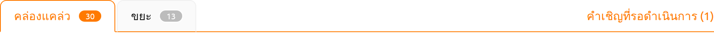
<!-- TODO: ถ่ายภาพหน้าจอของป้ายคำเชิญในหน้าข้อมูล -->

คลิกที่ป้ายเพื่อเปิดรายการคำเชิญ ซึ่งคุณสามารถยอมรับหรือปฏิเสธคำเชิญที่ค้างอยู่แต่ละ
รายการได้ โฟลเดอร์ที่ยอมรับแล้วจะปรากฏในรายการโฟลเดอร์ของคุณทันทีด้วยประเภท `เชิญแล้ว` หน้า `/data` เองก็เป็นจุดเข้าใช้งานที่ถูกต้องสำหรับการตรวจสอบคำเชิญด้วย เพียง
เปิดหน้าข้อมูล คุณก็สามารถเข้าถึงรายการคำเชิญเดียวกันได้จากสรุปสถานะของโฟลเดอร์

โฟลเดอร์ผู้ใช้ถูกสร้างขึ้นโดยตรงโดยผู้ใช้แต่ละรายเพื่อใช้งานส่วนตัว
โฟลเดอร์โปรเจกต์ถูกสร้างโดยผู้ดูแลระบบโดเมนสำหรับแต่ละโปรเจกต์
ผู้ใช้ทั่วไปไม่สามารถสร้างโฟลเดอร์โปรเจกต์ด้วยตนเองได้ พวกเขาสามารถใช้เฉพาะโฟลเดอร์โปรเจกต์ที่สร้างโดยผู้ดูแลระบบเท่านั้น

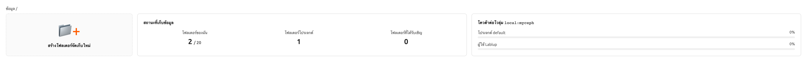

สถานะการจัดเก็บและโควตาต่อปริมาตรการจัดเก็บจะแสดงข้อมูลต่อไปนี้:

- สถานะการจัดเก็บ
    - โฟลเดอร์ที่สร้างแล้ว: จำนวนโฟลเดอร์ที่ผู้ใช้สร้างขึ้น

         - ข้อจำกัด: จำนวนโฟลเดอร์สูงสุดที่ผู้ใช้สามารถสร้างได้ภายหลัง ค่านี้ขึ้นอยู่กับนโยบายทรัพยากรที่นำไปใช้กับผู้ใช้และไม่สามารถเปลี่ยนแปลงได้หากไม่เปลี่ยนนโยบายทรัพยากร โฟลเดอร์ที่ไม่ได้สร้างโดยผู้ใช้ (เช่น โฟลเดอร์ที่ถูกเชิญให้แชร์ หรือโฟลเดอร์โปรเจกต์) จะไม่ถูกนับรวม

    * โฟลเดอร์โปรเจกต์: จำนวนโฟลเดอร์โปรเจกต์ที่ผู้ใช้สร้างขึ้น
    * โฟลเดอร์ที่ได้รับเชิญ: จำนวนโฟลเดอร์ที่ผู้ใช้ได้รับเชิญให้แชร์
- โควตาต่อปริมาตรการจัดเก็บ
    * โฮสต์: ชื่อของโฮสต์ที่เก็บข้อมูล
    * โปรเจกต์: การใช้งานโฟลเดอร์โปรเจกต์ปัจจุบัน / ขอบเขตโควตาของโฟลเดอร์โปรเจกต์ปัจจุบัน
    * ผู้ใช้: การใช้งานโฟลเดอร์ของผู้ใช้ปัจจุบัน / ขอบเขตโควตาของโฟลเดอร์ผู้ใช้ปัจจุบัน


:::note
โปรดทราบว่าโควตาสามารถใช้ได้เฉพาะในระบบจัดเก็บที่รองรับการตั้งค่าโควตาเท่านั้น
(เช่น XFS, CephFS, NetApp, Purestorage เป็นต้น) สำหรับการตั้งค่าโควตา โปรดดูที่
ส่วน [แผงตั้งค่าโควตา](#quota-setting-panel)
:::

<a id="create-storage-folder"></a>
<a id="create_storage_folder"></a>

## สร้างโฟลเดอร์จัดเก็บ


หากต้องการสร้างโฟลเดอร์ใหม่ ให้คลิก 'สร้างโฟลเดอร์' ในหน้าข้อมูล จากนั้นกรอกข้อมูลในกล่องโต้ตอบการสร้างดังนี้:

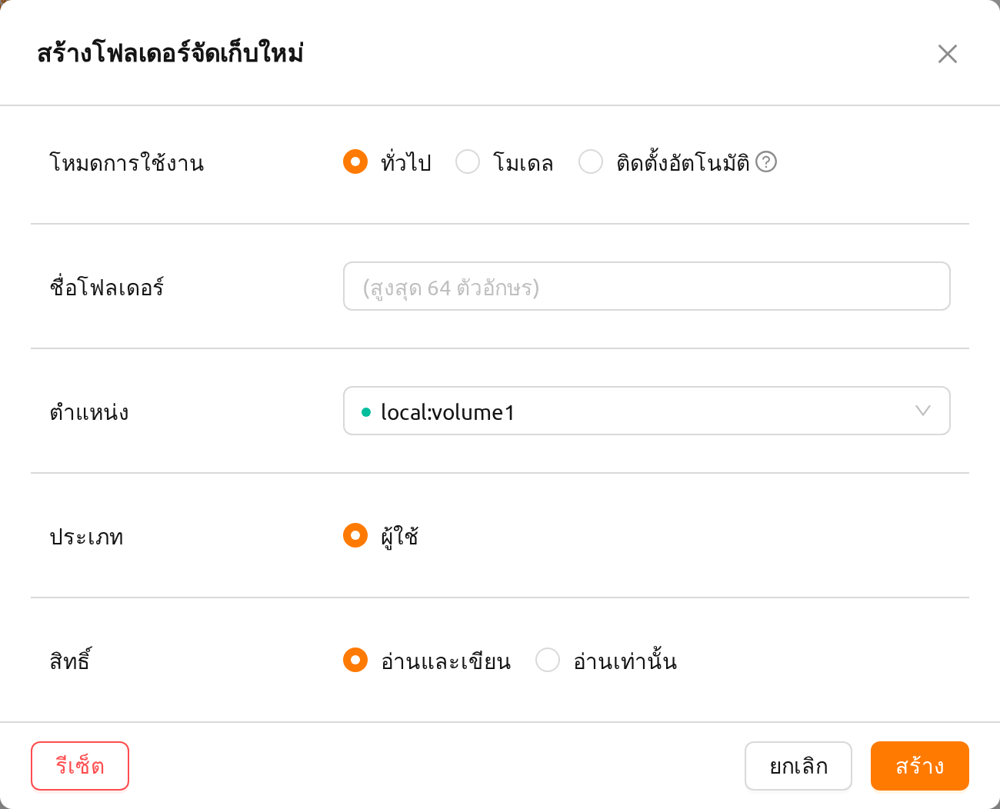

ความหมายของแต่ละช่องในกล่องโต้ตอบการสร้างมีดังต่อไปนี้

- **โหมดการใช้งาน**: กำหนดวัตถุประสงค์ของโฟลเดอร์

   * ทั่วไป: กำหนดให้เป็นโฟลเดอร์สำหรับจัดเก็บข้อมูลทั่วไปได้หลากหลายประเภท
   * โมเดล: กำหนดให้เป็นโฟลเดอร์เฉพาะสำหรับการให้บริการโมเดลและการจัดการโมเดล หากเลือกโหมดนี้ คุณจะสามารถตั้งค่าว่าโฟลเดอร์นั้นสามารถทำสำเนาได้หรือไม่
   * ติดตั้งอัตโนมัติ: โฟลเดอร์ที่จะถูกเมาท์โดยอัตโนมัติเมื่อสร้างเซสชัน หากเลือกโหมดนี้ ชื่อโฟลเดอร์ต้องขึ้นต้นด้วยจุด ('.')

- **ชื่อโฟลเดอร์**: ชื่อของโฟลเดอร์ (สูงสุด 64 ตัวอักษร)
- **ตำแหน่ง**: เลือกโฮสต์ NFS ที่จะใช้สร้างโฟลเดอร์ หากมีหลายโฮสต์ ให้เลือกหนึ่งในนั้น ตัวบ่งชี้จะแสดงว่ามีพื้นที่ว่างเพียงพอหรือไม่
- **ประเภท**: กำหนดประเภทของโฟลเดอร์ที่จะสร้าง สามารถตั้งค่าเป็นผู้ใช้ (User) หรือโปรเจกต์ (Project) โฟลเดอร์ผู้ใช้คือโฟลเดอร์ที่ผู้ใช้สร้างและใช้งานได้เพียงคนเดียว ส่วนโฟลเดอร์โปรเจกต์คือโฟลเดอร์ที่สร้างโดยผู้ดูแลระบบและแชร์กับผู้ใช้ในโปรเจกต์
- **โปรเจกต์**: จะแสดงเฉพาะเมื่อคุณเลือกประเภทเป็นโปรเจกต์ ใช้สำหรับกำหนดโปรเจกต์ที่โฟลเดอร์นั้นสังกัดเมื่อสร้างโฟลเดอร์โปรเจกต์ใหม่ โฟลเดอร์โปรเจกต์ต้องสังกัดโปรเจกต์เสมอ สำหรับโฟลเดอร์โปรเจกต์ โปรเจกต์ที่เลือกอยู่ในแถบด้านบนในปัจจุบันจะถูกเลือกเป็นโปรเจกต์เป้าหมายโดยอัตโนมัติ อย่างไรก็ตาม การตั้งค่านี้จะไม่มีผลเมื่อสร้างโฟลเดอร์ผู้ใช้
- **สิทธิ์**: กำหนดสิทธิ์ของโฟลเดอร์โปรเจกต์สำหรับสมาชิกในโปรเจกต์ หากตั้งค่าเป็น "อ่านอย่างเดียว" (Read only) สมาชิกในโปรเจกต์จะไม่สามารถเขียนลงในโฟลเดอร์นี้ภายในเซสชันการคำนวณของตนได้
- **สามารถโคลนได้**: จะแสดงเฉพาะเมื่อคุณเลือกโหมดการใช้งานเป็น "โมเดล" ใช้สำหรับเลือกว่าโฟลเดอร์เสมือน (vfolder) ที่กำลังสร้างควรสามารถโคลนได้หรือไม่

โฟลเดอร์ที่สร้างขึ้นที่นี่สามารถ[เมาท์](../mount_vfolder/mount_vfolder.md#session-mounts)ได้เมื่อสร้างเซสชันการคำนวณ โฟลเดอร์จะถูกเมาท์ไว้ภายใต้ไดเรกทอรีการทำงานเริ่มต้นของผู้ใช้ คือ `/home/work/` และไฟล์ที่เก็บไว้ในไดเรกทอรีที่เมาท์แล้วจะไม่ถูกลบเมื่อเซสชันการคำนวณสิ้นสุดลง
(หากคุณลบโฟลเดอร์ ไฟล์ก็จะถูกลบไปด้วยเช่นกัน)

<a id="explore-folder"></a>

## สำรวจโฟลเดอร์


คลิกที่ชื่อโฟลเดอร์เพื่อเปิดตัวสำรวจไฟล์และดูเนื้อหาภายในโฟลเดอร์

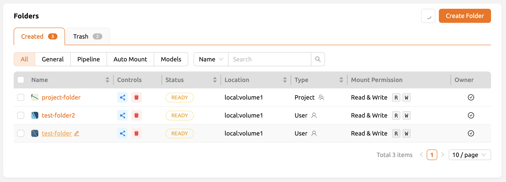

คุณสามารถเห็นได้ว่าไดเรกทอรีและไฟล์ภายในโฟลเดอร์จะถูกแสดงรายการ หากมีอยู่ คลิกที่ชื่อไดเรกทอรีในคอลัมน์ชื่อเพื่อย้ายไปยังไดเรกทอรีนั้น คุณสามารถคลิกที่ปุ่มดาวน์โหลดหรือปุ่มลบในคอลัมน์การกระทำเพื่อลงดาวน์โหลดหรือลบออกจากไดเรกทอรีโดยสิ้นเชิง คุณสามารถเปลี่ยนชื่อไฟล์/ไดเรกทอรีได้เช่นกัน สำหรับการดำเนินการไฟล์ที่ละเอียดมากขึ้น คุณสามารถทำการเมานต์โฟลเดอร์นี้เมื่อสร้างเซสชันการคอมพิวเตอร์ จากนั้นใช้บริการเช่น Terminal หรือ Jupyter Notebook ทำการดำเนินการดังกล่าว

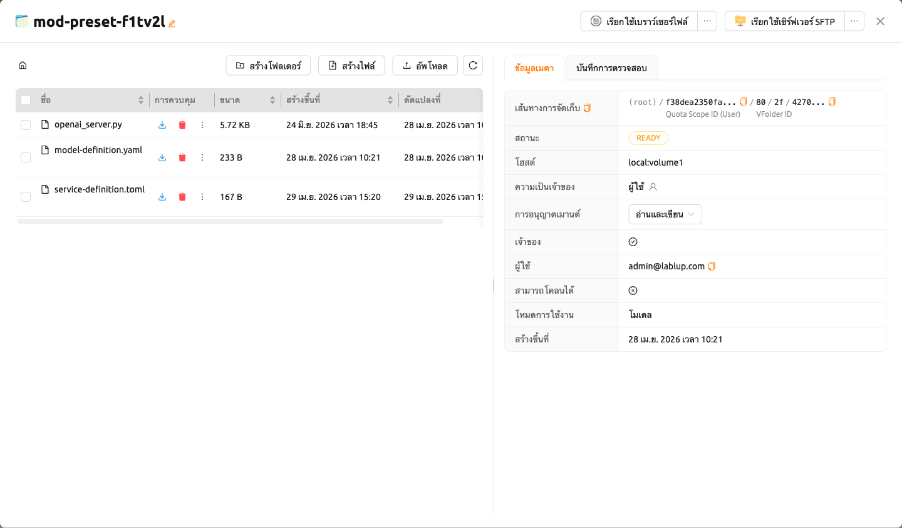

คุณสามารถสร้างไดเรกทอรีใหม่ในพาธปัจจุบันได้ด้วยปุ่ม 'สร้าง' (ในตัวสำรวจโฟลเดอร์) หรืออัปโหลดไฟล์หรือโฟลเดอร์ภายในเครื่องได้ด้วยปุ่ม 'อัปโหลด' การดำเนินการเกี่ยวกับไฟล์ทั้งหมดเหล่านี้ยังสามารถทำได้โดยใช้วิธีการเมาท์โฟลเดอร์เข้าสู่เซสชันการคำนวณตามที่อธิบายไว้ข้างต้น

:::warning
ปุ่ม 'อัปโหลด' (และการอัปโหลดด้วยการลากและวาง) จะ **ถูกปิดใช้งาน** เมื่อบัญชีของคุณ
ไม่มีสิทธิ์ `upload-file` บน storage host ที่เก็บโฟลเดอร์นี้ ปุ่มจะยังคงปรากฏอยู่แต่จะ
แสดงเป็นสีเทา และมีคำอธิบายในเครื่องมือแนะนำว่าไม่อนุญาตให้อัปโหลด

`upload-file` คือสิทธิ์ระดับโฮสต์ที่ได้รับผ่าน **นโยบายทรัพยากรของคีย์แพร์** ของคุณ
หากคุณจำเป็นต้องอัปโหลดไฟล์แต่ปุ่มถูกปิดใช้งาน โปรดขอให้ผู้ดูแลระบบเพิ่ม
`upload-file` ลงในสิทธิ์โฮสต์ sFTP / vfolder ที่อนุญาตในนโยบายทรัพยากรของคุณ คุณ
สามารถระบุได้ว่าโฟลเดอร์อยู่บนโฮสต์ใดจากคอลัมน์ **Location** ในรายการโฟลเดอร์ หรือ
จากลิ้นชักรายละเอียดของโฟลเดอร์ สิทธิ์ที่ต้องการต้องเปิดใช้งานสำหรับโฮสต์ *นั้น*
:::

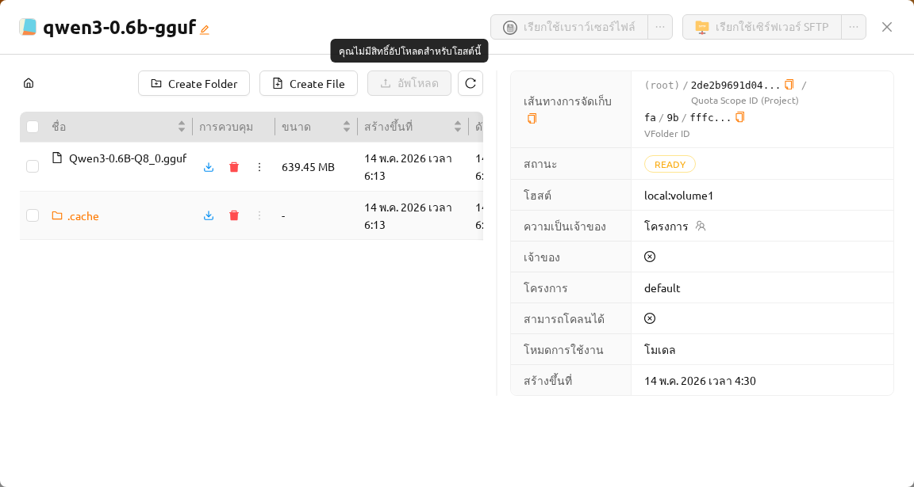
<!-- TODO: ถ่ายภาพหน้าจอของปุ่มอัปโหลดในสถานะปิดใช้งานพร้อมเครื่องมือแนะนำสิทธิ์ -->

ความยาวสูงสุดของไฟล์หรือไดเรกทอรีภายในโฟลเดอร์อาจขึ้นอยู่กับระบบไฟล์ของโฮสต์ แต่โดยปกติจะไม่สามารถเกิน 255 ตัวอักษร


:::note
เพื่อให้การทำงานราบรื่น หน้าจอจะจำกัดจำนวนไฟล์สูงสุดที่สามารถแสดงได้เมื่อไดเรกทอรีมีไฟล์จำนวนมากเกินไป หากโฟลเดอร์มีไฟล์จำนวนมาก บางไฟล์อาจไม่ปรากฏบนหน้าจอ ในกรณีเช่นนี้ โปรดใช้เทอร์มินัลหรือแอปพลิเคชันอื่นเพื่อดูไฟล์ทั้งหมดในไดเรกทอรี
:::

### แก้ไขไฟล์ข้อความ

คุณสามารถแก้ไขไฟล์ข้อความได้โดยตรงในโฟลเดอร์เอ็กซ์พลอเรอร์ คลิกที่ชื่อโฟลเดอร์เพื่อเปิดไฟล์เอ็กซ์พลอเรอร์ จากนั้นคลิกที่ปุ่ม 'แก้ไขไฟล์' ในคอลัมน์ควบคุมสำหรับไฟล์ข้อความใด ๆ

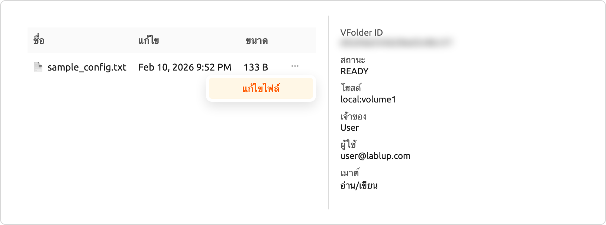

โปรแกรมแก้ไขไฟล์ข้อความจะเปิดขึ้นในโมดัลพร้อมอินเทอร์เฟซตัวแก้ไขโค้ด ตัวแก้ไขจะตรวจจับประเภทไฟล์โดยอัตโนมัติตามนามสกุลไฟล์และใช้การเน้นไวยากรณ์ที่เหมาะสม (เช่น Python, JavaScript, Markdown) หัวเรื่องโมดัลจะแสดงชื่อไฟล์และขนาด

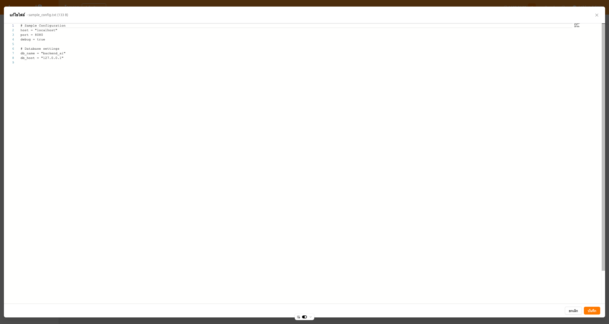

ตัวแก้ไขรองรับทั้งธีมสว่างและธีมมืดที่ตรงกับการตั้งค่า UI ของคุณ คุณสามารถแก้ไขเนื้อหาไฟล์ จากนั้นคลิก 'บันทึก' เพื่ออัปโหลดไฟล์ที่แก้ไข หรือ 'ยกเลิก' เพื่อยกเลิกการเปลี่ยนแปลง

:::note
ปุ่มแก้ไขไฟล์จะใช้งานได้เฉพาะเมื่อสิทธิ์การเข้าถึงของคุณต่อโฟลเดอร์จัดเก็บนี้มีสิทธิ์ `write_content` (ที่ได้รับผ่านสิทธิ์การแชร์โฟลเดอร์หรือบทบาทของคุณบนโฟลเดอร์) การตั้งค่าระดับ storage host ในแผงควบคุมไม่มีผลต่อการทำงานนี้ หากไฟล์โหลดไม่สำเร็จ ข้อความแสดงข้อผิดพลาดจะปรากฏขึ้น
:::

## เปลี่ยนชื่อโฟลเดอร์


หากคุณมีสิทธิ์ในการเปลี่ยนชื่อโฟลเดอร์จัดเก็บ ให้เปิดลิ้นชักรายละเอียดของโฟลเดอร์แล้วคลิกปุ่มแก้ไขข้างชื่อโฟลเดอร์ การเปลี่ยนชื่อจะดำเนินการภายในลิ้นชักรายละเอียดเท่านั้น

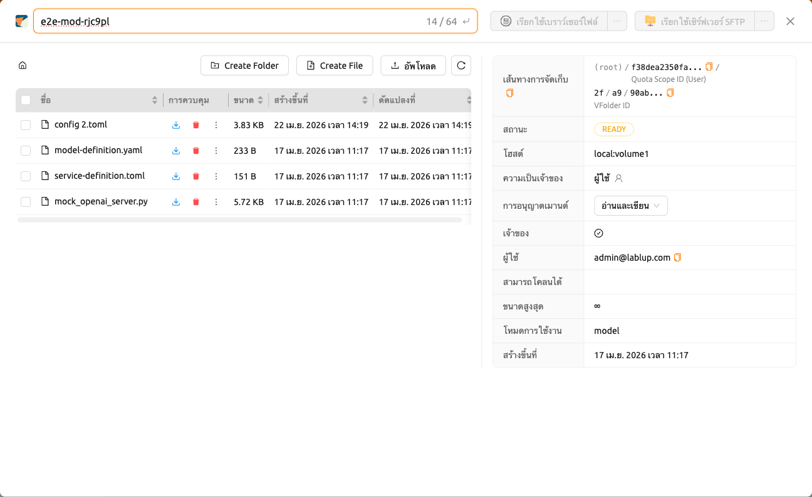


## ลบโฟลเดอร์


หากคุณมีสิทธิ์ในการลบโฟลเดอร์จัดเก็บ คุณสามารถส่งโฟลเดอร์ไปยังแท็บ 'ถังขะยะ' ได้โดยคลิกที่ปุ่ม 'ถังขยะ' เมื่อคุณย้ายโฟลเดอร์ไปยังแท็บถังขยะ โฟลเดอร์จะถูกทำเครื่องหมายเป็นรอการลบ

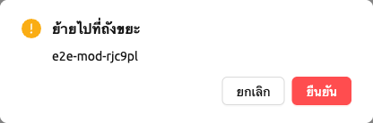

ในสถานะนี้ คุณสามารถกู้คืนโฟลเดอร์โดยคลิกที่ปุ่มกู้คืนในคอลัมน์ควบคุม หากคุณต้องการลบโฟลเดอร์อย่างถาวร กรุณาคลิกที่ปุ่ม 'ถังขยะ' ในคอลัมน์เดียวกัน

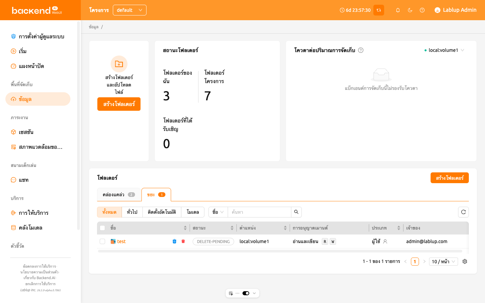

โมดัลยืนยันจะปรากฏขึ้นพร้อมกับช่องป้อนข้อมูลที่ระบุว่า `พิมพ์ชื่อโฟลเดอร์เพื่อลบ` ตรวจสอบให้แน่ใจว่าคุณพิมพ์ชื่อโฟลเดอร์ที่ถูกต้องลงในช่อง จากนั้นคลิกปุ่มสีแดง 'ลบถาวร' เพื่อลบโฟลเดอร์อย่างถาวร

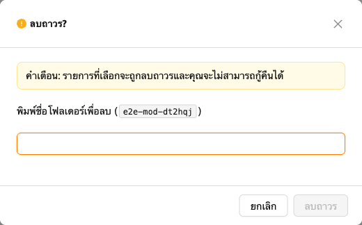

:::warning[การลบโมเดลการ์ดแบบลูกโซ่]
หากโฟลเดอร์ที่คุณกำลังลบเชื่อมโยงกับ **โมเดลการ์ด** โมดัลยืนยันจะแสดงตัวเลือก
*"ลบโฟลเดอร์โมเดลที่เกี่ยวข้องด้วย"* พร้อมคำเตือน *"การลบโฟลเดอร์โมเดลที่เกี่ยวข้องจะลบ
โมเดลการ์ดทุกตัวที่ใช้งานโฟลเดอร์นั้นด้วย"* การยืนยันการลบจะทำให้โมเดลการ์ดทุกตัวที่
อาศัยโฟลเดอร์จัดเก็บนี้ถูกลบอย่างถาวร ไม่ใช่เฉพาะไฟล์ในโฟลเดอร์เท่านั้น โปรดตรวจสอบ
รายการโมเดลการ์ดที่แสดงก่อนยืนยันการลบ เนื่องจากการดำเนินการนี้ไม่สามารถย้อนกลับได้
:::

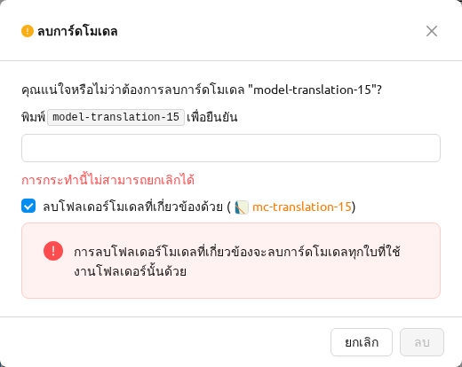
<!-- TODO: ถ่ายภาพหน้าจอของกล่องโต้ตอบเตือนการลบแบบลูกโซ่ -->

ผู้ดูแลระบบที่ลบโมเดลการ์ดจากหน้า **ผู้ดูแลระบบ → จัดการโมเดลการ์ด** สามารถใช้กระบวนการ
ในทิศทางตรงกันข้ามได้ การลบโมเดลการ์ดแบบหลายรายการจะให้ตัวเลือกในการย้ายโฟลเดอร์
จัดเก็บที่เกี่ยวข้องไปยังถังขยะด้วย ดูรายละเอียดของกระบวนการแบบหลายรายการในฝั่งผู้ดูแล
ระบบได้ที่ [จัดการโมเดลการ์ด](../admin_menu/admin_menu.md#manage-model-cards)

## การใช้ FileBrowser


Backend.AI รองรับ [FileBrowser](https://filebrowser.org) ตั้งแต่เวอร์ชัน 20.09 FileBrowser เป็นโปรแกรมที่ช่วยให้คุณจัดการไฟล์บนเซิร์ฟเวอร์ระยะไกลผ่านเว็บเบราว์เซอร์ ซึ่งมีประโยชน์เป็นพิเศษเมื่อต้องการอัปโหลดไดเรกทอรีจากเครื่องของผู้ใช้

ปัจจุบัน Backend.AI มี FileBrowser เป็นแอปพลิเคชันของเซสชันการคำนวณ ดังนั้น จึงมีเงื่อนไขต่อไปนี้ที่จำเป็นต้องมีเพื่อเรียกใช้มัน

- ผู้ใช้สามารถสร้างเซสชันการคอมพิวเตอร์ได้อย่างน้อยหนึ่งเซสชัน
- ผู้ใช้สามารถกำหนดสรรพคุณอย่างน้อย 1 แกนของ CPU และ 512 MB ของหน่วยความจำ
- ภาพที่สนับสนุน FileBrowser ต้องถูกติดตั้ง

คุณสามารถเข้าถึง FileBrowser ได้สองวิธี

- เรียกใช้ FileBrowser จากกล่องโต้ตอบตัวสำรวจไฟล์ของโฟลเดอร์จัดเก็บ
- เริ่มเซสชันการคอมพิวเตอร์โดยตรงจากภาพ FileBrowser ในหน้าเซสชัน


### เรียกใช้ FileBrowser จากกล่องโต้ตอบตัวสำรวจโฟลเดอร์

ไปที่หน้าข้อมูลและเปิดกล่องโต้ตอบตัวสำรวจไฟล์ของโฟลเดอร์จัดเก็บเป้าหมาย คลิกชื่อโฟลเดอร์เพื่อเปิดตัวสำรวจไฟล์


คลิกปุ่ม 'เรียกใช้เบราว์เซอร์ไฟล์' ที่มุมขวาบนของตัวสำรวจ


คุณสามารถเห็นว่า FileBrowser ถูกเปิดในหน้าต่างใหม่ คุณยังสามารถเห็นว่าหมายเหตุข้อมูลที่คุณเปิดหน้าต่างสำรวจกลายเป็นโฟลเดอร์หลัก จากหน้าต่าง FileBrowser คุณสามารถอัปโหลด แก้ไข และลบโฟลเดอร์และไฟล์ใด ๆ ได้อย่างอิสระ


เมื่อผู้ใช้คลิกปุ่ม 'EXECUTE FILEBROWSER' ระบบ Backend.AI จะสร้างเซสชันการคำนวณเฉพาะสำหรับแอปโดยอัตโนมัติ ดังนั้นในหน้าเซสชัน คุณควรเห็นเซสชันการคำนวณ FileBrowser เป็นความรับผิดชอบของผู้ใช้ในการลบเซสชันการคำนวณนี้

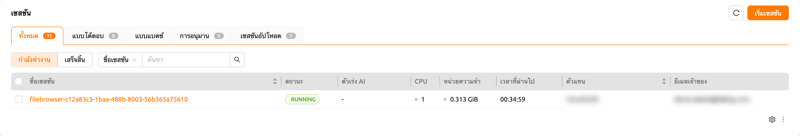


:::note
หากคุณปิดหน้าต่าง FileBrowser โดยไม่ได้ตั้งใจและต้องการเปิดใหม่ เพียงแค่ไปที่หน้าเซสชันและคลิกปุ่มแอปพลิเคชัน FileBrowser ของเซสชันการคำนวณ FileBrowser

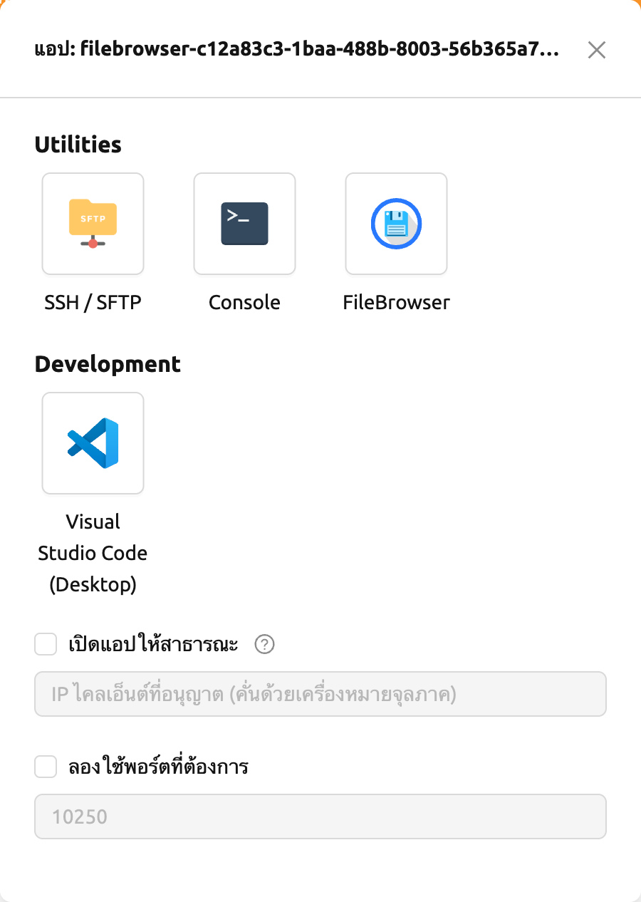

เมื่อคุณคลิกที่ปุ่ม 'EXECUTE FILEBROWSER' อีกครั้งในตัวสำรวจโฟลเดอร์ข้อมูล จะมีการสร้างเซสชันการคำนวณใหม่และจะมีการแสดงเซสชัน FileBrowser ทั้งหมดสองรายการ
:::

### สร้างเซสชันการคำนวณด้วยภาพ FileBrowser

คุณสามารถสร้างเซสชันคอมพิวเตอร์ได้โดยตรงด้วยภาพที่รองรับโดย FileBrowser คุณจำเป็นต้องติดตั้งโฟลเดอร์ข้อมูลอย่างน้อยหนึ่งโฟลเดอร์เพื่อเข้าถึงพวกเขา คุณสามารถใช้ FileBrowser ได้โดยไม่มีปัญหาแม้ว่าคุณจะไม่ติดตั้งโฟลเดอร์ข้อมูลใด ๆ แต่ไฟล์ที่อัปโหลด/อัปเดตทุกไฟล์จะหายไปหลังจากเซสชันสิ้นสุด


:::note
ไดเรกทอรีรากของ FileBrowser จะเป็น `/home/work` ดังนั้นคุณจึงสามารถเข้าถึง
โฟลเดอร์จัดเก็บที่เมาท์ไว้สำหรับเซสชันการคำนวณได้ทั้งหมด
:::

### ตัวอย่างการใช้งานพื้นฐานของ FileBrowser

ในส่วนนี้จะแนะนำตัวอย่างการใช้งานพื้นฐานของ FileBrowser ใน Backend.AI การใช้งาน FileBrowser ส่วนใหญ่นั้นเข้าใจได้ง่ายและเป็นไปโดยสัญชาตญาณ แต่หากคุณต้องการคู่มือที่ละเอียดกว่านี้ โปรดดูที่ [เอกสาร FileBrowser](https://filebrowser.org)

**อัปโหลดไดเรกทอรีท้องถิ่นโดยใช้ FileBrowser**

FileBrowser รองรับการอัปโหลดไดเรกทอรีท้องถิ่นหนึ่งหรือหลายไดเรกทอรีในขณะที่รักษาโครงสร้างต้นไม้ไว้ คลิกปุ่มอัปโหลดที่มุมขวาบนของหน้าต่าง จากนั้นคลิกปุ่มโฟลเดอร์ จะมีการแสดงกล่องโต้ตอบสำรวจไฟล์ท้องถิ่นขึ้นมา และคุณสามารถเลือกไดเรกทอรีใดก็ได้ที่คุณต้องการอัปโหลด


:::note
หากคุณพยายามอัปโหลดไฟล์ไปยังโฟลเดอร์ที่มีสถานะเป็นอ่านอย่างเดียว FileBrowser จะเกิดข้อผิดพลาดของเซิร์ฟเวอร์
:::

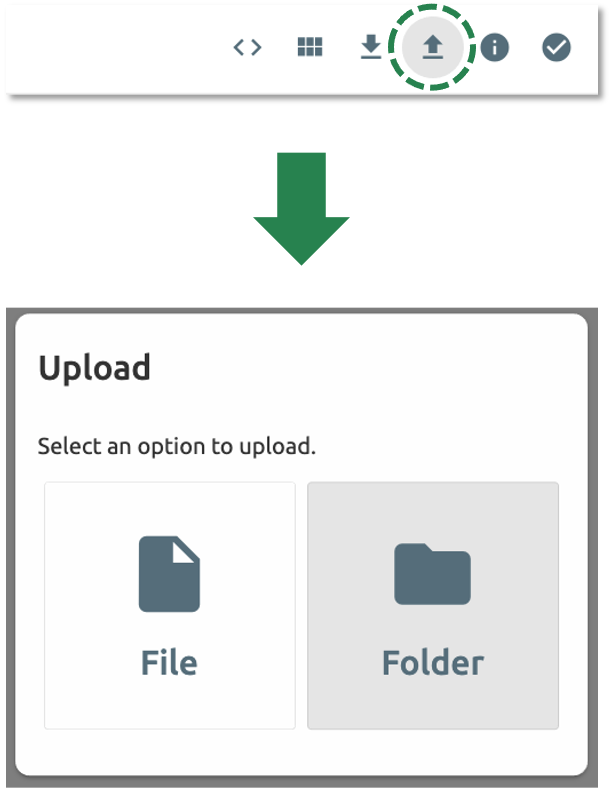

ให้เราอัปโหลดไดเรกทอรีที่มีโครงสร้างดังต่อไปนี้

```shell
foo
+-- test
|   +-- test2.txt
+-- test.txt
```

หลังจากเลือกไดเรกทอรี `foo` คุณจะเห็นว่าไดเรกทอรีถูกอัปโหลดสำเร็จแล้ว


คุณยังสามารถอัปโหลดไฟล์และไดเรกทอรีในเครื่องด้วยการลากและวางได้อีกด้วย

**ย้ายไฟล์หรือไดเรกทอรีไปยังไดเรกทอรีอื่น**

นอกจากนี้ คุณยังสามารถย้ายไฟล์หรือไดเรกทอรีภายในโฟลเดอร์จัดเก็บผ่าน FileBrowser ได้ โดยทำตามขั้นตอนดังต่อไปนี้

1. เลือกไดเรกทอรีหรือไฟล์จาก FileBrowser


2. คลิกปุ่ม 'ลูกศร' ที่มุมขวาบนของ FileBrowser

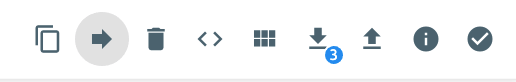

3. เลือกปลายทาง


4. คลิกปุ่ม 'MOVE'

คุณจะเห็นว่าการย้ายเสร็จสมบูรณ์แล้ว


:::note
ปัจจุบัน FileBrowser ถูกจัดเตรียมไว้ในรูปแบบแอปพลิเคชันภายในเซสชันการคำนวณ
เรากำลังวางแผนที่จะอัปเดต FileBrowser เพื่อให้สามารถทำงานได้อย่างอิสระโดยไม่ต้องสร้างเซสชัน
:::

## การใช้งานเซิร์ฟเวอร์ SFTP


ตั้งแต่เวอร์ชัน 22.09 เป็นต้นไป Backend.AI รองรับการอัปโหลดไฟล์ผ่าน SSH / SFTP จากทั้งแอปเดสก์ท็อปและ WebUI แบบเว็บ เซิร์ฟเวอร์ SFTP ช่วยให้คุณอัปโหลดไฟล์ได้อย่างรวดเร็วผ่านสตรีมข้อมูลที่เชื่อถือได้


:::note
ขึ้นอยู่กับการตั้งค่าของระบบ การเรียกใช้เซิร์ฟเวอร์ SFTP จากกล่องโต้ตอบไฟล์อาจ
ไม่ได้รับอนุญาต
:::

### เรียกใช้เซิร์ฟเวอร์ SFTP จากกล่องโต้ตอบตัวสำรวจโฟลเดอร์ในหน้าข้อมูล

ไปที่หน้าข้อมูล (Data) และเปิดกล่องโต้ตอบตัวสำรวจไฟล์ของโฟลเดอร์จัดเก็บเป้าหมาย คลิกปุ่มโฟลเดอร์หรือชื่อโฟลเดอร์เพื่อเปิดตัวสำรวจไฟล์

คลิกปุ่ม 'เรียกใช้เซิร์ฟเวอร์ SFTP' ที่มุมขวาบนของตัวสำรวจ


กล่องโต้ตอบการเชื่อมต่อ SSH / SFTP จะปรากฏขึ้น และเซสชัน SFTP ใหม่จะถูกสร้างขึ้นโดยอัตโนมัติ (เซสชันนี้จะไม่ส่งผลต่อการใช้ทรัพยากร)


สำหรับการเชื่อมต่อ ให้คลิกปุ่ม 'ดาวน์โหลดคีย์ SSH' เพื่อดาวน์โหลดคีย์ส่วนตัว SSH (`id_container`) และโปรดจดจำโฮสต์และหมายเลขพอร์ตไว้ จากนั้นคุณสามารถคัดลอกไฟล์ไปยังเซสชันได้โดยใช้โค้ดตัวอย่างการเชื่อมต่อที่ระบุในกล่องโต้ตอบ หรือดูคู่มือต่อไปนี้: [คู่มือการเชื่อมต่อ SFTP](../sftp_to_container/sftp_to_container.md#for-linux-mac) หากต้องการรักษาไฟล์ไว้ คุณต้องโอนไฟล์ไปยังโฟลเดอร์จัดเก็บ นอกจากนี้ เซสชันจะถูกยุติเมื่อไม่มีการถ่ายโอนข้อมูลเป็นระยะเวลาหนึ่ง


:::note
หากคุณอัปโหลดคีย์แพร์ SSH ของคุณเอง `id_container` จะถูกตั้งค่าเป็นคีย์ส่วนตัว SSH
ของคุณ ดังนั้นคุณไม่จำเป็นต้องดาวน์โหลดคีย์ทุกครั้งที่ต้องการเชื่อมต่อกับคอนเทนเนอร์
ผ่าน SSH โปรดดู[การจัดการคีย์แพร์ SSH ของผู้ใช้](#user-ssh-keypair-management)
:::

## โฟลเดอร์ไปป์ไลน์

แท็บนี้จะแสดงรายการโฟลเดอร์ที่ถูกสร้างขึ้นโดยอัตโนมัติเมื่อมีการดำเนินการไปป์ไลน์ใน FastTrack เมื่อมีการสร้างไปป์ไลน์ โฟลเดอร์ใหม่จะถูกสร้างและเมาท์ไว้ภายใต้ `/pipeline` สำหรับแต่ละอินสแตนซ์ของงาน (เซสชันการคำนวณ)

<a id="automount-folder"></a>

## โฟลเดอร์เมาท์อัตโนมัติ


หน้าข้อมูล (Data) มีแท็บโฟลเดอร์เมาท์อัตโนมัติ (Automount Folders) คลิกที่แท็บนี้เพื่อดูรายการโฟลเดอร์ที่มีชื่อขึ้นต้นด้วยจุด (`.`) เมื่อคุณสร้างโฟลเดอร์โดยระบุชื่อที่ขึ้นต้นด้วยจุด (`.`) โฟลเดอร์นั้นจะถูกเพิ่มเข้าไปในแท็บโฟลเดอร์เมาท์อัตโนมัติแทนที่จะเป็นแท็บโฟลเดอร์ โฟลเดอร์เมาท์อัตโนมัติเป็นโฟลเดอร์พิเศษที่จะถูกเมาท์ในไดเรกทอรีโฮมของคุณโดยอัตโนมัติ แม้ว่าคุณจะไม่ได้เมาท์ด้วยตนเองตอนสร้างเซสชันการคำนวณก็ตาม การใช้ฟีเจอร์นี้ในการสร้างและใช้โฟลเดอร์จัดเก็บ เช่น `.local`, `.linuxbrew`, `.pyenv` ฯลฯ จะช่วยให้คุณสามารถกำหนดค่าแพ็กเกจหรือสภาพแวดล้อมของผู้ใช้ที่จะไม่เปลี่ยนแปลงไปตามชนิดของเซสชันการคำนวณ

สำหรับข้อมูลเพิ่มเติมเกี่ยวกับการใช้งานโฟลเดอร์เมาท์อัตโนมัติ โปรดดูที่
[ตัวอย่างการใช้งานโฟลเดอร์เมาท์อัตโนมัติ](#using-automount-folder)

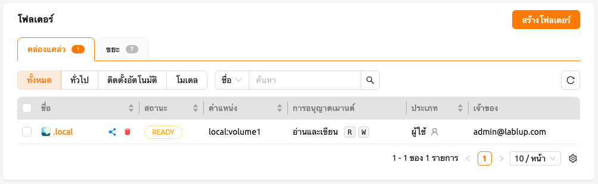

<a id="models"></a>

## โฟลเดอร์โมเดล


แท็บโมเดลช่วยให้การให้บริการโมเดลเป็นไปอย่างสะดวกและตรงไปตรงมา
คุณสามารถจัดเก็บข้อมูลที่จำเป็น ซึ่งรวมถึงข้อมูลนำเข้าสำหรับ[การให้บริการโมเดล](#model-serving) และข้อมูลสำหรับการฝึกสอน ไว้ในโฟลเดอร์โมเดลได้

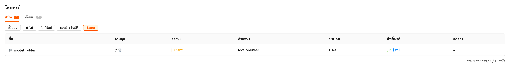